At [Microsoft Build 2024](https://build.microsoft.com/), we're thrilled to unveil a new set of features and tools designed to make .NET development faster and easier.

Explore the [.NET sessions at Microsoft Build 2024](https://www.youtube.com/watch?v=8OviTSFqucI) to see the new features in action, or [try them yourself](https://aka.ms/dotnet/9/preview4) by downloading .NET 9 Preview 4 today. 

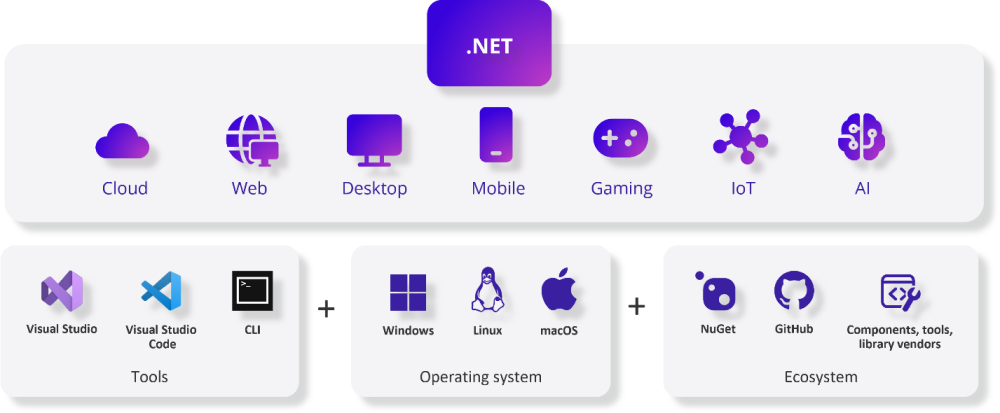

Here's a look at our updates & announcements:

- [Artificial Intelligence](#net-and-artificial-intelligence): End-to-end scenarios for building AI-enabled applications, embracing the AI ecosystem, and deep integration with cloud services.
- [.NET Aspire](#cloud-native-development-with-net): for building cloud-native distributed applications, releasing today.
- [C# 13](#c-13): Improvements to much loved C# features to make them even better for you.
- [Performance](#reducing-memory-usage): Reducing memory and execution time with critical benchmarks.
- Enhancements to .NET libraries and frameworks including [ASP.NET Core](#web-development-with-net), [Blazor](#full-stack-web-ui-with-blazor), [.NET MAUI](#multi-platform-development-with-net), and more.

Let's start with how we are improving AI development for developers with .NET.

## .NET and Artificial Intelligence

.NET provides you with tools to create powerful applications with AI. You can use the semantic kernel to orchestrate AI plugins, allowing you to seamlessly integrate AI functionality into your applications. You can use state-of-the-art libraries like OpenAI, Qdrant, and Milvus to enhance the functionality of your applications. You can also deploy your applications to the cloud with .NET Aspire, ensuring optimal performance and scalability. Let's take a look at these in more depth.

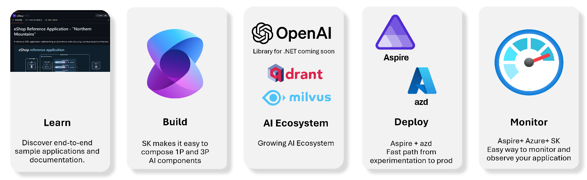
 
### AI Fundamentals

We're introducing a new `Tensor<T>` type. Tensors are a fundamental data structure in AI, often seen as multidimensional arrays that encode and represent diverse data types. They enable efficient data management and information flow across a variety of tasks. In .NET, we achieve extra efficiencies by building on [TensorPrimitives](https://devblogs.microsoft.com/dotnet/announcing-dotnet-8-rc2/#introducing-tensor-primitives-for-net), which utilize SIMD instructions to optimize throughput.

As a quick example, a common operation on Tensors is changing their shape. If you wanted to change an array with 1x3 dimensions to 3x1, you'd write code similar to the following:

```csharp
public int[,] Reshape(int[] inputArray, int rows, int cols)
{
    if (rows * cols != inputArray.Length)
    {
        throw new ArgumentException("The product of the specified dimensions must equal the length of the input array.");
    }

    int[,] reshapedArray = new int[rows, cols];
    for (int i = 0; i < rows; i++)
    {
        for (int j = 0; j < cols; j++)
        {
            reshapedArray[i, j] = inputArray[i * cols + j];
        }
    }

    return reshapedArray;
}
```

This code:

1. Creates a new array
2. Loops over the original array
3. Populates a new array 

Those operations are straightforward, however, the approach doesn’t provide much flexibility. Introducing additional functionality also means additional maintenance for your code base.

With the new `Tensor<T>` types, here's what a reshape operation might look like.

```csharp
var t0 = Tensor.Create(new float[] { 1, 2, 3 }, [1,3]);
var t1 = t0.Reshape(3, 1);
```

With one line of code, you able to perform the reshape operation on the tensor. The `Tensor<T>` APIs are flexible enough to handle N-number of dimensions and shapes so you can focus on your application.

`Tensor<T>` is designed to simplify your AI application development process in .NET. It makes it easy to share data between libraries like ONNX Runtime, TorchSharp, or ML.NET, creating your own mathematical libraries, or developing applications using AI models.

Give [`Tensor<T>` a try and give us feedback](https://aka.ms/tensor-p4-notes)!

### Get started building AI apps quickly

The world of AI is moving fast, and we are making sure that developers can get started quickly with minimal changes to their code. Take our new [AI quick-start samples](https://www.github.com/dotnet/ai-samples) for a spin to see how you can start using LLM frameworks like Semantic Kernel to quickly tap into the AI ecosystem. Semantic Kernel allows developers to leverage various models, connect to vector stores, and simplify their prompting process with templates.

In addition to our samples, we've been developing [Smart Components](https://aka.ms/smartcomponents), prebuilt controls with end-to-end AI features designed specifically for Blazor and MVC / Razor. These components can drop into your existing apps in minutes to infuse them with AI capabilities. With Smart Components, teams can save significant development time and avoid the need for extensive UX design or in-depth research into machine learning and prompt engineering. Currently, we have three Smart Components that you can integrate including:  SmartPasteButton, SmartTextArea, and SmartComboBox. The following is an example of adding a SmartPasteButton that takes copied texted from a clipboard and automatically fills in InputText controls using AI:

```razor
@page "/"
@using SmartComponents

<form>
    <p>Name: <InputText @bind-Value="@name" /></p>
    <p>Address line 1: <InputText @bind-Value="@addr1" /></p>
    <p>City: <InputText @bind-Value="@city" /></p>
    <p>Zip/postal code: <InputText @bind-Value="@zip" /></p>

    <button type="submit">Submit</button>
    <SmartPasteButton DefaultIcon />
</form>

@code {
    string? name, addr1, city, zip;
}
```

Here's how you can use a Smart Component to intelligently paste data from the clipboard directly into a form.


### Expanding the .NET AI ecosystem

We have collaborated with numerous partners, at Microsoft and across the industry, to enable developers to tap into the AI ecosystem. One of our most exciting collaborations this year has been with OpenAI. We partnered with them to deliver an official .NET library, which is set to be released later this month. This collaboration and new SDK ensures that .NET developers have a delightful experience and will have parity with other programming language libraries that you may be familiar with. It also provides support for the latest OpenAI features and models, such as GPT4o and Assistants v2, and a unified experience across OpenAI and Azure OpenAI. Please join our [OpenAI SDK for .NET Advisors](https://aka.ms/oai/net/champs) in order to influence the shape of this SDK.
 

Our partnerships extend beyond this. Last year, we announced official C# clients with [Qdrant](https://github.com/qdrant/qdrant-dotnet) and [Milivus](https://devblogs.microsoft.com/dotnet/get-started-milvus-vector-db-dotnet/). Our collaborative efforts continue as we work with partners like Weavite to offer developers a variety of .NET vector database options. Finally, we've been working with teams at Microsoft including Semantic Kernel, Azure SQL, and Azure AI Search to ensure that our developers can have seamless native experience with their AI capabilities.

### Future Investments: Monitoring and Observing your LLM Apps.

Large language model (LLM) applications require reliable, performant, and high-quality outcomes. Developers need to measure and track the results and behaviors of their LLM applications in both development and production environments and identify and resolve any issues.  

Our team is working on how developers can use [.NET Aspire](https://learn.microsoft.com/dotnet/aspire), [Semantic Kernel](https://learn.microsoft.com/semantic-kernel/overview/?tabs=Csharp), and Azure to monitor their AI applications.  These features are in preview, and we welcome your feedback. The following images demonstrate how you can use .NET Aspire with minimal code to collect detailed metrics and tracing data from Semantic Kernel, such as the model, token count, prompt, and generated response, following the OpenTelemetry standard convention for LLMs that's currently being designed.

Developers can view these traces in development with .NET Aspire and in production with various Azure Monitor tools like App Insights. The following is an example of enabling tracing in both .NET Aspire and App Insights.

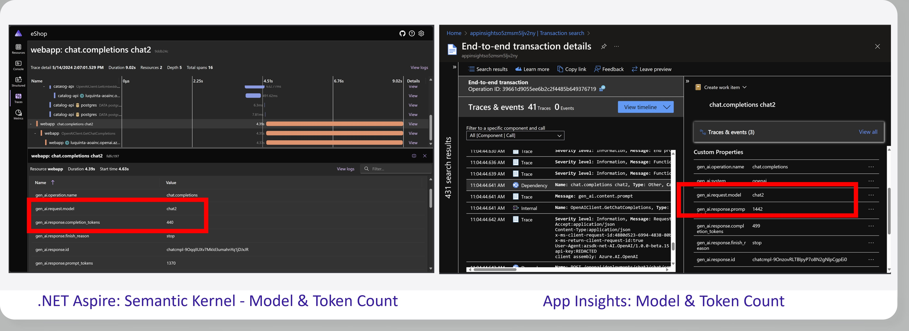
 
We have made collecting this telemetry with Semantic Kernel a breeze with just a few lines of code:

```csharp
// Enable the draft OpenTelemetry LLM data to be collected
AppContext.SetSwitch("Microsoft.SemanticKernel.Experimental.GenAI.EnableOTelDiagnosticsSensitive", true);

// Export the data
builder.Services.AddOpenTelemetry()
   .WithMetrics(m => m.AddMeter("Microsoft.SemanticKernel*"))
   .WithTracing(t => t.AddSource("Microsoft.SemanticKernel*"));
```

We are invested in making .NET a spectacular platform for building and integrating AI into your apps and working seamlessly with libraries in the AI ecosystem and with amazing frameworks including ASP.NET Core and .NET Aspire for building cloud-native apps. Next, let's go a bit deeper on how we are investing in building cloud-native apps with .NET.

## Cloud-native Development with .NET

Using .NET, you can build secure, efficient, resilient, observable, and configurable cloud-native applications. We have been enhancing cloud-native app development with reach release by delivering:

- Chiseled containers: Reducing the size of .NET container images
- NativeAOT & Trimming: Reducing app size while improving app startup time
- New features and libraries for ASP.NET Core to streamline cloud-native scenarios.
- Performance: Squeezing every drop of perf in all frameworks and libraries.

We are continuing our journey to improve the developer's experience for building these apps with the launch of .NET Aspire and continued investment for cloud-native scenarios with .NET 9. Let's start with .NET Aspire and how you can leverage it today in your .NET applications.

### .NET Aspire: Simplifying cloud-native development

[.NET Aspire](https://learn.microsoft.com/dotnet/aspire) is a new stack that streamlines development of .NET cloud-native apps and services. We are pleased to announce that [.NET Aspire is now generally available](https://aka.ms/aspirega).

 Get started with .NET Aspire today with the latest version [Visual Studio 2022 (17.10)](https://visualstudio.microsoft.com/), the [.NET CLI](https://get.dot.net/), or [Visual Studio Code with C# Dev Kit](https://code.visualstudio.com/docs/csharp/get-started). .NET Aspire brings together tools, templates, and NuGet packages that help you build observable, distributed, production-ready applications in .NET more easily. Whether you're building a new application, adding cloud-native capabilities to an existing one, or are already deploying .NET apps to production in the cloud today, .NET Aspire can help you get there faster.

<iframe width="800" height="450" src="https://www.youtube.com/embed/fYqnWmhR-HU?si=6APPVrHpBiqIiewY" title="YouTube video player" frameborder="0" allow="accelerometer; autoplay; clipboard-write; encrypted-media; gyroscope; picture-in-picture; web-share" referrerpolicy="strict-origin-when-cross-origin" allowfullscreen></iframe>

.NET Aspire enables building distributed applications, including project orchestration, components to integrate with prominent services and platforms, service discovery, service defaults, and so much more.

A main highlight of .NET Aspire is the dashboard, which provides a consolidated view of your apps resources, complete with logs, distributed traces, and metrics. Whether running during the local developer inner-loop or deployed in the cloud, the dashboard provides a real-time, developer-centric view of what your application is doing right now. 

The following image shows a trace a front-end web app all into multiple dependent backend services, caches, and databases.

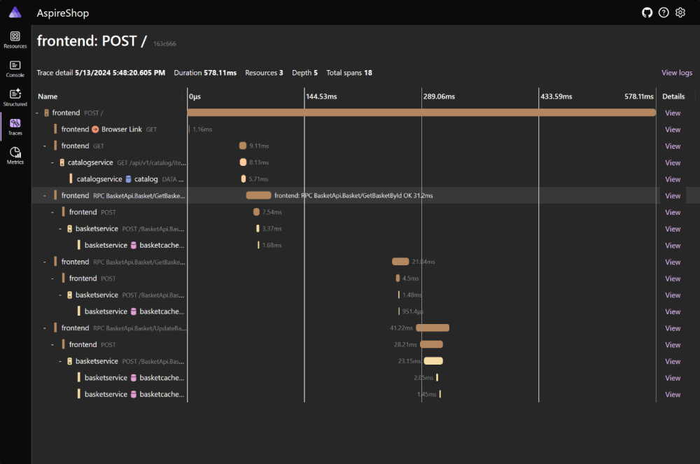

Developers need to deploy distributed applications throughout their development process for quick testing and need to be able to easily deploy into production when it is time. .NET Aspire is there to help with powerful features for taking your applications to the cloud, with support for provisioning and connecting to cloud services in Azure and AWS during development and deploying applications to [Azure Container Apps](https://learn.microsoft.com/azure/container-apps/) using the [Azure Developer CLI](https://learn.microsoft.com/azure/developer/azure-developer-cli/), or Kubernetes with [Aspirate](https://github.com/prom3theu5/aspirational-manifests).

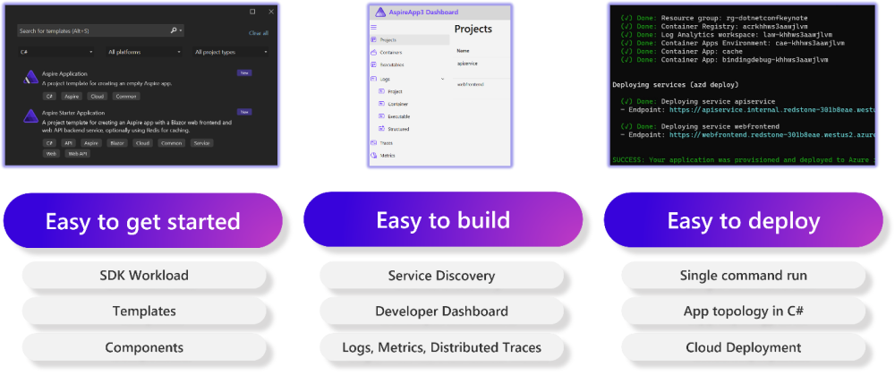

### .NET is Linux Native

.NET is cross-platform. Our mission is to ensure that .NET runs spectacularly everywhere developers build applications 🚀. We have invested a lot into improving developer and production workflows for apps running on Linux.

We've worked with Canonical, Red Hat, and other maintainers to ensure that [.NET packages are available](https://github.com/dotnet/core/blob/main/linux.md) to install from official feeds and updated for security patches on the same schedule as Microsoft.

For example, [.NET 8 is available in Ubuntu 24.04](https://devblogs.microsoft.com/dotnet/whats-new-for-dotnet-in-ubuntu-2404/), installable with the following commands.

```bash
sudo apt update
sudo apt install dotnet8
```

Containers are the most popular way to deploy cloud-native apps. The smaller the container, the quicker that new nodes can be provisioned. Smaller images are often more secure, too. [Chiseled containers](https://devblogs.microsoft.com/dotnet/announcing-dotnet-chiseled-containers/) are the solution to this, and they are now generally available for Ubuntu 24.04 for .NET 8 and .NET 9. Highly requested globalization-friendly images are now available that include **icu** and **tzdata** libraries.

Let's look at the impact chiseled images have on an ASP.NET Core web app. The Ubuntu 24.04 chiseled image is around 45% smaller than using regular Ubuntu. The only change was using a different base image.

<p class="text-center mx-auto">

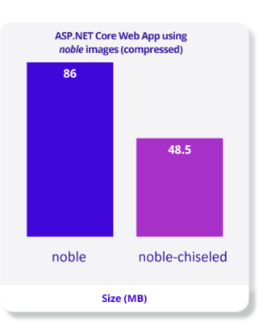

</p>
 
Now, let's get into some new .NET 9 features and enhancements that you can try today that are focused on optimizing cloud-native apps.

### Reducing Memory Usage

Automatic memory management has always been a key feature of .NET with world class garbage collection that is optimized for multiple scenarios. When it comes to cloud-native app development we are taking things to the next level with .NET 9 by introducing a [new server garbage collector (GC) mode](https://maoni0.medium.com/dynamically-adapting-to-application-sizes-2d72fcb6f1ea). This new mode dramatically reduces memory usage, which can lower costs, and at the same time delivers the same excellent performance that .NET is known for.

What does this mean for cloud-native apps? Imagine you had a Kubernetes cluster with two nodes. This new feature will automatically stay within those two nodes longer by adaptively responding to traffic to the scale of requests.

Let's look at an example of the new server GC mode in action. The chart below shows the Fortunes TechEmpower benchmark app running 1,000 requests per second (RPS) in a container configured with 4 CPU cores. The existing server GC mode is in blue and the new server GC mode is in black. The new mode is using less than a third of the memory 🤯!

<p class="text-center mx-auto">


</p>

Running this example at 10,000 RPS shows a similar improvement. Our testing has shown that the new server GC mode has very minimal impact on other metrics. 

> Source:[ ASP.NET Core Benchmarks](https://aka.ms/aspnet/benchmarks) (Containers page)

Performance is a consistent focus with every release of .NET and .NET 9 is no different. With every new version, people reach out to us telling us that their app got faster just by upgrading. That is indeed the intent! This time around, we have another set of deep changes that will make your apps run faster and leaner in production.

- [Exceptions are now 2-4x faster](https://github.com/dotnet/runtime/pull/98570), adopting a more modern implementation.
- Loops are getting faster with [loop hoisting](https://github.com/dotnet/core/blob/main/release-notes/9.0/preview/preview1/runtime.md#jit-loop-optimizations) and [induction variable widening](https://github.com/dotnet/core/blob/main/release-notes/9.0/preview/preview2/runtime.md#loop-optimizations-iv-widening).
- Dynamic PGO is now more efficient by [reducing the cost of type checks](https://github.com/dotnet/core/blob/main/release-notes/9.0/preview/preview2/runtime.md#pgo-improvements-type-checks-and-casts).
- RyuJIT can deliver better performance by [inlining more generic methods](https://github.com/dotnet/core/blob/main/release-notes/9.0/preview/preview3/runtime.md#inlining-improvements-shared-generics-with-runtime-lookups).
- Arm64 code can be written to be much faster using [SVE/SVE2 SIMD instructions on Arm64](https://github.com/dotnet/core/blob/main/release-notes/9.0/preview/preview1/runtime.md#jit-arm64-svesve2-support).

We are excited to have you try out these latest low-level optimizations in the .NET runtime and give us feedback on their impact of your apps. Now, let's get into some higher-level discussion with what is new and coming soon for C#!

## C# 13

C# 13 focuses on flexibility and performance, making many of your favorite features even better. We're enhancing `params` parameters to provide you with more flexibility, taking extensions to the next level with extension types, and are adding several features to enhance performance, some of them you'll get for free, without having to modify your code. Let's take a look!

### Enhancing C# `params`

`params` are no longer restricted to arrays!

When the `params` keyword appears before a parameter, calls to the method can provide a comma delimited list of zero or more values and those values are placed in a collection of the parameter's type. Starting in C# 13, the `params` parameter type can be any of the types used with collection expressions, like `List<T>`, `Span<T>`, and `IEnumerable<T>`. You can even use your own collection types if they follow special rules.

Just specify a different collection type as the parameter type:

```csharp
void PrintList(params IEnumerable<string> list) 
    => Console.WriteLine(string.Join(", ", list));

PrintList("Sun", "Mon", "Tue", "Wed", "Thu", "Fri", "Sat");

// prints "Sun, Mon, Tue, Wed, Thu, Fri, Sat"
```

It's really that easy to use the collection type that best fits your needs. Programmers using your method can just pass a comma delimited list of values. They do not need to care about the underlying type.

### Making `params` better with spans

One important aspect of performance is reducing memory use, and `System.Span<T>` and `System.ReadonlySpan<T>`are tools in reducing memory allocations. You can learn more in [Memory<T> and Span<T> usage guidelines]( https://learn.microsoft.com/dotnet/standard/memory-and-spans/memory-t-usage-guidelines).

If you want to use a span, just use the `params` parameter type to a span type. Values passed to the `params` parameter are implicitly converted to that span type.
If you have two method signatures that differ only by one being a span and the other being an array and the calling code uses a list of values, the span overload is selected. This means you're running the fastest code available and makes it easier to add span to your apps.

Many of the methods of the .NET Runtime are being updated to accept `params Span<T>`, so your applications will run faster, even if you don't directly use spans. This is part of our ongoing effort to make C# faster and more reliable. It's also an example of the attention we give to ensuring various C# features work well together. Here is an example from `StringBuilder`.

``` csharp
public StringBuilder AppendJoin(string? separator, params ReadOnlySpan<string?> values)
```

### `params` and interfaces

The story gets even better with `params` support for interfaces. If no concrete type is specified, how does the compiler know what type to use?

Just like collection expressions in C# 12, when you specify an interface as a parameter type, it's a clear indication that you just want anything that implements that interface. Key interfaces are mapped to implementation, so we can give you the best available type that fulfills the interface. The compiler may use an existing type or create one. You should not have any dependencies on the underlying concrete collection type because we will change it if a better type is available.

The great thing about this design is that you can just use interfaces for your `params` types. If you pass a value of a type that implements the interface, it will be used. When a list of values or a collection expression are passed, the compiler will give you the best concrete type.

### Extension types
Extension types aren't in the current preview, although you'll see them demonstrated in Mads Torgersen and Dustin Campbell's [What's new in C# talk](https://build.microsoft.com/sessions/689e5104-72e9-4d02-bb52-77676d1ec5bc?source=sessions). Here's a sneak peek into this important part of the C# 13 story. 

Since C# 3, extension methods have allowed you to add methods to an underlying type, even if you cannot change its code. LINQ is an example of a set of extension methods on `IEnumerable<T>`. The LINQ extension methods appear as if they were instance methods on the underlying type.

C# 13 takes the next step with extension types. This is a new kind of type that supplies extension  members for an underlying type.  They have methods, properties and other members that can be instance or static. Instance extension types cannot hold state. For example, they can't include fields. They can access state on the underlying type or in another location.

There are two kinds of extension types: implicit and explicit extensions. Implicit extension types apply to all occurrences of the underlying type – in the same way extension methods do today. Explicit extension methods and properties apply only to instances of the underlying type that have been converted to the explicit extension type.

An extension type builds on an underlying type, which are just normal C# types. One of the reasons you might use an extension is that you can't change the code of the underlying type.

Let's look at some examples, starting with the underlying types and assuming we don't have access to change their code:

``` csharp
public class Person()
{
    public required string GivenName { get; init; } 
    public required string SurName { get; init; }
    public required Organization Organization { get; init; } 
} 

public class Organization()
{
    public required string Name { get; init; }
    public required List<Team> Teams { get; init; }
} 

public class Team()
{
    public required string TeamName { get; init; }
    public required Person Lead { get; init; }
    public required IEnumerable<Person> Members { get; init; }
} 
```

A bit of LINQ code can return whether a `Person` is a lead. Since we don't want to write this piece of code every time it's needed, we could write an extension method, and if desired control access to it via namespaces. Or, we could use and implicit extension type to organize the extensions for the `Person` class, and provide `IsLead` as a property to all `Person` instances:

```csharp
public implicit extension PersonExtension for Person
{
    public bool IsLead
        => this.Organization
            .Teams
            .Any(team => team.Lead == this);
}
```

This property would be called as:

```csharp
if (person.IsLead) { ... }
```

Explicit extensions let you give extra features to specific instances of a type. For example, it makes sense to retrieve which teams a person leads. An explicit extension can provide the `Teams` property only to leads:

```csharp
public explicit extension Lead for Person
{
    public IEnumerable<Team> Teams 
        => this.Organization
            .Teams
            .Where(team => team.Lead == this);
}
```

Both implicit and explicit extension types support static members as well as instance members. One way to use this is to provide defaults specific to your scenario. In this case, we have only one organization, and it's quite awkward to specify it every time we create a person:

``` csharp
public implicit extension OrganizationExtension for Organization
{
   private static Organization ourOrganization = new Organization("C# Design");

   public static Person CreatePerson(string givenName, string surName) 
       => new(givenName, surName, ourOrganization);
}
``` 

Putting this together:

```csharp
var mads = Organization.CreatePerson("Mads", "Torgersen");
// code to add more people and teams
if (mads.IsLead)
{
    Lead madsAsLead = mads;
    PrintReport(madsAsLead.Teams);
}
```

From a usage perspective, extension types allow you to simplify the code that provides the important work and logic of your application. It does this by organizing extensions and supplying extensions that customize specific instances of the underlying objects. From a technical perspective, extension types are an enhancement to the extension methods you use today. You'll be able to experiment with them in a future preview of C# 13.

This is just a quick overview of what we are working on, and you'll see more detailed posts as we complete features. To see all the features we're working on, check out the [Roslyn feature status page](https://github.com/dotnet/roslyn/blob/main/docs/Language%20Feature%20Status.md).  Find out more about all these features in Mads Torgersen and Dustin Campbell's talk [What's New in C# 13](https://build.microsoft.com/sessions/689e5104-72e9-4d02-bb52-77676d1ec5bc?source=sessions) at Microsoft Build.

## Web Development with .NET

.NET includes [ASP.NET Core](https://dotnet.microsoft.com/apps/aspnet), which has everything you need to build modern web apps, including browser-based web apps or scalable backend services. With .NET there's no need to stitch together a solution from multiple different frameworks. .NET is built for security and optimized for performance, so that you're ready to handle any server scenario.

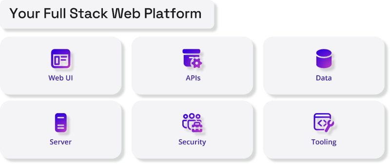

We're continuing to improve the web development experience with .NET and ASP.NET Core. In .NET 9 we're focused on addressing quality and fundamentals, including performance, security, and reliability. Existing ASP.NET Core features are also getting important upgrades to address the needs of modern cloud-native apps.

### Built-in support for OpenAPI document generation

The [OpenAPI specification](https://www.openapis.org/) enables developers to define the shape of APIs in a standardized format that can be plugged into client generators, server generators, testing tools, documentation, and more. ASP.NET Core now provides [built-in support for generating OpenAPI documents](https://aka.ms/aspnet/openapi) representing controller-based or minimal APIs.

```csharp
var builder = WebApplication.CreateBuilder();
builder.Services.AddOpenApi();

var app = builder.Build();
app.MapOpenApi();
app.MapGet("/hello/{name}", (string name) => $"Hello {name}"!);

app.Run();
```

OpenAPI documents can be generated at build-time or runtime from an addressable endpoint and the generated OpenAPI documents can be customized as needed using document and operation transformers.

### Improved distributed caching with HybridCache

ASP.NET Core's support for distributed caching is getting an upgrade with the new [`HybridCache` API](https://github.com/dotnet/core/blob/main/release-notes/9.0/preview/preview4/aspnetcore.md#introducing-hybridcache). `HybridCache` augments the existing `IDistributedCache` support in ASP.NET Core with new capabilities, including multi-tier storage, with a limited in-process (L1) cache supplemented by a separate (usually larger) out-of-process (L2) cache. This “hybrid” approach to cache storage gives the best of both worlds, where most fetches are served efficiently from L1, but cold-start and less-frequently-accessed data still doesn't hammer the underlying backend, thanks to L2. `HybridCache` also includes "stampede" protection (to prevent parallel fetches of the same work) and configurable serialization, while simplifying the API usage for common scenarios.

Here's an example of `HybridCache` in action:

```csharp
public class SomeService(HybridCache cache)
{
    public async Task<SomeInformation> GetSomeInformationAsync(string name, int id, CancellationToken token = default)
    {
        return await cache.GetOrCreateAsync(
            $"someinfo:{name}:{id}", // unique key for this combination
            async cancel => await SomeExpensiveOperationAsync(name, id, cancel),
            token: token
        );
    }
}
```

`HybridCache` is designed to be a drop-in replacement for most `IDistributedCache` scenarios, while providing more features, better usability, and improved performance. In our benchmark tests, `HybridCache` is almost 1000x faster than using `IDistributedCache` in high cache hit rate scenarios thanks to its multi-tiered cache storage. Caching performance is improved further when using immutable types.

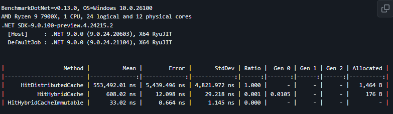

### Full Stack Web UI with Blazor

[Blazor](https://dotnet.microsoft.com/apps/aspnet/web-apps/blazor) makes building web UI for your ASP.NET Core apps simple and productive. Blazor developers who have upgraded to .NET 8 have been taking advantage of new features including static server rendering, streaming rendering, enhanced navigation & form handling, and much more.

<p class="text-center mx-auto">

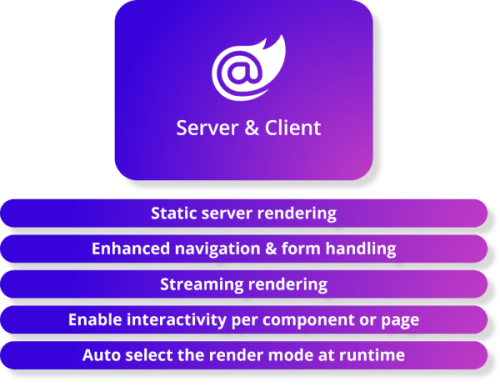

</p>

The feedback from developers has been fantastic, and we have been continuing to improve Blazor with new features that you can try out today in the latest .NET 9 previews including:

- **[Component constructor injection](https://learn.microsoft.com/aspnet/core/release-notes/aspnetcore-9.0#constructor-injection)**: Blazor now supports constructor injection for components in addition to the existing support for property injection with `@inject`. Constructor injection supports optional services and works great with null state checking.
- **[WebSocket compression](https://learn.microsoft.com/aspnet/core/release-notes/aspnetcore-9.0#websocket-compression-for-interactive-server-components)**: The WebSocket traffic for interactive server rendering is now compressed by default, significantly reducing the message payload size.
- **[Render pages statically from globally interactive apps](https://github.com/dotnet/core/blob/main/release-notes/9.0/preview/preview4/aspnetcore.md#add-static-ssr-pages-to-a-globally-interactive-blazor-web-app)**: You can now exclude pages from interactive routing in Blazor Web Apps set up for global interactivity and force them to render statically from the server. This is useful when most of your app is interactive, but you have certain pages that must render in the context of a request.


Be sure to check out the [release notes](https://learn.microsoft.com/aspnet/core/release-notes/aspnetcore-9.0) for additional details on what's new in ASP.NET Core in .NET 9 and the ASP.NET Core [roadmap](https://aka.ms/aspnet/roadmap) for what's still to come.

## Multi-platform Development with .NET

[.NET MAUI](https://dot.net/maui) is .NET's multi-platform app UI for building beautiful apps across iOS, Android, Mac, and Windows.

<p class="text-center mx-auto">

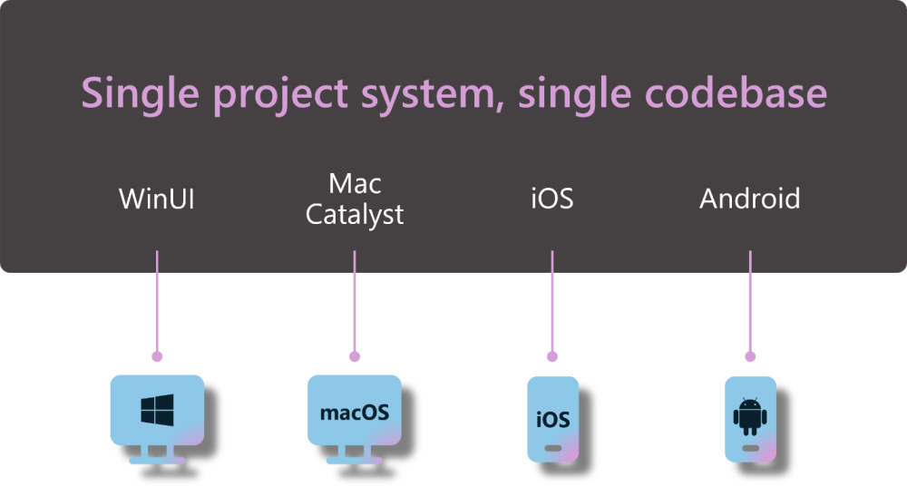

</p>
 
Since its launch we have seen explosive growth and adoption from new users and existing Xamarin developers migrating to take advantage of new features and performance. Apps that you use every day are built with .NET MAUI including NBC Sports, Hawaiian Airlines, UPS, Microsoft Azure, DigiD, Seeing AI, E-ZPass Pennsylvania, and so many more. We have loved seeing the continued support from the .NET community building beautiful .NET MAUI libraries & controls, such as the [.NET MAUI Community Toolkit](https://learn.microsoft.com/dotnet/communitytoolkit/maui/), and from control vendors including [Telerik](https://www.telerik.com/maui-ui), [Syncfusion](https://www.syncfusion.com/maui-controls), [Grial](https://grialkit.com/), [DevExpress](https://www.devexpress.com/maui/), and so many more. We are humbled to have your support ensuring .NET MAUI is a world class experience for building multi-platform apps.

<p class="text-center mx-auto">


</p>

In .NET 8, we focused on enhancing performance & quality, supporting our ecosystem, improving the developer experience, and ensuring building Hybrid apps with .NET MAUI and Blazor were top notch. A major focus was shifting our development process to being NuGet package first. This means we can rapidly deploy new service releases and you can easily upgrade in seconds. Today, we are releasing our fourth service release for .NET 8 providing hundreds more improvements that you can leverage today.

<p class="text-center mx-auto">

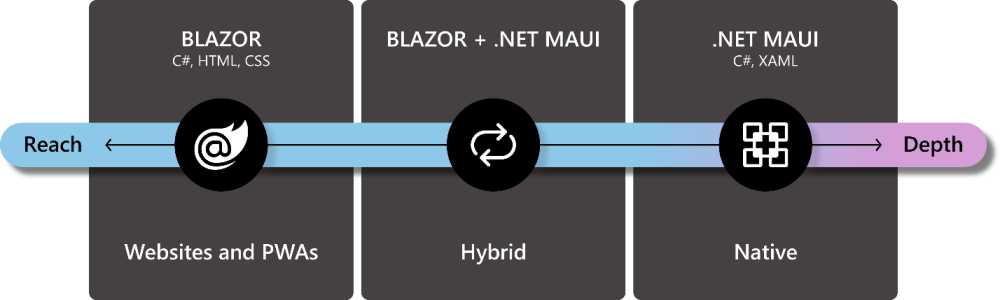

</p>

Last year we introduced initial support for building [.NET MAUI apps in Visual Studio Code](https://devblogs.microsoft.com/visualstudio/announcing-the-dotnet-maui-extension-for-visual-studio-code/) across Windows, Mac, and Linux with the C# Dev Kit. This week we have launched a new pre-release version of the .NET MAUI extension for VS Code that adds support for XAML Intellisense, Xcode Sync, and other improvements that you have been requesting. It has been great to see developers leverage VS Code on new platforms for building apps with .NET MAUI.

<p class="text-center mx-auto">

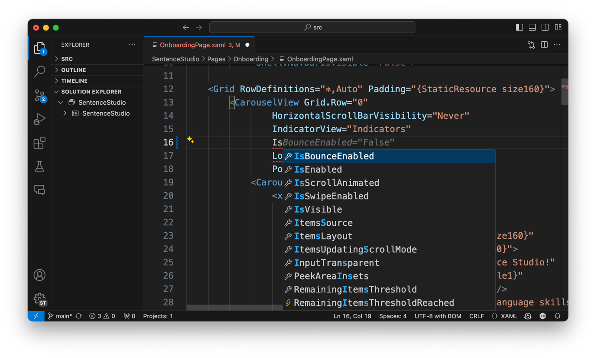

</p>

Moving forward we will continue to enhance our migration story for Xamarin developers moving to .NET MAUI and .NET MAUI developers upgrading to newer versions of .NET with the Upgrade Assistant. We will also continue to have consistent and reliable service releases for .NET 8 as we push forward on adding new features for multi-platform developers in .NET 9. You can start to try out some of our newest features such as [iOS library multi-targeting](https://github.com/dotnet/core/blob/main/release-notes/9.0/preview/preview3/dotnetmaui.md#asset-packs), [Android Asset Packs](https://github.com/dotnet/core/blob/main/release-notes/9.0/preview/preview3/dotnetmaui.md#asset-packs) to shrink your app size when dealing with large assets such as videos, and [Native AOT experimental support for iOS and Mac Catalyst apps](https://github.com/dotnet/core/blob/main/release-notes/9.0/preview/preview4/dotnetmaui.md#native-aot-for-ios--mac-catalyst) which can trim your app size up to 62% while making your startup times nearly 50% faster! In subsequent previews you'll see features to make building .NET MAUI hybrid apps easier like a new Solution Template for setting up [Blazor Hybrid and web apps that share UI](https://aka.ms/maui-blazor-web), as well as a new HybridWebView control to enable JavaScript frameworks.

We will continue to prioritize your top feedback and encourage you to be active on our GitHub repo, follow along with our release announcements, and give the latest previews and VS Code integration a spin.

## In Summary
We are excited for you to try all of these new features in .NET. 

- [Download .NET 9 Preview 4](https://get.dot.net/9) today
- Read the [latest .NET 9 release notes](https://aka.ms/dotnet/9/preview4) for more insights into these features and more.
- Check out the latest features in [Visual Studio 2022 (17.10 out today)](https://devblogs.microsoft.com/visualstudio/) and the [C# Dev Kit for VS Code](https://devblogs.microsoft.com/dotnet/may-release-of-csharp-dev-kit/)
- [Start building cloud-native apps with .NET Aspire](https://aka.ms/aspire/learn)
- Watch our [“What is .NET Aspire?” video series](https://aka.ms/aspire/videos) to jump start your cloud-native journey.
- Try out our [.NET AI samples](https://github.com/dotnet/ai-samples) and learn more on our documentation.
