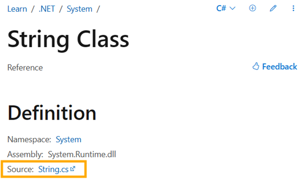
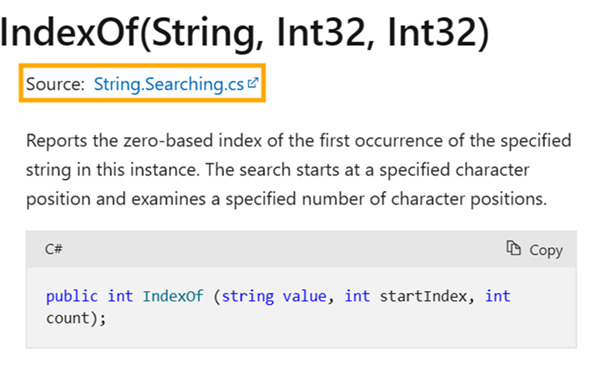
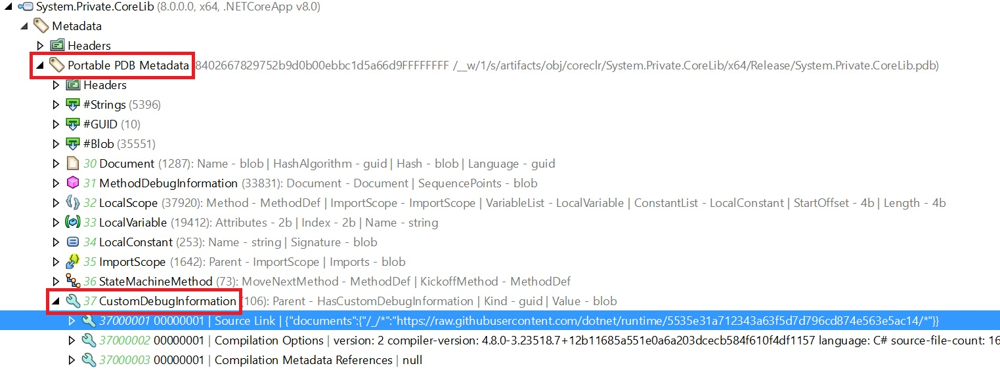
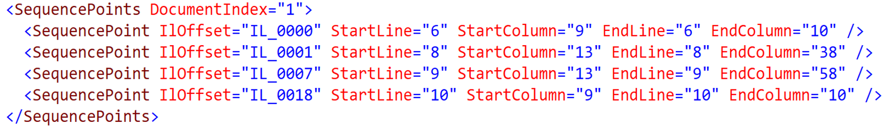
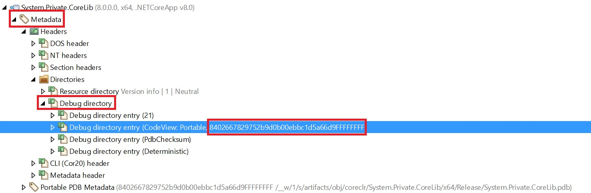
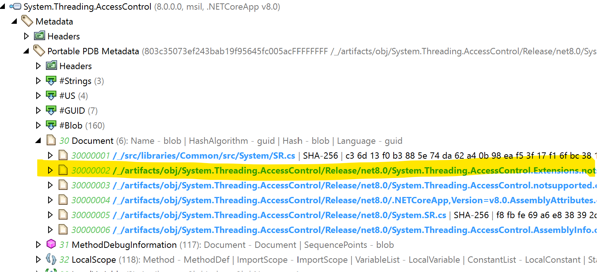
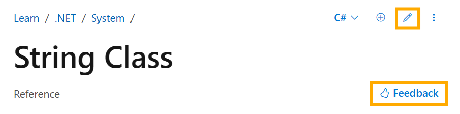

When developers read API reference, they sometimes have a need or desire to review the corresponding source code. Until recently, the [.NET API reference docs](https://learn.microsoft.com/dotnet/api/) did not provide a link back to the source code, prompting calls from the community for this addition. In response to this feedback, we are happy to announce links connecting docs to the source code are now available on most of our popular .NET APIs.

In this blog post, we will share details about how we added the links to the docs experience and how we made use of existing APIs to deliver this improvement.

## Live examples of the links

Before going into implementation details, we would like to showcase where the docs have changed. For .NET APIs that meet our required criteria (having Source Link enabled, having accessible PDB, and being hosted in a public repository), the links are included in the `Definition metadata`. The following image from the [`String`](https://learn.microsoft.com/dotnet/api/system.string?view=net-8.0) class demonstrates the placement of this new link:




In cases where overloads are present, the links are included below the overload title. The following image of [`String.IndexOf`](https://learn.microsoft.com/dotnet/api/system.string.indexof?view=net-8.0#system-string-indexof(system-string-system-int32-system-int32)) method demonstrates this pattern:



## How do we build the links?

The .NET reference docs pipeline operates on a set of DLL files and NuGet packages. These are processed by a variety of tools to transform their contents into the HTML pages displayed on Microsoft Learn. Correctly building the links to source requires an understanding of the relationship between source, binaries, and GitHub, and how to tie them together with some existing .NET APIs. In discussing our goal to surface links to source with developers from the .NET and Roslyn teams, it became clear that our requirement was closely aligned with Visual Studio's [Go to definition](https://github.com/dotnet/roslyn/issues/55834) functionality.

With this understanding and the extensive details of `Go to definition` provided by [@davidwengier](https://github.com/davidwengier) in [Go To Definition improvements for external source in Roslyn](https://devblogs.microsoft.com/dotnet/go-to-definition-improvements-for-external-source-in-roslyn/), we were able to apply a similar approach to build links to source for the docs.

### Source Link

[Source Link](https://github.com/dotnet/sourcelink) is a technology that enables .NET developers to debug the source code of assemblies referenced by their applications. Though originally intended for source debugging, Source Link is perfectly adaptable to our scenario. Every .NET project which enabled Source Link will generate a mapping from a relative folder path to an absolute repository URL in PDB (Program Database). This is as described in the [Go To Definition improvements for external source in Roslyn](https://devblogs.microsoft.com/dotnet/go-to-definition-improvements-for-external-source-in-roslyn/#source-link) blog post by [@davidwengier](https://github.com/davidwengier).

To view the `Source Link` entry, you can open the DLL using dotPeek or [ILSpy](https://github.com/icsharpcode/ILSpy). The following screenshot shows an example accessing the `Source Link` entry of `System.Private.CoreLib` with dotPeek by navigating to `Portable PDB Metadata` then the `CustomDebugInformation` table:


  
> [!NOTE]
> To find out the metadata definition about Source Link, go to: [PortablePdb-Metadata](https://github.com/dotnet/runtime/blob/main/docs/design/specs/PortablePdb-Metadata.md#source-link-c-and-vb-compilers).  

### Building the links

Now we know we have an overall mapping stored in Source Link entry, the next question is how we build a unique link for each type/member in this DLL?  

For example, the link we built for `String.Clone` method is: <https://github.com/dotnet/runtime/blob/5535e31a712343a63f5d7d796cd874e563e5ac14/src/libraries/System.Private.CoreLib/src/System/String.cs#L388C13-L388C25>

This link can be split into 3 parts:

1. The first part `https://github.com/dotnet/runtime/blob/5535e31a712343a63f5d7d796cd874e563e5ac14` is parsed from Source Link mapping json and is bound to a specific repository commit.
2. The second part `src/libraries/System.Private.CoreLib/src/System/String.cs` can be found in `Document` table of the PDB.
3. And the last part `#L388C13-L388C25` is built from `SequencePoints` column of `MethodDebugInformation` table. `SequencePoints` blob will map a range of IL instructions in this method block back to the line numbers of its original source code as demonstrated in below screenshot. For more details, go to [SequencePoints Metadata definition](https://github.com/dotnet/runtime/blob/main/docs/design/specs/PortablePdb-Metadata.md#sequence-points-blob).

    

We use [System.Reflection.Metadata](https://learn.microsoft.com/dotnet/api/system.reflection.metadata?view=net-8.0) library to iterate all the types/members in this DLL and then match the records in `MethodDebugInformation` table to build the final links.  

```csharp
var mdReader = peReader.GetMetadataReader();
foreach(var typeDefHandle in mdReader.TypeDefinitions)
{
    var typeDef = mdReader.GetTypeDefinition(typeDefHandle);

    string typeName = mdReader.GetString(typeDef.Name);
    string ns = mdReader.GetString(typeDef.Namespace);

    string fullName = String.IsNullOrEmpty(ns) ? typeName : $"{ns}.{typeName}";
    Console.WriteLine(fullName);

    foreach (var document in debugReader.FindSourceDocuments(typeDefHandle))
    {
        Console.WriteLine($"  {document.SourceLinkUrl}");
    }
}
```

The implementation can also be found in Roslyn [DocumentDebugInfoReader.cs](https://github.com/dotnet/roslyn/blob/bbcac94e166e0cd87d36b41a387278e7d00d1728/src/Features/Core/Portable/PdbSourceDocument/DocumentDebugInfoReader.cs) and [SymbolSourceDocumentFinder.cs](https://github.com/dotnet/roslyn/blob/4262648cadff59cc703b6be8c00b9814a6b13c5a/src/Features/Core/Portable/PdbSourceDocument/SymbolSourceDocumentFinder.cs).

### Finding the PDB file

Since we know the link's information is available in the PDB, our next step is to locate these PDBs for our use.

Currently given a DLL, we will look for 3 places to locate the corresponding PDB:  

1. **Embedded PDB**. If `<DebugType>`embedded`</DebugType>` is specified in your csproj, the PDB file will be embedded in this DLL.
2. **PDB on the disk**. You can put your PDB right next to your DLL.
3. **Microsoft Symbol Server**. There is a public symbol server where we can download the PDB for the DLL.

See the implementation in Roslyn [PdbFileLocatorService.cs](https://github.com/dotnet/roslyn/blob/b3d9ff7c9dc9e330b24d6087419dffe611a9dd77/src/Features/Core/Portable/PdbSourceDocument/PdbFileLocatorService.cs).

### Finding the correct PDB version

We would like to talk a little more about how we download the correct version of PDB for a given DLL from Microsoft Symbol Server.

Below is a sample PDB download URL and with its format defined in [portable-pdb-signature](https://github.com/dotnet/symstore/blob/main/docs/specs/SSQP_Key_Conventions.md#portable-pdb-signature).  
<http://msdl.microsoft.com/download/symbols/System.Private.CoreLib.pdb/8402667829752b9d0b00ebbc1d5a66d9FFFFFFFF/System.Private.CoreLib.pdb>  

From the URL pattern we can observe we need to provide the PDB file name `System.Private.CoreLib.pdb` and a GUID `8402667829752b9d0b00ebbc1d5a66d9FFFFFFFF`. So the question is where can we find this information?

Previously we used dotPeek to open a DLL to look for the `Source Link` entry. Now we can open it again and check the `Metadata` section.



In the above screenshot, we can find this GUID in the `Debug Directory` and the entry must be a portable code view entry. The `Path` attribute of this entry stands for the path to the PDB file which we can get the file name from it.

```csharp
foreach (var entry in peReader.ReadDebugDirectory())
{
    if (entry.Type == DebugDirectoryEntryType.CodeView && entry.IsPortableCodeView)
    {
        var codeViewEntry = peReader.ReadCodeViewDebugDirectoryData(entry);
        var pdbName = Path.GetFileName(codeViewEntry.Path);
        var codeViewEntryGuid = $"{codeViewEntry.Guid.ToString("N").ToUpper()}FFFFFFFF";
        return $"{MsftSymbolServerUrl}/{pdbName}/{codeViewEntryGuid}/{pdbName}";
    }
}
```

### Finding the DLL file

As mentioned earlier, our .NET reference docs pipeline operates on a collection of DLL files or NuGet packages. For some assemblies though we needed to get creative producing the links to source. Here are two situations we needed to develop workarounds for:

1. **Reference Assembly**. For example, DLLs in this package [Microsoft.NETCore.App.Ref](https://www.nuget.org/packages/Microsoft.NETCore.App.Ref/8.0.0). Reference assemblies don't have PDBs uploaded to the symbol server which preventing us from generating the links to source. Our current solution is to download the [Runtime package](https://www.nuget.org/packages/Microsoft.NETCore.App.Runtime.linux-x64/8.0.0) and use the assemblies there to download the matched PDBs.
2. **Source embedded in PDB**. For example, package [System.Threading.AccessControl](https://www.nuget.org/packages/System.Threading.AccessControl/8.0.0) has source being generated at build time into the `obj` folder.

    

    This doesn't help us link to the source code, so instead of using the DLL in `lib` folder we will also look for DLL with the same name in `runtimes` folder.

### Consuming the links in the docs pipeline

Once we find the correct DLL/PDB files and successfully build the links to source, we save this information as a JSON file in the target docs GitHub repo.

To understand how we will use this information, we need to revisit the .NET reference docs pipeline. The pipeline creates an XML file for each unique type, which our build system later converts into an HTML page that is presented on Microsoft Learn. To map an API in the XML to its corresponding links to source found in the JSON file we use the unique identifier `DocId`. This value is present in both the XML (`DocId`) and the JSON (`DocsId`).

For example, the `DocId` for `System.String` is [`T:System.String`](https://github.com/dotnet/dotnet-api-docs/blob/main/xml/System/String.xml#L4). This `DocId` value will be used to locate the link to source within the [System.Private.CoreLib.json](https://github.com/dotnet/dotnet-api-docs/blob/main/xml/SourceLinkInformation/net-8.0/System.Private.CoreLib.json) file (for its corresponding version).

```json
"DocsId": "T:System.String",
"SourceLink": "https://github.com/dotnet/runtime/blob/5535e31a712343a63f5d7d796cd874e563e5ac14/src/libraries/System.Private.CoreLib/src/System/String.cs"
```

To know about how to generate a `DocId`, see [DocCommentId.cs](https://github.com/jbevain/cecil/blob/56d4409b8a0165830565c6e3f96f41bead2c418b/rocks/Mono.Cecil.Rocks/DocCommentId.cs#L303C2-L303C66) or [DocumentationCommentId.cs](https://github.com/dotnet/roslyn/blob/fd9a371c76d7b3440d0bf61ba2d8fe534d4a99ac/src/Compilers/Core/Portable/DocumentationCommentId.cs#L50).

### Known limitations

In our current implementation we are aware of a few limitations:

1. For types with no document info recorded in PDB such as enums or interfaces, a new GUID [TypeDefinitionDocuments](https://github.com/dotnet/roslyn/blob/3226945381c21b8057771851329e7369dac6101a/src/Dependencies/CodeAnalysis.Debugging/PortableCustomDebugInfoKinds.cs#L25) was introduced in `CustomDebugInformation` table to solve this problem. However this information will be trimmed sometimes for some DLLs and makes us unable to produce the links. See the bug details here <https://github.com/dotnet/runtime/issues/100051>.
2. For class members which are defined without a body (e.g. extern or abstract), there is no line information (SequencePoints) included in the PDB. Because of this, we are unable to direct to a span range and instead direct to the entire file. A future improvement is planned to address this.

### Another idea for improvement

As you may have noticed, we shared a lot of core logic with `Go to definition`. In fact, we reused a couple of their classes in our implementation. A [proposed feature](https://github.com/dotnet/roslyn/issues/71953) we have to improve the process is to modify Roslyn with existing code to generate a source mapping at the type/member level for us to consume.

If the community shares the same requirement, please comment to vote for us. Thanks!

### Give us your feedback

We would love to get your feedback on using the links so please let us know what you think! And if you find any issue related to the links, don't hesitate to share using the feedback controls or open a GitHub issue on the related docs repo.



### Lastly, acknowledgments

I want to share thanks to my colleague [@shiminxu](https://github.com/jianying10202713) for his contribution to this project.
Also thanks to [@ericstj](https://github.com/ericstj) from .NET team and [@tmat](https://github.com/tmat) from Roslyn team for the technical guidance. And finally thanks to the countless others who contributed to make this change possible.
