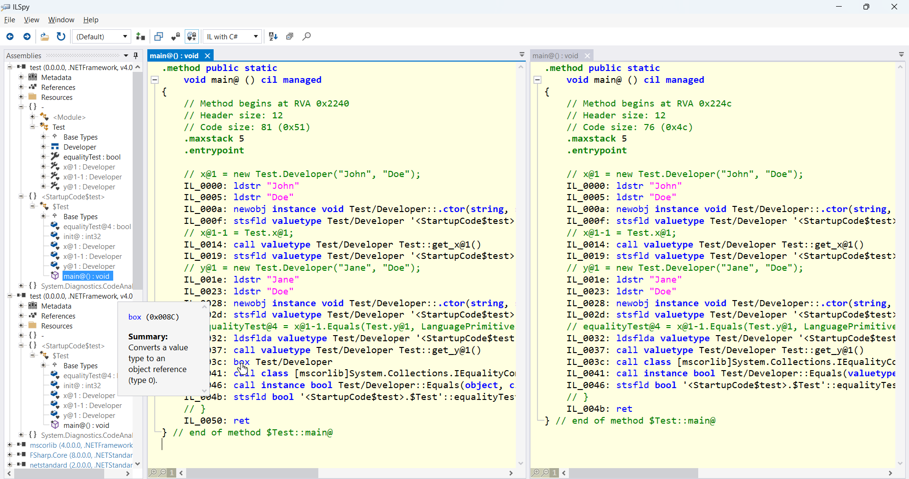

Programming language authors have to think about many things at once: overall language design, runtime dangers, possible feature misuse, backward compatibility, forward compatibility, and so on. All these aspects, together with communication hiccups and time constraints, might get in the way of some seemingly clear and manageable problems.

## The Bug 🐛

The story began in the summer of 2015 with [this issue](https://github.com/dotnet/fsharp/issues/526) on GitHub.

The ticket talks about a few problems at the same time, which unfortunately created some confusion. It mentions compiler-generated equality, custom equality, value types, reference types - many scenarios that are related but linked to different parts of the language specification and the compiler implementation.

Yet, let's pull out the first and most glaring problem here. The code is as simple as this:

```fsharp
[<Struct>]
type MyVal =
    val X: int

    new x = { X = x }

let equalityTest = MyVal 1 = MyVal 2
```

The last line essentially decompiles to this:

```csharp
myVal1.Equals(myVal2, LanguagePrimitives.GenericEqualityComparer)
```

It turned out that this equality test boxes the `myVal2` before passing it to the `Equals` call, wasting runtime and memory. (And that's why the bug on the featured image sits in a box.)

## How bad is this problem? 🧐

In F#, the most basic data structures are plain records and discriminated unions. From the .NET CIL perspective, they are .NET classes, allocated on the heap and garbage collected. This is fine for general-purpose programming where reference semantics allow for more developer convenience.

Structs are important for .NET developers when performance becomes a concern. Saving on heap allocations and garbage collection might become a valid tradeoff for the manual management of data copying happening in the case of stack allocation. Thus we end up in an unfortunate and somewhat paradoxical situation: once an F# developer starts caring about performance, they might get a performance penalty here.

Since equality testing is a foundational thing in programming languages, it propagates everywhere. For example, this boxing is applied during some collection operations on structs, e.g., `Array.contains` or `Array.exists`. All of them do equality testing multiple times, each test includes boxing - and suddenly we start talking about real performance traps in the code, especially in pessimistic scenarios when searched elements are not found:

```fsharp
[<Struct>]
type MyVal =
    val X: int
    new x = { X = x }

let array = Array.init 1000 (fun x -> MyVal x)
let existingElement = MyVal 1
let nonexistingElement = MyVal -1

let scenario1 = array |> Array.contains existingElement     // boxes 2 times (0, 1)
let scenario2 = array |> Array.contains nonexistingElement  // boxes 1000 times (0...999)
```

## We tried, and tried, and tried 🔄

What happened afterward?

The ticket immediately got traction and support. However, also immediately, the discussion around it diverged from the initial problem. Contributors started talking about inconsistencies in comparing floats and unnecessary generalization of equality and hashing in many cases.

The latter refers to the `GenericEqualityComparer` in the example above - it is an expensive fallback comparer that does boxing internally. In many cases (e.g., when comparing primitive types), we avoid calling it by using the "native" comparer for the type, but we can avoid it in many more cases (like enums or options). To reiterate, this is a different issue - boxing arguments prior to applying the comparer versus applying a less boxing comparer. However, for the next many years, most of the efforts were dedicated to fixing this unnecessarily generic comparison.

The first [attempt](https://github.com/dotnet/fsharp/pull/513) came from a brave external contributor, [Paul](https://github.com/manofstick), a few weeks later and got merged... half a year later. This was happening in the early days of the F# GitHub repo and things were *a bit* chaotic. Sadly, the fix was soon [reverted](https://github.com/dotnet/fsharp/pull/966)! The PR, hanging there all those months unreviewed, with time also got comparison functionality adjustments, a few co-fixes around IL generation, and some refactorings - eventually growing from the original [100 lines proposal](https://github.com/dotnet/fsharp/pull/513/commits/39d2a365d10da2ddeaaa3448452f935195f8e364?diff=unified&w=1) to a large change in the most critical parts of the codebase. As a result, it actually wasn't reviewed properly and had to be undone when some problems in that space popped up shortly.

The next [take](https://github.com/dotnet/fsharp/pull/5112) came again from Paul in 2018. This got [very close](https://github.com/dotnet/fsharp/pull/5112#issuecomment-401144811), but unfortunately, didn't get in. The PR scope was reduced compared to the first attempt, but also was not reviewed duly, collected a few co-improvements and refactorings along the way, got parked, and lost the momentum, eventually getting closed.

Similar efforts were pursued in [2019](https://github.com/dotnet/fsharp/pull/6175), and in [2020](https://github.com/dotnet/fsharp/pull/9404) - again somewhat overdone, under-reviewed, and eventually abandoned.

Meanwhile, the original problem became even worse since F# got new struct types - struct records, struct tuples, struct discriminated unions. All of them inherited the issue: the equality test was causing unnecessary boxing. Contributors kept complaining and getting confused - rightfully so!

## The light of hope 🌟

Since 2015, many things have changed in F#. The maintainers' team got bigger, the community got bigger, and we've got many safety mechanisms around releases allowing us to catch regressions quickly. This led us to the idea that we should [resurrect](https://github.com/dotnet/fsharp/issues/16125) all or at least some of those efforts.

At this point, we decided to take a deep breath, sit down with [Don](https://github.com/dsyme) (the F# BDFL), and write down [the overview](https://github.com/dotnet/fsharp/pull/16537) of what's going on in the language on the topic of equality. There we identified all the different problems and also the most impactful and the least risky remedies we can have in that space.

## First optimization: faster equality in generic contexts ⚡

So we began this February with [this PR](https://github.com/dotnet/fsharp/pull/16615), which is essentially a remake of some previous PRs by Paul. We got down to the very core of the initial suggestion - get smart about picking the fast "native" comparer for some known types. Everything else was stripped away, instead replaced by benchmarks and tests. Even this took more than a month to get in - but it did!

The mechanics of the change are thoroughly described in the PR. Benchmarks were executed on some non-inlined collection functions which would now pick a simpler comparer and hence execute faster and with fewer allocations. The thinner are the types of the collection elements, the bigger are the gains. This can be demonstrated, for example, on struct tuples:

```fsharp
// simplified benchmark code
Array.init 1000 id
|> Array.countBy (fun n -> struct (n, n, n, ...)) // <- value tuple creation
```

Before:
|      Method |       Mean | Ratio |    Gen 0 |   Gen 1 |   Gen 2 | Allocated |
|------------ |-----------:|------:|---------:|--------:|--------:|----------:|
| ValueTuple3 |   673.4 us |  1.00 |  61.5234 | 15.8691 |       - | 378.13 KB |
| ValueTuple4 |   812.2 us |  1.22 |  69.0918 | 19.7754 |       - | 424.98 KB |
| ValueTuple5 | 1,004.2 us |  1.50 |  84.9609 | 24.4141 |       - | 523.63 KB |
| ValueTuple6 | 1,100.7 us |  1.65 |  92.7734 | 23.4375 |       - | 570.48 KB |
| ValueTuple7 | 1,324.9 us |  1.97 | 117.1875 | 57.6172 | 29.2969 | 669.14 KB |
| ValueTuple8 | 1,461.9 us |  2.20 | 117.1875 | 58.1055 | 29.2969 | 762.85 KB |

After:
|      Method |     Mean | Ratio |   Gen 0 |   Gen 1 |   Gen 2 | Allocated |
|------------ |---------:|------:|--------:|--------:|--------:|----------:|
| ValueTuple3 | 173.0 us |  1.00 | 28.5645 |  9.3994 |       - | 175.11 KB |
| ValueTuple4 | 174.9 us |  1.03 | 28.5645 |  9.4604 |       - | 175.11 KB |
| ValueTuple5 | 208.9 us |  1.22 | 34.4238 | 11.3525 |       - | 211.29 KB |
| ValueTuple6 | 217.0 us |  1.26 | 34.4238 | 11.3525 |       - | 211.29 KB |
| ValueTuple7 | 293.7 us |  1.73 | 29.2969 | 29.2969 | 29.2969 | 247.48 KB |
| ValueTuple8 | 293.8 us |  1.73 | 29.2969 | 29.2969 | 29.2969 | 247.48 KB |

Many more benchmarks can be found in the PR description - check them out!

## Second optimization: the new Equals overload 🔧

And [in this PR](https://github.com/dotnet/fsharp/pull/16857), just a few weeks ago, we finally fixed the original bug!

The reason for the boxing in question is actually quite simple. The F# compiler generates a lot of equality and comparison functionality for different types. But for the scenario when a custom comparer is pulled, there was only one `Equals` overload generated: `Equals(object obj, IEqualityComparer comp)`. This takes in an object parameter, so things had to be boxed here. Hence the fix idea is to generate another `Equals` overload with the parameter of the type in question. In the initial example, this would be generated like `Equals(MyVal obj, IEqualityComparer comp)`.

Here is the performance difference for the affected array functions mentioned at the beginning of the post, applied to a 2-member struct.

Before:
| Method                       | Mean        | Error      | Gen0   | Allocated |
|----------------------------- |------------:|-----------:|-------:|----------:|
| ArrayContainsExisting        |    15.48 ns |   0.398 ns | 0.0008 |      48 B |
| ArrayContainsNonexisting     | 5,190.95 ns | 103.533 ns | 0.3891 |   24000 B |
| ArrayExistsExisting          |    17.97 ns |   0.389 ns | 0.0012 |      72 B |
| ArrayExistsNonexisting       | 5,316.64 ns | 103.776 ns | 0.3891 |   24024 B |
| ArrayTryFindExisting         |    24.80 ns |   0.554 ns | 0.0015 |      96 B |
| ArrayTryFindNonexisting      | 5,139.58 ns | 260.949 ns | 0.3891 |   24024 B |
| ArrayTryFindIndexExisting    |    15.92 ns |   0.526 ns | 0.0015 |      96 B |
| ArrayTryFindIndexNonexisting | 4,349.13 ns | 100.750 ns | 0.3891 |   24024 B |

After:
| Method                       | Mean         | Error      | Gen0   | Allocated |
|----------------------------- |-------------:|-----------:|-------:|----------:|
| ArrayContainsExisting        |     4.865 ns |  0.3452 ns |      - |         - |
| ArrayContainsNonexisting     |   766.005 ns | 15.2003 ns |      - |         - |
| ArrayExistsExisting          |     8.025 ns |  0.1966 ns | 0.0004 |      24 B |
| ArrayExistsNonexisting       |   834.811 ns | 16.2784 ns |      - |      24 B |
| ArrayTryFindExisting         |    16.401 ns |  0.3932 ns | 0.0008 |      48 B |
| ArrayTryFindNonexisting      | 1,140.515 ns | 22.7372 ns |      - |      24 B |
| ArrayTryFindIndexExisting    |    14.864 ns |  0.3648 ns | 0.0008 |      48 B |
| ArrayTryFindIndexNonexisting |   990.028 ns | 19.7157 ns |      - |      24 B |

The PR describes the changes in much greater detail and gives more benchmarks. Take a look! Don't be scared by its size - most updates are baselines for catching IL regressions.

## Lessons learned 📝

Even though technically this is a happy ending, it's a shame that things took this long. How can we - as the F# community - avoid having similar situations in the future?

Here are a few reminders:

1. When creating issues, be specific. If you notice multiple (even if similar) problems, it might be better to report separate issues for them and link them to each other. This helps keep discussions focused.

2. When creating PRs, concentrate on the problem that initially brought you there. Big repos tend to have a lot of technical debt and opportunities for improvements, yet leveraging too many of them at once makes things hard to review, increases paranoia levels in maintainers, and creates merge conflicts everywhere. Refactorings are better done separately.

3. If you want to help, one of the best ways to do that is to review - or revive - some [dangling PRs](https://github.com/dotnet/fsharp/pulls?q=is%3Apr+is%3Aopen+sort%3Acreated-asc). We as maintainers try hard to get to them, but sometimes things can slip. Giving a thorough review to a solid contribution helps keep the momentum and gives extra motivation to everybody involved.

## A few technical notes 🧑‍💻

I deliberately do not dive too deep into the implementations of all the PRs mentioned in the post, because they substantially differ. Equality and comparison might seem like a simple topic, but there are a lot of nitty-gritty details to them. And since such fundamentals go through all the layers of the programming language, the improvements can be done on different levels and in different ways. Of those, some can be safe, others are a bit riskier (and hence require feature flags), and yet others might even need RFCs to the language specification. Something can be opt-out, something must be opt-in.

That said, how do we discover and fix these problems in general? Well, some people *feel* that things are slower than they should be, others profile, and yet others benchmark. A relatively quick and comprehensible approach is to decompile code and see what's going on there. Let's analyze this record comparison:

```fsharp
[<Struct>]
type Developer = { FirstName: string; LastName: string }

let equalityTest = 
    { FirstName = "John"; LastName = "Doe" } = { FirstName = "Jane"; LastName = "Doe" }
```

This used to decompile to:

```csharp
// x@1 = new Test.Developer("John", "Doe");
IL_0000: ldstr "John"
IL_0005: ldstr "Doe"
IL_000a: newobj instance void Test/Developer::.ctor(string, string)
IL_000f: stsfld valuetype Test/Developer '<StartupCode$test>.$Test'::x@1
// x@1-1 = Test.x@1;
IL_0014: call valuetype Test/Developer Test::get_x@1()
IL_0019: stsfld valuetype Test/Developer '<StartupCode$test>.$Test'::'x@1-1'
// y@1 = new Test.Developer("Jane", "Doe");
IL_001e: ldstr "Jane"
IL_0023: ldstr "Doe"
IL_0028: newobj instance void Test/Developer::.ctor(string, string)
IL_002d: stsfld valuetype Test/Developer '<StartupCode$test>.$Test'::y@1
// equalityTest@4 = x@1-1.Equals(Test.y@1, LanguagePrimitives.GenericEqualityComparer);
IL_0032: ldsflda valuetype Test/Developer '<StartupCode$test>.$Test'::'x@1-1'
IL_0037: call valuetype Test/Developer Test::get_y@1()
IL_003c: box Test/Developer
IL_0041: call class [mscorlib]System.Collections.IEqualityComparer [FSharp.Core]Microsoft.FSharp.Core.LanguagePrimitives::get_GenericEqualityComparer()
IL_0046: call instance bool Test/Developer::Equals(object, class [mscorlib]System.Collections.IEqualityComparer)
IL_004b: stsfld bool '<StartupCode$test>.$Test'::equalityTest@4
```

Now, with the new optimizations, this decompiles to:

```csharp
// x@1 = new Test.Developer("John", "Doe");
IL_0000: ldstr "John"
IL_0005: ldstr "Doe"
IL_000a: newobj instance void Test/Developer::.ctor(string, string)
IL_000f: stsfld valuetype Test/Developer '<StartupCode$test>.$Test'::x@1
// x@1-1 = Test.x@1;
IL_0014: call valuetype Test/Developer Test::get_x@1()
IL_0019: stsfld valuetype Test/Developer '<StartupCode$test>.$Test'::'x@1-1'
// y@1 = new Test.Developer("Jane", "Doe");
IL_001e: ldstr "Jane"
IL_0023: ldstr "Doe"
IL_0028: newobj instance void Test/Developer::.ctor(string, string)
IL_002d: stsfld valuetype Test/Developer '<StartupCode$test>.$Test'::y@1
// equalityTest@4 = x@1-1.Equals(Test.y@1, LanguagePrimitives.GenericEqualityComparer);
IL_0032: ldsflda valuetype Test/Developer '<StartupCode$test>.$Test'::'x@1-1'
IL_0037: call valuetype Test/Developer Test::get_y@1()
IL_003c: call class [mscorlib]System.Collections.IEqualityComparer [FSharp.Core]Microsoft.FSharp.Core.LanguagePrimitives::get_GenericEqualityComparer()
IL_0041: call instance bool Test/Developer::Equals(valuetype Test/Developer, class [mscorlib]System.Collections.IEqualityComparer)
IL_0046: stsfld bool '<StartupCode$test>.$Test'::equalityTest@4
```

The only difference is the disappearance of the `box Test/Developer` call (line IL_003c). It's visible only on the IL level - the decompiled C# still looks the same, because it's the `Equals` overload that changes here.

This might look like a hardcore technique, but things have become much simpler in this space in recent years. Once you have your F# repo [set up](https://github.com/dotnet/fsharp?tab=readme-ov-file#contributing), the developer loop is quite fast:
1. Build or rebuild the naked [F# compiler](https://github.com/dotnet/fsharp/tree/ecf71018f374c88f5a903a810b7d146b8f259185/src/fsc/fscProject).
2. Locate the generated assembly, its path would be something like `artifacts\bin\fsc\Debug\net8.0\fsc.exe`.
3. Create a small `test.fs` file with the code to compile.
4. Run the compiler against it: `fsc test.fs`.
5. Analyze the generated `test.exe` file. There are different options out there - on Windows, you can install [ILSpy](https://github.com/icsharpcode/ILSpy?tab=readme-ov-file) even from the Microsoft Store.

The resulted setup for comparing the differences can look like this:


You can see the decompiled C#, IL, quick info for the instructions, and much more. An even more lightweight option is to use [sharplab.io](https://sharplab.io/) online, but be aware that it might not be powered by the most recent F# compiler.

## What's next? 🚀

We have done plenty of performance improvements in F# in recent months and we plan to write about them as well. And we're going to do more!

As always, any help is welcome! We track performance issues [in this ticket](https://github.com/dotnet/fsharp/issues/14017). The specific performance efforts we're "resurrecting" are gathered [in this issue](https://github.com/dotnet/fsharp/issues/16125) - what's described in the post touches only a part of those ambitions. Even in regards to unnecessary boxing, there is still plenty of work to be done in the equality and comparison areas. We now also have [the benchmarking infrastructure](https://github.com/dotnet/fsharp/tree/main/tests/benchmarks), so it's easy to get the numbers.

We are looking forward to your contributions. Performance is `fun`!