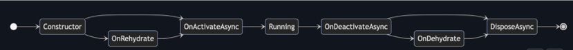
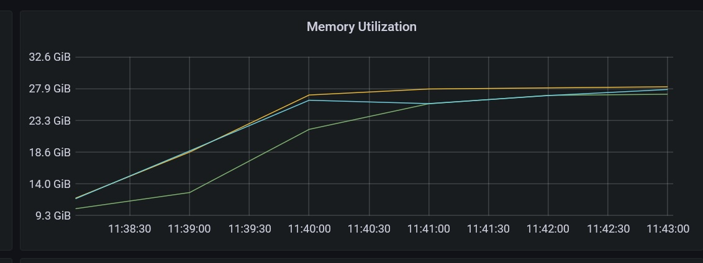

Orleans is a cross-platform framework for building robust, scalable distributed applications. A lot has happened in Orleans for since our last blog on new features in [Orleans 7.0](https://devblogs.microsoft.com/dotnet/whats-new-in-orleans-7/) including new integration with [.NET Aspire](https://aka.ms/dotnet-aspire). Let's take a look at what's new!

The Orleans 7.2 release delivered two great new capabilities that I think Orleans developers will find exciting:
- Live migration of grains
- [IAsyncEnumerable](https://learn.microsoft.com/archive/msdn-magazine/2019/november/csharp-iterating-with-async-enumerables-in-csharp-8) support

These features were carried forward into the Orleans 8.0 release, and we recently released Orleans 8.1.0 with two additional features:
- Resource Optimized Placement Strategy
- Orleans support in Aspire

Below is more detail on each of these features. I hope you find them as exciting as I do!

## Live migration of grains (Orleans 7.2)

Live grain migration allows grains to move from one silo to another without dropping requests or losing in-memory state. Support is added to preserve the in-memory state during migration without needing to refresh from storage.

This feature can be used to offload work from existing silos when a new silo is added to an Orleans cluster.

It can also be beneficial when upgrading an Orleans cluster. This typically involves rolling updates across the silos, so silos upgrading early in the cycle will have substantially more grain activations than those near the end. Live migration can be used to rebalance activations across the cluster after the upgrade completes.

This diagram illustrates the lifecycle of a grain that supports live migration:



Note that rehydration occurs before OnActivateAsync is called and dehydration occurs after OnDeactivateAsync is called.

### How it works

A grain will support live migration if all the components of the grain implement the `IGrainMigrationParticipant` interface, which defines the methods for dehydrating and rehydrating in-memory state in a migration.

```csharp
 public interface IGrainMigrationParticipant
{
    void OnDehydrate(IDehydrationContext dehydrationContext);
    void OnRehydrate(IRehydrationContext rehydrationContext);
}
```

Live migration is triggered for a grain with the `MigrateOnIdle()` grain method. When the grain becomes idle, the runtime will migrate the grain to another silo chosen by the placement strategy. You can designate a specific silo as the new location for the grain activation. To do this, set the `IPlacementDirector.PlacementHintKey` in the RequestContext to the target silo address.

```csharp
RequestContext.Set(IPlacementDirector.PlacementHintKey, targetHost);
```

## IAsyncEnumerable support (Orleans 7.2)

This feature allows a grain method to return a stream of results asynchronously.

```csharp
public IAsyncEnumerable<string> GetUpdates() => _updates.Reader.ReadAllAsync();
```

The user can enumerate on this result asynchronously:

```csharp
await foreach (var update in grain.GetUpdates())
{
  // Do something with update
}
```

### How it works

A grain method that returns an `IAsyncEnumerable<T>` returns a proxy object `AsyncEnumeratorProxy<T>` to the caller. The proxy object contains a Guid to identify the enumeration. Calls to `MoveNextAsync` send the Guid back to the remote grain so that it can continue to the next result for this enumeration. When multiple results are available, the grain can return a batch of results to reduce communication costs. The maximum batch size defaults to 100. You can control the maximum size of a batch with the `WithBatchSize` method on the grain method call, like this:

```csharp
await foreach (var update in grain.GetUpdates().WithBatchSize(1))
{
  // Do something with update
}
```

If the enumerable does not yield results for some period of time (defaults to 10s), the request will complete with a "heartbeat" status. The proxy object catches this and issues the call again (i.e, long-poll).

## Resource Optimized Placement Strategy (Orleans 8.1.0)

Resource Optimized Placement is a new placement strategy which attempts to optimize resource distribution across the cluster. It joins the list of existing placement strategies: Random (default), Local, Hash-based, Activation-Count, Stateless Worker, Silo-Role. You can learn all about placement strategies in the [Orleans grain placement topic] on Learn.

[Orleans grain placement topic]: https://learn.microsoft.com/dotnet/orleans/grains/grain-placement

The ResourceOptimizedPlacement strategy computes a score for each silo as a weighted sum of the following runtime statistics:

- CPU usage: default weight 40.
- Memory usage: default weight 30.
- Memory available: default weight 20.
- Maximum memory available: default weight 10.

Users can adjust the weights based on their specific requirements and priorities for load balancing. A smoothing algorithm is applied to filter out rapid changes in the score, and a configurable bias is used to prefer local silos over remote silos.

The silo with the lowest score is chosen for placing the activation. If there is a tie for the lowest score, we pick one from this set at random. We have already received positive feedback from users who have tried this new placement strategy. One user shared memory utilization measurements for a 3 silo configuration that show memory utilization quickly evolved to even utilization across the silos with Resource Optimized Placement.



### How it works

As with the other grain placement strategies, you can specify the placement strategy for a grain using an attribute on the grain interface or class. For Resource Optimized Placement, use the `ResourceOptimizedPlacement` attribute:

```csharp
using Orleans.Placement;

[ResourcedOptimizedPlacement]
public class MyGrain : Grain, IMyGrain
{
    // ...
}
```

The weights for the runtime statistics can be set with the `UseOrleans` extension method on the `HostBuilder`.

For example, you could overweight CPU usage and underweight memory usage like this:

```csharp
builder.Host.UseOrleans(siloBuilder =>
{
    // Configure weights for environment statistics in ResourceOptimizedPlacement.
    siloBuilder.Configure<ResourceOptimizedPlacementOptions>(options =>
    {
        options.CpuUsageWeight = 60;         // Must be between 0 and 100 inclusive
        options.MemoryUsageWeight = 20;      // Must be between 0 and 100 inclusive
        options.AvailableMemoryWeight = 10;  // Must be between 0 and 100 inclusive
        options.MaxAvailableMemoryWeight = 10;  // Must be between 0 and 100 inclusive
        options.LocalSiloPreferenceMargin = 5;  // Must be between 0 and 100 inclusive
    });
});
```

The total of the weights is not required to be 100. The weights are converted to a percentage of the total weight and used to calculate the score.

## Orleans support in Aspire (Orleans 8.1.0)

Starting in .NET Aspire preview 3 you can add Orleans to an Aspire application. This allows you to use Orleans grains in your Aspire application, but more importantly it enables Aspire to manage the provisioning of your Orleans silos, clients, persistence, and clustering.

### How it works

To add Orleans to an Aspire application, use the `AddOrleans` extension method of the `DistributedApplicationBuilder` in the `AppHost` project. This is also where you configure the grain storage(s) and clustering.

```csharp
var orleans = builder.AddOrleans("orleans");
    .WithGrainStorage("Default", grainStorage)
    .WithClustering(clusteringTable)
```

The `grainStorage` and `clusteringTable` objects are references to components defined earlier in the `AppHost` project.

```csharp
var grainStorage = builder.AddRedis("grainStorage");
var clusteringTable = builder.AddRedis("clusteringTable");
```

Then add Orleans Silo projects:

```csharp
builder.AddProject<Projects.OrleansServer>("silo")
    .WithReference(orleans);
```

And add Orleans client projects:

```csharp
builder.AddProject<Projects.FrontEnd>("frontend")
   .WithReference(orleans);
```

The Silo and client projects declare their use of Orleans with the `UseOrleans` extension method, as previously, but do not need to configure the grain storage or clustering as this has been done centrally in the `AppHost` project.

## Conclusion

I hope you find these new features exciting and useful. We'd love to hear your feedback on these features and any ideas for new features. Be sure to read through the [Orleans documentation](https://learn.microsoft.com/dotnet/orleans/overview) and please let us know what you think in the comments below, on our [Orleans Discord channel](https://aka.ms/orleans/discord), or on [GitHub](https://github.com/dotnet/orleans).
