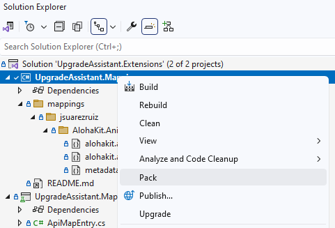
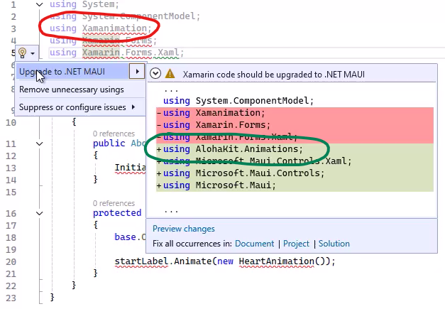

The .NET Upgrade Assistant is a Visual Studio extension and command-line tool that helps you upgrade apps from previous versions of .NET and .NET Framework to the latest versions of .NET. It includes great support for upgrading Microsoft libraries and frameworks, as we’ve described in previous posts. We’re excited to announce the addition of Third-Party API and Package Map Support, which will allow you to easily find and replace outdated third-party APIs and packages with their newer counterparts during the upgrade process. This new feature streamlines the transition to new platforms such as UWP to WinUI or Xamarin Forms to .NET MAUI, ensuring a smoother and more efficient upgrade experience.

## What is Third Party API and Package Map Support?

One of the challenges of upgrading an older application to the latest version of .NET is finding the equivalent APIs and NuGet packages from third party libraries. This is especially challenging when you also upgrade to a new platform, such as from UWP to WinUI or Xamarin Forms to .NET MAUI for example. For the latter, you would need to replace the `Xamarin.Forms` namespace with `Microsoft.Maui` and/or `Microsoft.Maui.Controls`.

That’s just the beginning though. Besides namespaces, types and methods are often not the same either and therefore you may need to make some changes in your code to use the new APIs. Let’s take `Xamarin.Forms.Color` for example. Not only do you need to update the namespace from `Xamarin.Forms` to `Microsoft.Maui.Graphics`, you also need to change properties like `R`, `G` or `B` to `Red`, `Green` or `Blue`, and the static `Color` properties like `AliceBlue` for example now belong to a new type called `Colors`.

To help you with this task, the .NET Upgrade Assistant includes a comprehensive set of known mappings for Microsoft owned libraries. But what about all those popular third-party libraries you may use? Can third-parties provide mappings for their own libraries?

Yes, they can! The .NET Upgrade Assistant now supports third party API and package maps. This feature allows anyone to specify maps for their own libraries that contain information about the old and new APIs and packages. The Upgrade Assistant will then use these maps in addition to its built-in maps to make code and project changes during an upgrade.

## How to create API and Package Maps

To create third party API maps for the .NET Upgrade Assistant, you need to do the following:

* Start by reading the `README.md` in the [upgrade-assistant](https://github.com/dotnet/upgrade-assistant) github repo
* Clone the repo and open `UpgradeAssistant.Extensions.sln` in Visual Studio
* Create a new folder for your company with a sub folder for your library under `mappings` in the `UpgradeAssistant.Mappings` project
* Add `*.apimap.json` and `*.packagemap.json` files for your library (use the samples or any existing maps as a starting point)
* Create the NuGet package for the maps by running the `Pack` command

  

This creates a Microsoft.UpgradeAssistant.Mappings NuGet package in the project’s output folder.

## How to test API and Package Maps

To test the NuGet package with the maps you created for the .NET Upgrade Assistant, you need to perform the following steps:

1. Make sure you have the latest version of [.NET Upgrade Assistant extension](https://marketplace.visualstudio.com/items?itemName=ms-dotnettools.upgradeassistant) from the Visual Studio Marketplace
2. Create/Open a test project to be upgraded that uses the APIs and packages specified in your new mappings
3. Set up a local feed folder, let’s say `C:\LocalFeed`
4. Add the Microsoft.UpgradeAssistant.Mappings package you created earlier to the local feed by running the following command from the output folder:
`nuget add Microsoft.UpgradeAssistant.Mappings.1.0.0.nupkg -source C:\LocalFeed`
5. Create a Nuget.config file with the following content in the solution folder of the test project from the second step:

    ```xml
    <?xml version="1.0" encoding="utf-8"?>
    <configuration>
      <packageSources>
        <add key="Local Feed" value="C:\LocalFeed" />
      </packageSources>
    </configuration>
    ```

6. Run the Upgrade Assistant to upgrade the test project

The APIs and packages should be upgraded according to the maps you created.

## What happens next?

Once you have validated that your new mappings work as expected we encourage you to create a pull request in the [upgrade-assistant](https://github.com/dotnet/upgrade-assistant) github repo. We will review your changes, and once they are merged the CI/CD pipeline will create a new `Microsoft.UpgradeAssistant.Mappings` package and publish it on [nuget.org](https://www.nuget.org). As soon as it's published, existing .NET Upgrade Assistant installation will include the new mappings during upgrades.

## Are you upgrading to .NET MAUI manually?

If so, did you know that the .NET Upgrade Assistant extension includes a C# analyzer and code fixer for Xamarin.Forms -> .NET MAUI upgrades? It can help you with manually upgrading code copied from Xamarin.Forms projects into .NET MAUI projects. The analyzer looks for Xamarin.Forms namespaces and the lightbulb code fix applies code changes based on the built-in mappings as well as the new third party API mappings. Give it a try.



## Summary

Third Party API and Package Map Support is a new feature that expands the capabilities of the .NET Upgrade Assistant to help upgrade projects with third party library dependencies. You can contribute to the .NET developer community by creating and sharing upgrade maps for your libraries.

We hope you find this feature useful, and we welcome your feedback and suggestions by commenting on this blog post or in the [upgrade-assistant](https://github.com/dotnet/upgrade-assistant) github repo.
