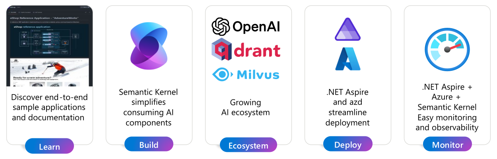
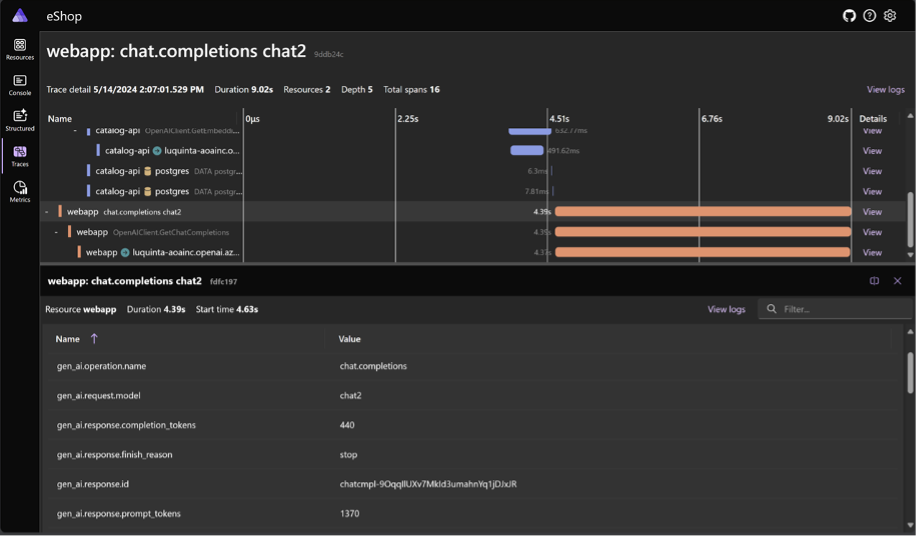
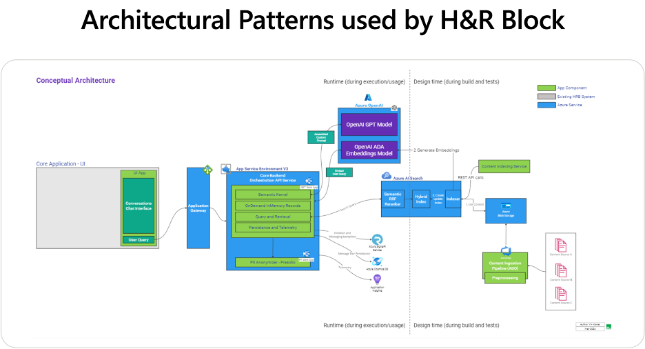

The future of AI is here, and .NET is ready for it! With .NET 8, you can create amazing applications that integrate language models in your new and existing projects. You can go from an idea to a solution using the tools, services and frameworks you love. We’ve made it easier than ever to learn, build, and deploy your LLM (Large Language Model) applications.

At Build 2024, we teamed up with H&R Block to demonstrate how to [Infuse your .NET Apps with AI](https://aka.ms/AAqp2ly). In this post, we’ll give you an overview of .NET and AI as shown in that session – and point you to the [latest samples](https://aka.ms/AAqp2m1), libraries, and our new [documentation hub](https://aka.ms/dotnet-ai-docs) for everything .NET and AI.

## Why should I care about building apps with AI?

If you haven’t started exploring AI solutions yet, here are some compelling reasons to do so:

* **Increasing User Engagement and Retention**: Offer more relevant and satisfying interactions.
* **Boost Productivity and Efficiency**: Reduce errors and save time.
* **Create New Business Opportunities**: Deliver innovative and value-added services.
* **Gaining a Competitive Edge**: Stay ahead of market trends and meet customer expectations.

These are just a few of the many benefits of integrating AI into your solutions. Let's dive into the .NET developer experience today.

## How to get started

If you’re new to AI development, check out the new [.NET + AI documentation and samples](https://aka.ms/dotnet-ai-docs). Included here are also a set of [quickstart guides](https://aka.ms/AAqofiw) that will help you get hands on with the code and try things out for yourself, using Open AI models with the Azure OpenAI SDK, or the Semantic Kernel library., using Open AI models with the Azure OpenAI SDK, or the Semantic Kernel library.

To explore more samples that utilize AI services available in Azure, take a look at the [Azure Developer templates for .NET and AI](https://aka.ms/AAqpz31) that were recently expanded with new examples.

## What is Semantic Kernel and why should I use it?

In many of our samples, you’ll see us using Semantic Kernel  (SK) – SK is an open-source library that lets you easily build AI solutions that can call your existing code. As a highly extensible SDK, you can use Semantic Kernel to work with models from [OpenAI](https://aka.ms/AAqr0cg), [Azure OpenAI](https://aka.ms/AAqq6np), [Hugging Face](https://aka.ms/AAqpz36), and more. You can also connect to popular vector stores like Qdrant, Milivus, Azure AI Search, and a growing list of others.

While you can work with various models and vector stores using their own .NET SDKs and REST endpoints, Semantic Kernel makes it easier to do while minimizing the impact to your code. It provides a common set of abstractions you can use to access models and vector stores using dependency injection in .NET; so, you can swap different components out as you experiment and iterate on your apps.

## Monitoring your application locally and in production

At Build we also demonstrated how to debug and diagnose your AI solutions, including monitoring in production. Semantic Kernel supports end-to-end traceability and debugging of AI calls to help you diagnose performance, quality, and cost. SK builds on top of the [OpenTelemetry (OTLP) protocol](https://aka.ms/AAqq6nv), making it easy to monitor your application using any store or reporting tool that supports it.

[.NET Aspire](https://aka.ms/AAqofj3) also offers robust support for debugging and diagnosing your applications. By building on top of the .NET OpenTelemetry SDK, a .NET implementation of the OpenTelemetry observability framework, .NET Aspire simplifies the configuration of Logging, Tracing, and Metrics. At development time, the .NET Aspire dashboard makes it easy to visualize your logs, traces, and metrics. When it’s time to deploy your application to production, you can leverage tools and services like Prometheus and Azure Monitor.

For more details, see the [.NET Aspire telemetry documentation](https://aka.ms/AAqouwu).

## Build on top of solid AI fundamentals

The .NET runtime and libraries are continuously evolving to more natively embrace the field of artificial intelligence, providing developers with robust tools to build AI applications.  Tokenization libraries streamline the preprocessing of text data, simplifying context management or text preparation for AI model inputs. The recent addition of [Tensor<T>](https://aka.ms/AAqpz3i), a type designed to represent the fundamental data structure of AI, along with TensorPrimitives, a suite of mathematical operations tailored for Tensor types, empowers .NET developers to construct AI applications on a solid and reliable foundation. Over time, these components will be integrated throughout existing libraries such as ML.NET, TorchSharp, and ONNX to enhance efficiencies. At the same time, they will serve as a foundational platform for new libraries to emerge. These advancements ensure that the .NET ecosystem remains at the forefront of the AI revolution, offering a seamless and powerful experience for developers venturing into the world of machine learning and AI.

## AI at the edge with Small Language Models (SLMs)

In recent months, there has been an increase in the availability of Smaller Language Models (SLMs) in the open. At Build 2024, several sessions highlighted models like Phi and Phi-3 Vision, demonstrating their capabilities to run locally and at the edge.  Libraries such as [OnnxRuntime GenAI](https://aka.ms/AAqofjb) empower .NET developers to harness these models, significantly enhancing their ability to architect tailored solutions that align with specific needs. This capability not only democratizes AI technology but also provides developers with the flexibility to design solutions that are optimized for their unique application scenarios, driving innovation and efficiency in AI-powered applications.

## A growing ecosystem of tools to improve your apps

The ecosystem of AI tools and services for .NET developers continues to grow. At Build 2024, several projects were announced that may also be particularly interesting to .NET developers:

* [Official OpenAI library for .NET](https://aka.ms/AAqsirl)
* [Azure Functions OpenAI Bindings](https://learn.microsoft.com/azure/azure-functions/functions-bindings-openai?tabs=isolated-process&pivots=programming-language-csharp)
* [AI Application Templates & Prompty for simplifying prompt tooling](https://techcommunity.microsoft.com/t5/ai-ai-platform-blog/empowering-your-business-with-ai-introducing-ai-application/ba-p/4144399)

There are also some new announcements related to technology that a lot of .NET developers use in our applications:

* [Early Access Preview of Vector Support in Azure SQL Database](https://devblogs.microsoft.com/azure-sql/announcing-eap-native-vector-support-in-azure-sql-database/)
* [Building JavaScript intelligent web apps with the AI Chat Protocol](https://build.microsoft.com/sessions/8c458b1c-691f-4c39-bb75-40c2aa8e7634)

## Who’s building AI solutions using .NET today?

H&R Block has developed an innovative AI Tax Assistant using .NET and Azure OpenAI, to help clients handle their tax-related queries. This assistant simplifies the process by providing personalized advice and clear guidance, enhancing user experience and efficiency. The project showcases the capabilities of .NET in building scalable, AI-driven solutions. This advancement by H&R Block serves as an inspiring example for developers looking to integrate AI into their own applications.

To learn more about how H&R Block’s journey and experience building AI with .NET, check out our session from Build 2024 where we showed how to [Infuse your .NET Apps with AI](https://aka.ms/AAqp2ly).

<iframe width="800" height="450" src="https://www.youtube.com/embed/jrNfKeGSuCg?si=TS2zQsnq949ybErC&amp;start=1762" title="YouTube video player" frameborder="0" allow="accelerometer; autoplay; clipboard-write; encrypted-media; gyroscope; picture-in-picture; web-share" referrerpolicy="strict-origin-when-cross-origin" allowfullscreen></iframe>

## Where can I go to learn more?

Excited to dive in? Here are a few useful links to jump start your learning and connect with our teams:

* [Explore the latest .NET AI documentation](https://aka.ms/dotnet-ai-docs)
* [Join us for a chat in an upcoming .NET AI Community Standup](https://aka.ms/AAqqslz)
* [Share your feedback or let us know what other samples you need](https://aka.ms/AAqr0aj)
* [Talk with our team by filling out a brief survey](https://aka.ms/AAqr08w)
