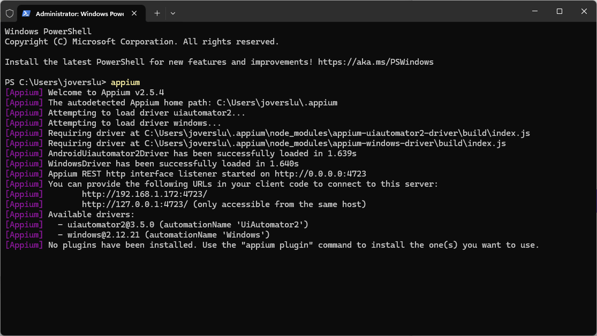
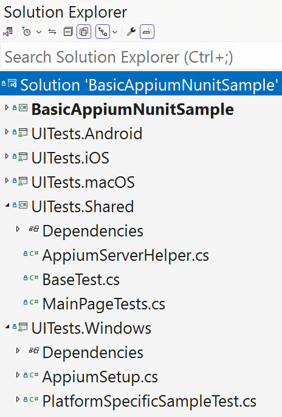
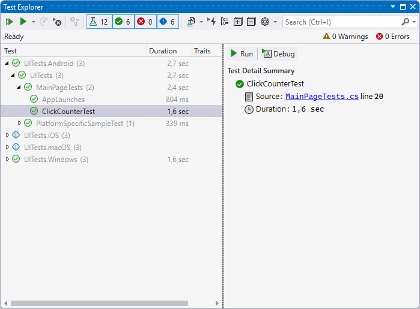

Testing is a crucial part of software development to ensure the quality of your application. While there are many forms of testing, one that is particularly popular is user-interface testing, also known as UI testing. In this blog post we will have a look at how to get started with UI testing your .NET MAUI app, on mobile and desktop, by using Appium.

## What is Appium?

Appium is a UI testing framework that is already around since 2011. A lot has happened since then and today it is available as the go-to framework for writing UI tests for testing native, web and hybrid applications on all kinds of platforms.

The way Appium works is that it will spin up a server process that will start sending the UI interactions to the application that is being tested. In order to send the right interactions, it will use different drivers for each platform. That is why you will have to install a driver for each platform that you will want to test. We will see that in a little bit when we will start writing and running actual tests.

At the level that Appium operates, it does not matter with which framework you app is built. To Appium, your app is just another Android/iOS/Windows/macOS/etc. app whether it was built with platform native tooling or .NET MAUI.

### What Appium isn't

While we use Appium for our testing, Appium only provides a way to interact with the user-interface and facilitates UI testing. It does _not_ provide a way to actually run tests. For this you can use whatever runner you want. For use with .NET this will likely be NUnit or xUnit. Throughout this blog post we will be using NUnit, where applicable I will call out what might be different when you are using another test runner framework.

## Appium & .NET MAUI

For the hands-on example we will be using the UI testing sample that is available on the [Microsoft Learn online samples website](https://learn.microsoft.com/samples/dotnet/maui-samples/uitest-appium-nunit/).

This sample is basically a new .NET MAUI project template that you get when you create a new project in Visual Studio. We will add some simple tests for that.

The important thing to note here is that all the user-interface elements you want to reach from your tests will need to have the `AutomationId` attribute with a (unique) value. Those will be the identifiers that are mapped on the UI controls and make them available to discover and interact with through Appium.

When we apply that to the `Button` that is in the default template for .NET MAUI, the result will look like underneath. Take note of the `CounterBtn` identifier, we will see that one again later when we start writing tests.

```xml
<!-- Note that we added the AutomationId attribute --> 
<Button
    x:Name="CounterBtn"
    AutomationId="CounterBtn"
    Text="Click me" 
    SemanticProperties.Hint="Counts the number of times you click"
    Clicked="OnCounterClicked"
    HorizontalOptions="Fill" />
```

### Install Appium

Before we can actually start writing and running tests, we want to make sure to set up all prerequisites on our machine. The first step for that is to install Appium. In this post the primary focus will be running all of this on Windows. On Windows you can only install and use the Appium drivers for Windows and Android, that means you can only test Windows and Android applications. If you want to test iOS and/or macOS, you will have to run them from macOS with the Appium drivers for iOS and macOS installed. This post will write about running tests from Windows primarily, but where applicable I will try to add the extra steps needed for macOS as well. If something seems to be missing, please let me know in the comments.

Appium is written with Node.js, so the easiest way to bring it in is through npm, which is Node's package manager just like NuGet is for .NET. If you haven't installed Node.js yet on your machine, you can go to [the website](https://nodejs.org/) and download the latest LTS version.

When Node.js is installed, open a terminal window and run `npm i --location=global appium`, that should complete successfully and install Appium on your local machine. Before we go verify that, let's install the drivers for Windows and Android first so we can see if those initialize correctly too.

In order to do that, run these commands: `appium driver install --source=npm appium-uiautomator2-driver` and `appium driver install --source=npm appium-windows-driver`.

Lastly, the Appium Windows driver in turn uses the Windows Application Driver (or WinAppDriver) to send instructions to the Windows app that is being tested. You can install that by going to the [GitHub repository](https://github.com/microsoft/WinAppDriver) for it and downloading the release from there.

**Please note:** you will need to use [version 1.2.1](https://github.com/microsoft/WinAppDriver/releases/tag/v1.2.1) as opposed to the latest (pre-release) version available.

When these are all successfully installed try running `appium` as a command and the result should look similar to the screenshot below.



#### Installing Appium on macOS

As mentioned, running tests on macOS requires some slightly different steps. Just as for Windows, Node.js is a requirement so make sure to install that.

From macOS you can test for iOS, macOS and Android. To install the drivers for that you can install the drivers as listed underneath.
* for iOS use `appium driver install --source=npm appium-xcuitest-driver`
* for macOS use `appium driver install --source=npm appium-mac2-driver`
* for Android use `appium driver install --source=npm appium-uiautomator2-driver`

For running tests on Android, make sure that the `ANDROID_HOME` and/or `ANDROID_SDK_ROOT` environment variables are set properly and pointing to a valid Android SDK location. If you have installed the [.NET MAUI VS Code Extension](https://marketplace.visualstudio.com/items?itemName=ms-dotnettools.dotnet-maui) and followed the installation instructions for Android, this location might be `$HOME/Library/Android/sdk`.

You can now try to start the `appium` command from your Terminal app. This should run successfully. While setting this up I have seen an instance where Appium would tell you about not having write permissions to the `~/.appium` folder. If that is the case, this can be fixed by running `sudo chmod -R 777 ~/.appium`.

With this in place you should be good to run tests on macOS as well.

### .NET MAUI Project Setup

Now lets go back to our actual project. There are many ways to setup your project structures. The most obvious options are to split out the UI test projects per platform, or to make your UI test project a single project for all platforms.

In the .NET MAUI codebase we have split out the UI test projects per platform. However, there was no strong reason to do one or the other. The multi-project setup allows us to run the tests more finegrained through our automated pipelines, however if we would be using the single project approach we'd still be able to do that but differently. So whichever one you prefer will work.

This same approach I have applied to the [sample project](https://github.com/dotnet/maui-samples/tree/main/8.0/UITesting/BasicAppiumNunitSample) that we will use for this blog post. You can see the structure in the screenshot below.



The project named BasicAppiumNunitSample is the .NET MAUI app that is going to get tested. In this example case this is just a new .NET MAUI project as it comes out of the box and we will be adding tests to see if the button increments correctly.

All projects that are prefixed with UITests are the actual testing projects and contain UI tests that will be ran against the .NET MAUI app that is to be tested.

You will notice that all UI test projects are for one specific platform, and then there is the Shared one. If you don't have a need for testing a specific platform you can leave that one out. If you have a need for a specific platform later, you can easily add it then.

Each of the platform projects have a couple of NuGet packages installed:
* [Appium.WebDriver](https://www.nuget.org/packages/Appium.WebDriver); provides a C# Appium client with which we can interact with our app.
* [Microsoft.NET.Test.Sdk](https://www.nuget.org/packages/Microsoft.NET.Test.Sdk); provides integration with the Visual Studio platform and tools.
* [NUnit](https://www.nuget.org/packages/NUnit); provides test running capabilities to run our tests.
* [NUnit3TestAdapter](https://www.nuget.org/packages/NUnit3TestAdapter); provides the integration of NUnit test inside of Visual Studio.

If you want to use another test runner framework (like xUnit) you will want to replace the latter two.

#### Code Sharing Considerations

The Shared project is where you will want to write most, if not all, of your tests. If a test is in there, it will be ran for all the platforms. However, it is good to note that the Shared project is a special type of project. We are using a so-called [NoTargets project](https://github.com/microsoft/MSBuildSdks/blob/main/src/NoTargets/). This type of project produces no assembly of its own. Instead, it acts as a collection of files that are easily accessible from within Visual Studio, including adding, removing and editing capabilities.

In each of the platform-specific projects, there are (invisible) links to the files of this project and these are compiled together with the platform-specific tests. There is no project reference between the shared project and the platform projects. The link is created through the .csproj file for each of the platform projects. This way, all the code ends up in one assembly making it easier to run the UI tests.

Typically, you should not notice any of this or have to worry about it. This does mean however that you will always want to run one of the platform UI test projects. The Shared project cannot be run on its own.

Something that is not very obvious but good to know is that you will want to keep the namespace you're using the same across the testing projects. In case of this sample that is `UITests`, I will go into the why of that in the next section.

#### Platform-Specific Setup

In the screenshot above you can see that the UITests.Windows project has 2 files: AppiumSetup.cs and PlatformSpecificSampleTest.cs. We will get into the latter in a minute, for now let's focus on AppiumSetup. This file is present in each of the platform projects and configures Appium and the Appium driver for that platform.

Find the full code for the Windows implementation below, in the full code some helpful comments are added, those are omitted here for brevity.

```csharp
using NUnit.Framework;

using OpenQA.Selenium.Appium;
using OpenQA.Selenium.Appium.Windows;

namespace UITests;

[SetUpFixture]
public class AppiumSetup
{
	private static AppiumDriver? driver;

	public static AppiumDriver App => driver ?? throw new NullReferenceException("AppiumDriver is null");

	[OneTimeSetUp]
	public void RunBeforeAnyTests()
	{
		AppiumServerHelper.StartAppiumLocalServer();

		var windowsOptions = new AppiumOptions
		{
			AutomationName = "windows",
			PlatformName = "Windows",
			App = "com.companyname.basicappiumsample_9zz4h110yvjzm!App",
		};

		driver = new WindowsDriver(windowsOptions);
	}

	[OneTimeTearDown]
	public void RunAfterAnyTests()
	{
		driver?.Quit();

		AppiumServerHelper.DisposeAppiumLocalServer();
	}
}
```

The main takeaway from this code should be the two methods. You can see those are adorned with the `OneTimeSetUp` and `OneTimeTearDown` attributes. Those come from NUnit. If you would use another test runner framework, those should be different. These attributes mark these methods as part of the test suite setup and tear down. Also notice the `SetUpFixture` attribute at the class level.

Remember how I told you that the namespace is the same across all the different projects. The reason for that is that the `SetupUpFixture` will run for each test fixture in a given namespace. In other words, if they are not in the same namespace, this initialization method will not run and your tests will most likely fail.

The `RunBeforeAnyTests` method will run once before any of the tests are ran and will initialize all that is needed to start running tests on Windows.

In turn the `RunAfterAnyTests` method will run once after all tests have ran.

The `RunBeforeAnyTests` first starts a local Appium server. This is something I have added to this sample to make the tests (and this sample) as self-contained as possible. By using this, you don't need to check if there is a Appium server already running and make sure the configuration matches etc. Code for starting Appium is included and will happen as part of the test run. The code for it can be found in the Shared project under `AppiumServerHelper.cs`. If you decide to run Appium yourself manually, simply remove the `AppiumServerHelper.StartAppiumLocalServer();` line and the `AppiumServerHelper` class from the Shared project.

The more important thing this method does is configure the options needed for our Windows .NET MAUI app and then return the `WindowsDriver` that will be used to actually execute the tests. Note that we set the `App` property to the unique identifier of the app we want to test. That needs to match with whatever you set in your .NET MAUI app so that it knows what app to start.

For other platforms the options will vary a little here, make sure to configure them correctly for each. I have added the bare minumum for each platform, but there are many more options that you can configure to customize the testing experience.

Especially for iOS and Android it will be important to configure what device or emulator/Simulator to use for the tests. Android will typically use whatever emulator is started at the time you run the tests, but you have the ability to specify a specific emulator or even physical device.

The iOS options let you specify an iOS version and device name which can refer to either a specific Simulator or physical device.

Lastly, the `RunAfterAnyTests` will close the Appium driver that we used and shutdown the Appium server if we started one through our helper code in this project. Again, if you do not wish to use that, simply remove the line that disposes the Appium server.

### Writing Tests

All the infrastructure is in place to run our UI tests, time to add some actual tests!

If you remember from the beginning, what we need to do is add the `AutomationId` property to all elements we want to reach from within a test. Since we want to validate that the button increments correctly, we will need to go into the `MainPage.xaml` of our .NET MAUI app and add the `AutomationId` to the button. I have repeated the code below, which is identical to what I showed you above.

```xml
<!-- Note that we added the AutomationId attribute --> 
<Button
    x:Name="CounterBtn"
    AutomationId="CounterBtn"
    Text="Click me" 
    SemanticProperties.Hint="Counts the number of times you click"
    Clicked="OnCounterClicked"
    HorizontalOptions="Fill" />
```

This test should run for every platform we want to test, so I have added a file `MainPageTests.cs` to the Shared project. How you want to structure your tests is completely up to you. Typically a per-page approach tends to work well.

Before we go look at the tests for our `MainPage`, have a look at the `BaseTest.cs`. This is a very simple abstract class that all other test classes can inherit from. By inheriting from this class you will get access to the `App` property which reflects the Appium driver that is being used. On the `App` we can call all kinds of operations we want to do like sending an app to the background, exit the application and even installing or uninstalling it or getting a screenshot of the current state.

Additionally there is a `FindUIElement` method that takes in the identifier you want to get a hold of. In our case, elements that have the `AutomationId` defined. There is a slight difference on how a UI item is found on Windows and other platforms. With the `FindUIElement` method you don't have to make that distinction over and over again. While I chose to make this something on an abstract class, this could have been implemented as an extension method too or even differently altogether.

#### Incrementing Button Test

Let's get back to the actual tests. In the `MainPageTests` class you will find a test `ClickCounterTest`, I have added the code for that below. Make sure to add the `Test` attribute on top of each method so that it is picked up by the test runner.

The `Test` attribute is something specific to NUnit, if you choose a different framework this might be different.

```csharp
[Test]
public void ClickCounterTest()
{
	// Arrange
	// Find elements with the value of the AutomationId property
	var element = FindUIElement("CounterBtn");

	// Act
	element.Click();
	Task.Delay(500).Wait(); // Wait for the click to register and show up on the screenshot

	// Assert
	App.GetScreenshot().SaveAsFile($"{nameof(ClickCounterTest)}.png");
	Assert.That(element.Text, Is.EqualTo("Clicked 1 time"));
}
```

For the tests I'm following the arrange, act, assert pattern. First I'm setting the stage, doing all operations to reach the situation I want to test; arrange. Then doing the actual operation that I want to test; act. And finally I'm going to see if the results of the operations are what I expect them to be; assert.

This code first gets the UI element by the value that we set in its `AutomationId` attribute a little earlier. Once we have a reference, we can call the `Click()` method on it to actually click it.

On all platforms there is some animation when the text of a button is updated, to account for that I have built in a little delay.

Then, I use the `App` object to grab a screenshot and save that to disk so I can collect that later and manually inspect if needed. This is especially handy when you are running multiple tests at once or you're running tests in a pipeline where you can't have a look at the actual screen.

Finally, with the `Assert` we determine that the text on the button is equal to the static string that we expect it to be as a result of our actions.

The `Assert` is something that comes from using NUnit as our runner. If you use something different, asserting the results might work a bit different too.

In the sample project you will find a couple of more tests that don't do much else than taking screenshots.

#### Platform-Specific Tests

This test is in the Shared project and thus will run for all platforms which is typically what you want to do.

If there is a special need for a very platform-specific scenario you can create a class in one of the platform UI test projects and write the tests there.

In the sample project for each platform I have added such a class. The actual test only takes a screenshot, but this will show you how to add platform-specific tests when needed.

### Running Tests

Appium is a framework that can interact with the UI. It does not actually know how to run tests. This means that you can use a test runner of your liking such as NUnit or xUnit. As mentioned earlier, for this sample we used NUnit, but using another test runner that you are familiar with should be self-explanatory.

From here there are roughly two ways to run your tests. Either locally on your machine, where everything will flash across your screen and you can inspect the results. Typically this is what you want to do to verify new tests your writing and implementing and not to run full test suites.

Or, you want to run the tests as part of an automated pipeline where the full test suite runs. This is typically what you want to do in order to keep an eye on the quality of your application and detect regressions as you further develop your functionalities.

For example, the .NET MAUI codebase runs thousands of UI tests in different stages of our builds. This is not something you want to do on your local machine as it will take a long time.

In either case, this assumes that you have everything setup to successfully run the tests. That specifically means that you have for example an Android emulator setup to be used or the iOS Simulator, or that you have hooked up a physical device, etc.

Typically when you are able to develop .NET MAUI apps on your machine, then that machine should also be able to run UI tests.

#### Locally

Running the tests locally is probably very familiar if you have worked with tests before. If you're working from Visual Studio (or VS Code) open the Test Explorer and the tests should show up there are normally. You can then run one test or a specific project or all of them. Below you can see a screenshot of the Test Explorer in Visual Studio 2022 that shows the tests in our sample setup.



Another way to run the tests is through the command-line.

#### Part of Automated Pipelines

Everything that is described above can be automated to run as part of your automated build pipelines.

One important thing to note here is that there is some work involved with setting up the environment. As mentioned earlier, you will have to make sure that a device with the right configuration is available to run the tests on. Specifically for iOS and Android this can be a bit of a chore to get right.

Depending on what system you run your automated pipelines on and how much control you have over the build agents it might be tricky to setup, but it can absolutely be done. Once you have, running the tests can be done through the command-line with `dotnet test` as shown above.

The whole setup is a bit out of scope for this post, but feel free to express your interest in the comments and I'll consider dedicating a post to that entirely!

##### GitHub Action Runners

In preparation of this blog post I have tried setting up an automated pipeline by only using the basic tier GitHub Action runners for the [Plugin.Maui.UITestHelpers](https://github.com/jfversluis/Plugin.Maui.UITestHelpers) project. As a side-note, this project might be helpful if you're going to look into UI testing as it has all kinds of helpers to support you. Maybe more on this in a separate blog post in the future.

The GitHub Action runners have mostly everything installed to run your UI tests on the iOS Simulator, the Android emulator or just on the macOS & Windows desktop. They do not have the possibility for physical iOS and Android devices, so you will have to settle for Simulators and emulators, which is still better than nothing.

While I was able to get it running on all platforms, the solution is not perfect. Especially iOS was problematic. The macOS runners are great for running builds, but a bit underpowered for tasks like UI testing. Additionally, from what I could tell I might have run into an iOS Simulator bug that significantly impacted the running time of the tests. Or rather, the setting up the infrastructure for the tests. Installing and booting a Simulator would take up a significant amount of time.

At some point I got it all to run with the latest Xcode (at the time) and iOS Simulator, the full run for 2 tests, the really basic ones from above, took 90 minutes. The actual running of the tests took 2 seconds. You can imagine this is not ideal.

Of course, at some point this is going to balance out as you have more tests, but still this is a lot of overhead. Switching to an earlier version of the iOS runtime already cut the time in half and made the full run 30-45 minutes in total.

In comparison, the full run for Android, Windows and macOS take 15 minutes, 7 minutes and 5 minutes respectively.

Lastly, trying to trim down the iOS testing running time, I have set up my [self-hosted runner](https://docs.github.com/actions/hosting-your-own-runners), with that the full run took about 5 minutes, which is much more realistic. Another advantage is that you now have full control over the prerequisites and its versions of that runner. Which, of course, can also be a disadvantage because you will have to do the updates of that yourself.

I didn't test the self-hosted runner for the other platforms, but based of the iOS results I would assume that the total running time would go down for testing Android, Windows and macOS as well.

All things considered I think if you want to get serious about running this in an automated fashion either consider self-hosted runners or using a specialized service which I'll write about in the next section.

One thing I was not able to test was the [GitHub large runners](https://docs.github.com/actions/using-github-hosted-runners/about-larger-runners) which have a bit more power, but then also come at more cost. This might still be an option if you still want to take this route but not manage a runner (or runners) yourself.

#### Specialized (UI) Testing Services

There are also specialized services that you can leverage for this. Those do not only allow you to run the UI tests in an automated fashion, but might also enable you to run the tests on actual physical devices in all kinds of combinations which is really powerful.

One of those services is BrowserStack and their solution: App Automate. This service offers running UI tests for your native and hybrid apps on physical devices in the cloud. By using actual, physical devices, the tests come as close to being used in real-world scenarios as possible.

Setting up and running with BrowserStack is very easy, but a bit out of scope for this blog post, which is long enough as it is. If this is something you'd like to learn more about, please let us know in the comments so we can follow up on that with a next post.

With a service like BrowserStack's App Automate, you don't have to rely on hosted build agents and emulator setup, just build your app as usual, upload that together with your tests to BrowserStack and they can run it on a variety of physical devices with different configurations in a fraction of the time.

## Summary

Adding UI tests to your app development is a really powerful tool. It will help you deliver better quality apps with less regressions and helps you release your apps with confidence.

Implementing user-interface testing for your .NET MAUI app is a breeze. Use your favorite test runner framework like NUnit or xUnit and then add Appium in the mix which is a proven, solid UI test framework that just works.

All of that integrates nicely with what Visual Studio offers out of the box so that you can start implementing and debugging tests with help of the Test Explorer or `dotnet test` just as you're used to for other types of testing.

The really cool thing is that all of this is based of what we are doing in the [.NET MAUI codebase](https://github.com/dotnet/maui). So if you want to see this running at scale or need some inspiration, deep-dive into the .NET MAUI repository and see for yourself.

In this post we have learned how to get started with implementing UI tests and running them locally. There is much more to explore: running tests on physical devices, locally or in the cloud and of course all kinds of things to do with the actual UI tests. Please let us know if anything is unclear or what you would like to see in follow up posts!
