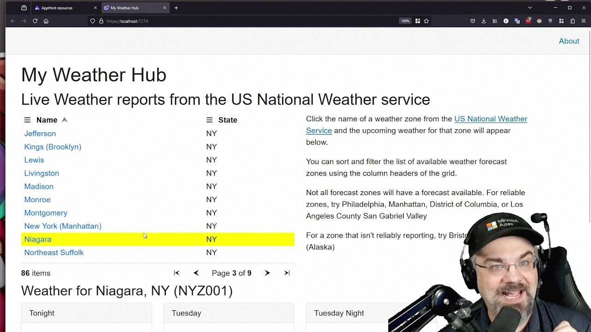

[Let's Learn .NET](https://aka.ms/letslearndotnet) is our world-wide live learning event. Over the last 3 years, developers from around the world have joined team members to learn about the latest .NET technologies and follow along with a live workshop on how to use it! Best of all the Let's Learn .NET events are hosted in local time zones and languages across the globe.

We are kicking off our next entry in the series, Let's Learn .NET Aspire, where you will learn all about the new cloud ready stack for building observable, production ready, distributed application with .NET. Best yet, you will learn how to integrate .NET Aspire into your existing .NET applications and see how it can give you better insight through observability, management through orchestration, and how to easily integrate new components as your application grows.

We are providing a [full collection]( https://aka.ms/letslearn/dotnet/aspire) for the 2 hour event that gives you everything you need to start your .NET Aspire journey.

## Grab the workshop

The first thing that you will want to do is grab our [full workshop](https://github.com/dotnet-presentations/letslearn-dotnet-aspire) and clone it from GitHub to your local development machine. This repo will give you everything you need including the start and finish projects for the workshop, workshop guides for each step, and the full presentation that you can at any time.

This is an all-new workshop where you'll be building out a weather browser with a Blazor front-end, interacting with live weather data.



## Setup your development machine

This workshop will be using the following tools:

- [.NET 8 SDK](https://dot.net/download)
- [.NET Aspire Workload](https://learn.microsoft.com/dotnet/aspire/fundamentals/setup-tooling?tabs=dotnet-cli%2Cunix#install-net-aspire)
- [Docker Desktop](https://docs.docker.com/engine/install/) or [Podman](https://podman.io/getting-started/installation)
- [Visual Studio 2022](https://visualstudio.microsoft.com/vs/) or [Visual Studio Code](https://code.visualstudio.com/) with [C# DevKit](https://code.visualstudio.com/docs/csharp/get-started)

For the best experience, we recommend using Visual Studio 2022 with the .NET Aspire workload. However, you can use Visual Studio Code with the C# Dev Kit and .NET Aspire workload. Below are setup guides for each platform.

### Windows with Visual Studio

- Install [Visual Studio 2022 version 17.10 or newer](https://visualstudio.microsoft.com/vs/).
  - Select the following workloads:
    - `ASP.NET and web development` workload.
    - `.NET Aspire SDK` component in `Individual components`.

### Mac, Linux, & Windows without Visual Studio
- Install the latest [.NET 8 SDK](https://dot.net/download?cid=eshop)
- Install the [.NET Aspire workload](https://learn.microsoft.com/dotnet/aspire/fundamentals/setup-tooling?tabs=dotnet-cli%2Cunix#install-net-aspire) with the following commands:

```powershell
dotnet workload update
dotnet workload install aspire
```

> Note: These commands may require `sudo`

### Codespaces & Dev Containers

In addition to getting your local development machine set up, the GitHub repo also provides a full Dev Container that you can use locally inside of VS Code or through GitHub Codespaces!

## Join us live!

With your development machine setup you will be ready to join us live at any one of our upcoming Let's Learn .NET Aspire events!

Things all start this [Thursday, June 27th 2024 at 9AM Pacific](https://www.youtube.com/watch?v=8i3FaHChh20&list=PLdo4fOcmZ0oVGRpRwbMhUA0KAvMA2mLyN&index=5) with the one and only Jeff Fritz aka CSharpFritz!

<iframe width="800" height="450" src="https://www.youtube.com/embed/8i3FaHChh20?si=k_i9kljbOzr-1RS1" title="YouTube video player" frameborder="0" allow="accelerometer; autoplay; clipboard-write; encrypted-media; gyroscope; picture-in-picture; web-share" referrerpolicy="strict-origin-when-cross-origin" allowfullscreen></iframe>

After this main event presented in English, the world-wide tour of Let's Learn .NET Aspire kicks off:

* [June 28th, 2024 - French](https://www.youtube.com/watch?v=jJiqqVPDN4w&list=PLdo4fOcmZ0oVGRpRwbMhUA0KAvMA2mLyN&index=3) with Frank Boucher
* [July 1st, 2024 - Korean](https://www.youtube.com/watch?v=rTpNgMaVM6g&list=PLdo4fOcmZ0oVGRpRwbMhUA0KAvMA2mLyN&index=2) with Jinseok Kim and Gusam Park
* [July 10th, 2024 - Portuguese](https://www.youtube.com/watch?v=PUCU9ZOOgQ8&list=PLdo4fOcmZ0oVGRpRwbMhUA0KAvMA2mLyN&index=0) with Jorge Arteiro and Alexandre Costa
* [July 10th 2024 - Japanese](https://www.youtube.com/watch?v=Cm7mqHZJIgc&list=PLdo4fOcmZ0oVGRpRwbMhUA0KAvMA2mLyN&index=2) with Kazuku Ota and Miho Kurmimoto


New Let's Learn .NET Aspire world-wide events will be announced soon, so check back and be sure to subscribe to [.NET on YouTube](https://youtube.com/@dotnet). Hope to see you at an upcoming event!