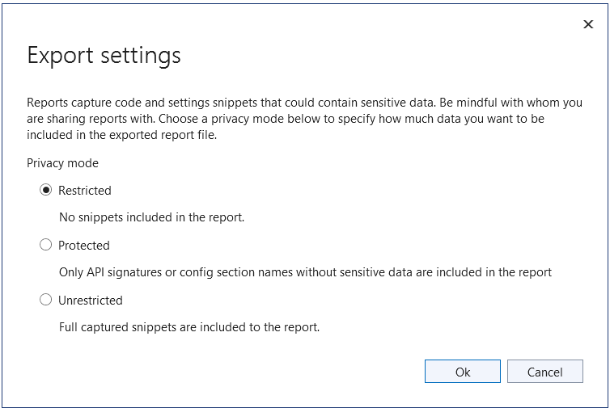

Recently, both [.NET Upgrade Assistant](https://learn.microsoft.com/dotnet/core/porting/upgrade-assistant-overview) and [Azure Migrate application and code assessment for .NET](https://learn.microsoft.com/azure/migrate/appcat/dotnet) have had updates improving privacy and security as well as adding some useful new features. 

.NET Upgrade Assistant helps upgrade solutions to newer versions of .NET. Whether you're upgrading from .NET Framework to .NET 8 or just between .NET Core versions (from .NET 6 or 7 to .NET 8 or 9), .NET Upgrade Assistant can help you understand what changes are needed and will automate many of the changes for you. .NET Upgrade Assistant is available as a [Visual Studio extension](https://marketplace.visualstudio.com/items?itemName=ms-dotnettools.upgradeassistant) or as a [command-line tool](https://www.nuget.org/packages/upgrade-assistant).

Azure Migrate application and code assessment helps you understand what changes may be necessary in an application to re-platform it to an Azure platform-as-a-service environment like Azure App Service, Azure Kubernetes Service, or Azure Container Apps. The tool's reports highlight issues in your app's code and configuration that may need to be addressed before moving from on-premises to Azure. The tool doesn't automate code changes, but integration with GitHub Copilot Chat means that Copilot can guide you through reviewing and addressing issues. Azure Migrate application and code assessment is also available as a [Visual Studio extension](https://marketplace.visualstudio.com/items?itemName=ms-dotnettools.appcat) or as a [command-line tool](https://www.nuget.org/packages/dotnet-appcat).

In this post, we'll take a look at the two improvements that apply to both of these tools.

## Installing per-user

One of the changes is that the tools' Visual Studio extensions now install on a per-user basis so there's no requirement for elevated admin permissions to install. This addresses a need voiced by some users who don't have admin permissions on their dev machines. 

Because the extensions were previously installed with admin privileges, in some situations users who have older versions of the extensions may need to uninstall them before installing the new versions. In most cases, the extensions should update automatically. However, if you have previously installed both .NET Upgrade Assistant and Azure Migrate application and code assessment extensions, you may find that you need to uninstall them before installing the new versions. This is a one-time requirement to move to the per-user versions of the extensions and won't be required for future updates.

## Privacy improvements in reports

To help protect user data, both .NET Upgrade Assistant and Azure Migrate application and code assessment now require users to opt-in if they want to include code snippets from analyzed projects in reports generated by the tools. Having a few lines of code embedded in a report to demonstrate an issue can be very helpful, but sometimes users want a report that they can share without worrying about sharing potentially sensitive source code. With this change, it's up to the user to decide whether to embed code snippets in reports or not. And, by default, the snippets will be left out.

You'll notice that code snippets are still available in the Visual Studio UI for both tools so that developers can easily see what code from the analyzed solution triggered a particular issue. But when exporting a report, there will be a new dialog asking the user to choose between `Restricted`, `Protected`, and `Unrestricted` privacy mode export settings. 

* The `Restricted` option will exclude code snippets from the report and only include issue descriptions and line numbers where issues were found. 
* The `Protected` option will additionally include which specific .NET APIs were used but will not include any snippets of user code.
* The `Unrestricted` option will have the same behavior as before, including code snippets in the report that demonstrate the issues.

*Choosing an export setting in Azure Migrate application and code assessment*

When using the command line version of the tools, the tools will prompt you to choose a privacy mode. Alternatively, you can use the `analyze` command's new `--privacyMode` parameter to specify which mode to use.

## Wrap-up

With more control over what is included in reports and an easier Visual Studio installation experience, the latest versions of .NET Upgrade Assistant and Azure Migrate application and code assessment should be simpler than ever to get started with. To learn more, check out docs for [.NET Upgrade Assistant](https://learn.microsoft.com/dotnet/core/porting/upgrade-assistant-overview) and [Azure Migrate application and code assessment for .NET](https://learn.microsoft.com/azure/migrate/appcat/dotnet).
