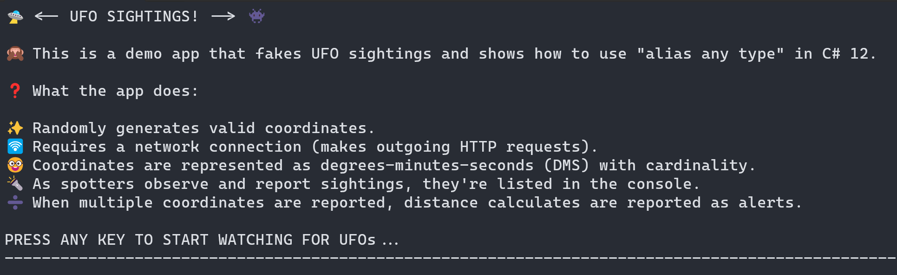
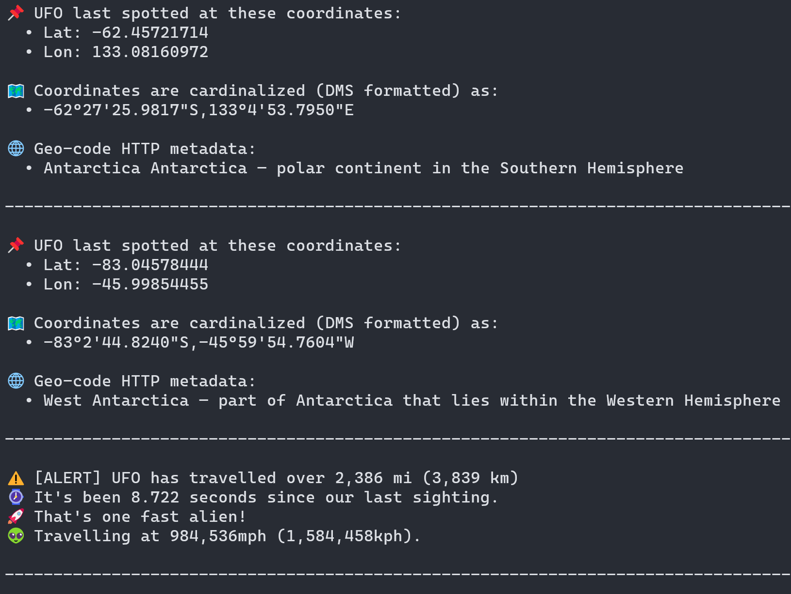
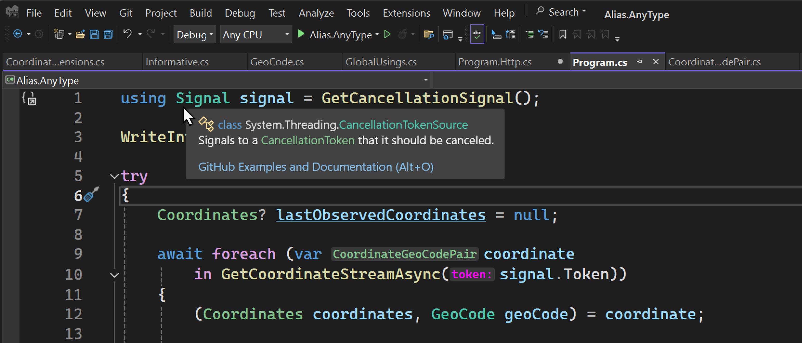
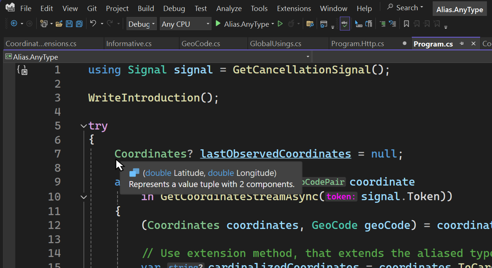

This post is the third in a series of four posts, exploring various C# 12 features. In this post, we'll dive into the "alias any type" feature, which allows you to create an alias for any type with the `using` directive. This series is really starting to shape up nicely:

1. [Refactor your C# code with primary constructors](https://devblogs.microsoft.com/dotnet/csharp-primary-constructors-refactoring/)
1. [Refactor your C# code with collection expressions](https://devblogs.microsoft.com/dotnet/refactor-your-code-with-collection-expressions/)
1. Refactor your C# code by aliasing any type (this post)
1. Refactor your C# code to use default lambda parameters

All of these features continue our journey to make our code more readable and maintainable, and these are considered "Everyday C#" features that developers should know. Let's dive in!

## Alias Any Type *️⃣

C# 12 introduced the ability to _alias any type_ with the `using` directive. This feature allows you to specify aliases that map to other types. This includes tuple types, pointer types, array types, and even non-open generic types, all of which are then available in your code. This feature is especially useful:

- When working with long or complex type names.
- When you need to disambiguate types and resolve potential naming conflicts.
- When defining value tuple types that you intend to share in an assembly.
- When you want to add clarity to your code by using more descriptive names.

The official C# documentation is great at providing many examples of how to use this feature, but rather than repeating those samples here, I decided to write a demo app that exemplifies various aspects of the feature.

[alert type="info" heading="Nullable reference types"]

This feature supports most types, with the single exception of nullable reference types. That is, you cannot alias a _nullable reference type_, and the C# compiler reports an error of CS9132: Using alias cannot be a nullable reference type. The following bits were lifted from the feature specification to help clarify this point:

```csharp
// This is not legal.
// Error CS9132: Using alias cannot be a nullable reference type
using X = string?;

// This is legal.
// The alias is to `List<...>` which is itself not a nullable
// reference type itself, even though it contains one as a type argument.
using Y = System.Collections.Generic.List<string?>;

// This is legal.
// This is a nullable *value* type, not a nullable *reference* type.
using Z = int?;
```

[/alert]

## Sample App: UFO Sightings 🛸

The demo app is available on GitHub at [`IEvangelist/alias-any-type`](https://github.com/IEvangelist/alias-any-type). It's a simple console app that emulates [unidentified flying object (UFO)][ufos] sightings. If you want to follow along locally, you can do so with any of the following methods in a working directory of your choice:

**Using the Git CLI:**

```bash
git clone https://github.com/IEvangelist/alias-any-type.git
```

**Using the GitHub CLI:**

```bash
gh repo clone IEvangelist/alias-any-type
```

**Download the zip file:**

If you'd rather download the source code, a zip file is available at the following URL:

- [IEvangelist/alias-any-type source zip][source-zip]

To run the app, from the root directory execute the following .NET CLI command:

```bash
dotnet run --project ./src/Alias.AnyType.csproj
```

When the app starts, it prints an introduction to the console—and waits for user input before continuing.



After pressing any key, for example the <kbd>Enter</kbd> key, the app randomly generates valid coordinates (latitude and longitude), then using said coordinates retrieves geo-code metadata related to the coordinates. The coordinates are represented in degrees-minutes-seconds format (including cardinality). And when the app is running, distances between the generated coordinates are calculated and reported as UFO sightings.



To stop the app, press the <kbd>Ctrl</kbd> + <kbd>C</kbd> keys.

While this app is simple, it does include other bits of C# that aren't necessarily relevant to our focus for this post. I'll be sure to keep peripheral topics light, but touch on them when I think they're important.

## Code Walkthrough 👀

We'll use this section to walk the codebase together. There are several interesting aspects of the code that I'd like to highlight, including the project file, _GlobalUsings.cs_, some extensions, and the _Program.cs_ file. Of the code available, there's a few things that we're not going to cover, for example the response models and several of the utilitarian methods.

```plaintext
└───📂 src
     ├───📂 Extensions
     │    └─── CoordinateExtensions.cs
     ├───📂 ResponseModels
     │    ├─── GeoCode.cs
     │    ├─── Informative.cs
     │    └─── LocalityInfo.cs
     ├─── Alias.AnyType.csproj
     ├─── CoordinateGeoCodePair.cs
     ├─── GlobalUsings.cs
     ├─── Program.cs
     ├─── Program.Http.cs
     └─── Program.Utils.cs
```

Let's start by looking at the project file:

```xml
<Project Sdk="Microsoft.NET.Sdk">

  <PropertyGroup>
    <OutputType>Exe</OutputType>
    <TargetFramework>net8.0</TargetFramework>
    <ImplicitUsings>enable</ImplicitUsings>
    <Nullable>enable</Nullable>
  </PropertyGroup>

  <ItemGroup>
    <Using Include="System.Console" Static="true" />

    <Using Include="System.Diagnostics" />
    <Using Include="System.Net.Http.Json" />
    <Using Alias="AsyncCancelable"
           Include="System.Runtime.CompilerServices.EnumeratorCancellationAttribute" />
    <Using Include="System.Text" />
    <Using Include="System.Text.Json.Serialization" />
    <Using Include="System.Text.Json" />
  </ItemGroup>

</Project>
```

The first thing to note here, is that the `ImplicitUsings` property is set to `enable`. This feature has been around since C# 10 and it enables the target SDK (in this case the `Microsoft.NET.Sdk`) to implicitly include a set of namespaces by default. Different SDKs include different default namespaces, for more information, see the [Implicit using directives][implicit-using] documentation.

### Implicit Using Directives 📜

The `ImplicitUsing` element is a feature of MS Build, whereas the `global` keyword is a feature of C# the language. Since we've opted into [_global using_ functionality][global-using], we can also take advantage of this feature by adding our own directives. One way to add these directives is by adding [`Using` elements][using] within an `ItemGroup`. Some using directives are added with the `Static` attribute set to `true`, which means all of their `static` members are available without qualification—more on this later. The `Alias` attribute is used to create an alias for a type, in this example we've specified an alias of `AsyncCancelable` for the `System.Runtime.CompilerServices.EnumeratorCancellationAttribute` type. In our code, we can now use `AsyncCancelable` as a type alias for `EnumeratorCancellation` attribute. The other `Using` elements create non-static and non-aliased `global using` directives for their corresponding namespaces.

### An Emerging Pattern 🧩

We're starting to see a common pattern emerge in modern .NET codebases where developers define a _GlobalUsings.cs_ file to encapsulate all (or most) using directives into a single file. This demo app follows this pattern, let's take a look at the file next:

```csharp
// Ensures that all types within these namespaces are globally available.
global using Alias.AnyType;
global using Alias.AnyType.Extensions;
global using Alias.AnyType.ResponseModels;

// Expose all static members of math.
global using static System.Math;

// Alias a coordinates object.
global using Coordinates = (double Latitude, double Longitude);

// Alias representation of degrees-minutes-second (DMS).
global using DMS = (int Degree, int Minute, double Second);

// Alias representation of various distances in different units of measure.
global using Distance = (double Meters, double Kilometers, double Miles);

// Alias a stream of coordinates represented as an async enumerable.
global using CoordinateStream = System.Collections.Generic.IAsyncEnumerable<
    Alias.AnyType.CoordinateGeoCodePair>;

// Alias the CTS, making it simply "Signal".
global using Signal = System.Threading.CancellationTokenSource;
```

Everything in this file is a `global using` directive, making the alias types, static members, or namespaces available throughout the entire project. The first three directives are for common namespaces, which are used in multiple places throughout the app. The next directive is a `global using static` directive for the `System.Math` namespace, which makes all of static members of `Math` available without qualification. The remaining directives are `global using` directives that create aliases for various types, including several tuples, a stream of coordinates, and a `CancellationTokenSource` that's now simply referable via `Signal`.

One thing to consider is that when you define a tuple alias type, you can easily pivot later to a `record` type if you need to add behavior or additional properties. For example, later on you might determine that you'd really like to add some functionality to the `Coordinates` type, you could easily change it to a `record` type:

```csharp
namespace Alias.AnyType;

public readonly record struct Coordinates(
    double Latitude, 
    double Longitude);
```

When you define an alias, you're not actually creating a type, but rather a name that refers to an existing type. In the case of defining tuples, you're defining the shape of a _value tuple_. When you alias an array type, you're not creating a new array type, but rather aliases the type with perhaps a more descriptive name. For example, when I define an API that returns an `IAsyncEnumerable<CoordinateGeoCodePair>`, that's a lot to write. Instead, I can now refer to it the return type as `CoordinateStream` throughout my codebase.

### Referencing Aliases 📚

There were several aliases defined, some in the project file and others in the _GlobalUsings.cs_ file. Let's look at how these aliases are used in the codebase. The start by looking at the top-level _Program.cs_ file:

```csharp
using Signal signal = GetCancellationSignal();

WriteIntroduction();

try
{
    Coordinates? lastObservedCoordinates = null;

    await foreach (var coordinate
        in GetCoordinateStreamAsync(signal.Token))
    {
        (Coordinates coordinates, GeoCode geoCode) = coordinate;

        // Use extension method, that extends the aliased type.
        var cardinalizedCoordinates = coordinates.ToCardinalizedString();

        // Write UFO coordinate details to the console.
        WriteUfoCoordinateDetails(coordinates, cardinalizedCoordinates, geoCode);

        // Write travel alert, including distance traveled.
        WriteUfoTravelAlertDetails(coordinates, lastObservedCoordinates);

        await Task.Delay(UfoSightingInterval, signal.Token);

        lastObservedCoordinates = coordinates;
    }
}
catch (Exception ex) when (Debugger.IsAttached)
{
    // https://x.com/davidpine7/status/1415877304383950848
    _ = ex;
    Debugger.Break();
}
```

The preceding code snippet shows how the `Signal` alias is used to create a `CancellationTokenSource` instance. As you may know, the `CancellationTokenSource` class is an implementation of `IDisposable`, that's why we can use the `using` statement to ensure that the `Signal` instance is properly disposed of when it goes out of scope. Your IDE understands these aliases, and when you hover over them, you'll see the actual type that they represent. Consider the following screen capture:



The introduction is written to the console from the `WriteIntroduction` call, just before entering a `try / catch`. The `try` block contains an `await foreach` loop that iterates over an `IAsyncEnumerable<CoordinateGeoCodePair>`. The `GetCoordinateStreamAsync` method is defined in a separate file. I find myself leveraging `partial class` functionality more often when I write top-level programs, as it helps to isolate concerns. All of the HTTP-based functionality is defined in the _Program.Http.cs_ file, let's focus on the `GetCoordinateStreamAsync` method:

```csharp
static async CoordinateStream GetCoordinateStreamAsync(
    [AsyncCancelable] CancellationToken token)
{
    token.ThrowIfCancellationRequested();

    do
    {
        var coordinates = GetRandomCoordinates();

        if (await GetGeocodeAsync(coordinates, token) is not { } geoCode)
        {
            break;
        }

        token.ThrowIfCancellationRequested();

        yield return new CoordinateGeoCodePair(
            Coordinates: coordinates, 
            GeoCode: geoCode);
    }
    while (!token.IsCancellationRequested);
}
```

You'll notice that it returns the `CoordinateStream` alias, which is an `IAsyncEnumerable<CoordinateGeoCodePair>`. It accepts an `AsyncCancelable` attribute, which is an alias for the `EnumeratorCancellationAttribute` type. This attribute is used to decorate the cancellation token such that it's used in conjunction with `IAsyncEnumerable` to support cancellation. While cancellation isn't requested, the method generates random coordinates, retrieves geo-code metadata, and yields a new `CoordinateGeoCodePair` instance. The `GetGeocodeAsync` method requests the geo-code metadata for the given coordinates, and if successful, it returns the `GeoCode` response model. For example, Microsoft Campus has the following coordinates:

```http
GET /data/reverse-geocode-client?latitude=47.637&longitude=-122.124 HTTP/1.1
Host: api.bigdatacloud.net
Scheme: https
```

To see the JSON, open this [link in your browser](https://api.bigdatacloud.net/data/reverse-geocode-client?latitude=47.637&longitude=-122.124). The `CoordinateGeoCodePair` type is not aliased, but it's a `readonly record struct` that contains a `Coordinates` and a `GeoCode`:

```csharp
namespace Alias.AnyType;

internal readonly record struct CoordinateGeoCodePair(
    Coordinates Coordinates,
    GeoCode GeoCode);
```

Going back to the `Program` class, when we're iterating each coordinate geo-code pair, we deconstruct the tuple into `Coordinates` and `GeoCode` instances. The `Coordinates` type is an alias for a tuple of two `double` values representing the latitude and longitude. Again, hover over this type in your IDE to quickly see the type, consider the following screen capture:



The `GeoCode` type is a response model that contains information about the geo-code metadata. We then use an extension method to convert the `Coordinates` to a cardinalized string, which is a string representation of the coordinates in degrees-minutes-seconds format. I personally, love how easy it is to use aliases throughout your codebase. Let's look at some of the extension methods that extend or return aliased types:

```csharp
internal static string ToCardinalizedString(this Coordinates coordinates)
{
    var (latCardinalized, lonCardinalized) = (
        FormatCardinal(coordinates.Latitude, true),
        FormatCardinal(coordinates.Longitude, false)
    );

    return $"{latCardinalized},{lonCardinalized}";

    static string FormatCardinal(double degrees, bool isLat)
    {
        (int degree, int minute, double second) = degrees.ToDMS();

        var cardinal = degrees.ToCardinal(isLat);

        return $"{degree}°{minute}'{second % 60:F4}\"{cardinal}";
    }
}
```

This extension method, extends the `Coordinates` alias type and return a string representation of the coordinates. It uses the `ToDMS` extension method to convert the latitude and longitude to degrees-minutes-seconds format. The `ToDMS` extension method is defined as follows:

```csharp
internal static DMS ToDMS(this double coordinate)
{
    var ts = TimeSpan.FromHours(Abs(coordinate));

    int degrees = (int)(Sign(coordinate) * Floor(ts.TotalHours));
    int minutes = ts.Minutes;
    double seconds = ts.TotalSeconds;

    return new DMS(degrees, minutes, seconds);
}
```

If you recall, the `DMS` alias is a tuple of three values representing degrees, minutes, and seconds. The `ToDMS` extension method takes a `double` value and returns a `DMS` tuple. The `ToCardinal` extension method is used to determine the cardinal direction of the coordinate, returning either `N`, `S`, `E`, or `W`. The `Abs`, `Sign`, and `Floor` methods are all static members of the `System.Math` namespace, which is aliased in the _GlobalUsings.cs_ file.

Beyond that, the app displays the UFO sighting details to the console, including the coordinates, geo-code metadata, and the distance traveled between sightings. This occurs on repeat, until the user stops the app with a <kbd>Ctrl</kbd> + <kbd>C</kbd> key combination.

## Next steps 🚀

Be sure to try this out in your own code! Check back soon for the last post in the series, where we'll explore default lambda parameters. To continue learning more about this feature, checkout the following resources:

- [C# using directive: using alias][using-alias]
- [Allow using alias directive to reference any kind of Type][using-alias-types]
- [Tuple types (C# reference)][value-tuples]
- [MSBuild reference for .NET SDK projects: Enable `ImplicitUsings`][sdk-implicit]

[global-using]: https://learn.microsoft.com/dotnet/csharp/language-reference/keywords/using-directive#global-modifier
[implicit-using]: https://learn.microsoft.com/dotnet/core/project-sdk/overview#implicit-using-directives
[sdk-implicit]: https://learn.microsoft.com/dotnet/core/project-sdk/msbuild-props#implicitusings
[source-zip]: https://github.com/IEvangelist/alias-any-type/archive/refs/heads/main.zip
[ufos]: https://en.wikipedia.org/wiki/Unidentified_flying_object
[using-alias-types]: https://learn.microsoft.com/dotnet/csharp/language-reference/proposals/csharp-12.0/using-alias-types
[using-alias]: https://learn.microsoft.com/dotnet/csharp/language-reference/keywords/using-directive#using-alias
[using]: https://learn.microsoft.com/dotnet/core/project-sdk/msbuild-props#using
[value-tuples]: https://learn.microsoft.com/dotnet/csharp/language-reference/builtin-types/value-tuples
