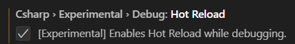
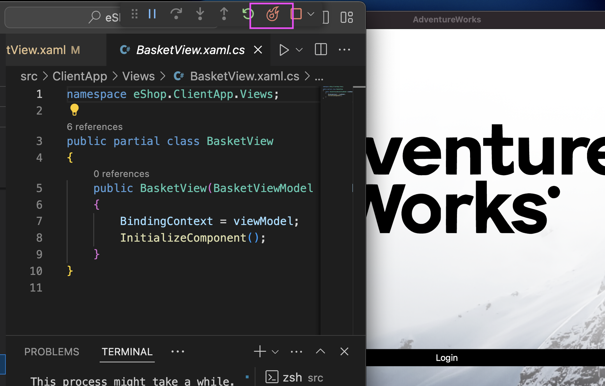

Today, we're thrilled to announce that the .NET MAUI VS Code extension is out of preview, and includes some long-awaited new features - including XAML IntelliSense and Hot Reload!

## What is the .NET MAUI extension?

The [.NET MAUI extension](https://aka.ms/mauidevkit-marketplace) brings the tools you need to develop .NET MAUI apps into the lightweight Visual Studio Code experience. It's built on top of [C# Dev Kit](https://marketplace.visualstudio.com/items?itemName=ms-dotnettools.csdevkit) and the [C# extension](https://marketplace.visualstudio.com/items?itemName=ms-dotnettools.csharp), which bring in a Solution Explorer, C# Hot Reload, powerful C# IntelliSense, and much more. The .NET MAUI extension adds the ability to target mobile and desktop devices, plus - with the latest releases of the extensions - XAML IntelliSense and XAML Hot Reload, while keeping your VS Code experience streamlined and simple.

## New & improved XAML editing experience

The Preview version of the .NET MAUI extension shipped with basic XAML syntax highlighting and completions, but it was far from the full experience we wanted to deliver. Over the past year, we've modernized the existing XAML Language Service in Visual Studio, packaged it up, and brought it over to VS Code for your .NET MAUI development. This addition, which also works with Copilot, gives you intelligent autocomplete, helpful tooltips, and seamless code navigation while you create your UIs.

[video src="https://devblogs.microsoft.com/dotnet/wp-content/uploads/sites/10/2024/06/IntellisenseDemo.mp4" width="1920" height="1202"]

## Hot Reload is here 🔥

Being able to edit your code without restarting your app is one of the most powerful productivity features that .NET developers have. With the latest release, you can now Hot Reload edits to your C# and XAML files in Visual Studio Code. XAML Hot Reload is already enabled - simply edit your XAML while the app is running, and watch the changes automatically reflect in your UI!

[video src="https://devblogs.microsoft.com/dotnet/wp-content/uploads/sites/10/2024/06/XAML-hot-reload.mp4" width="1920" height="1180"]

C# Hot Reload is still in an experimental state, but you can turn it on by opening VS Code Settings (**CTRL/CMD + SHIFT + ,**), searching "hot reload", and checking the box for "[Experimental] Enables Hot Reload while debugging".

Then, edit your C# and save or press the fire icon in the debug toolbar to apply your changes!

## Get started today

Today’s release is a great milestone in our VS Code journey, but we aren't done yet! We'll continue to listen to your feedback and work toward improved performance, reliability, and added features to make your .NET MAUI app development more streamlined. To file a bug or share a suggestion, you can use the **Help > Report Issue** dialog in VS Code. Just like C# and C# Dev Kit, we will release on a monthly cadence with a weekly update in the prerelease channel.

To start using the extension, you can read our [Getting Started Guide](https://aka.ms/mauidevkit-docs) or [download the extension](https://aka.ms/mauidevkit-marketplace) and follow the walkthrough in VS Code!
