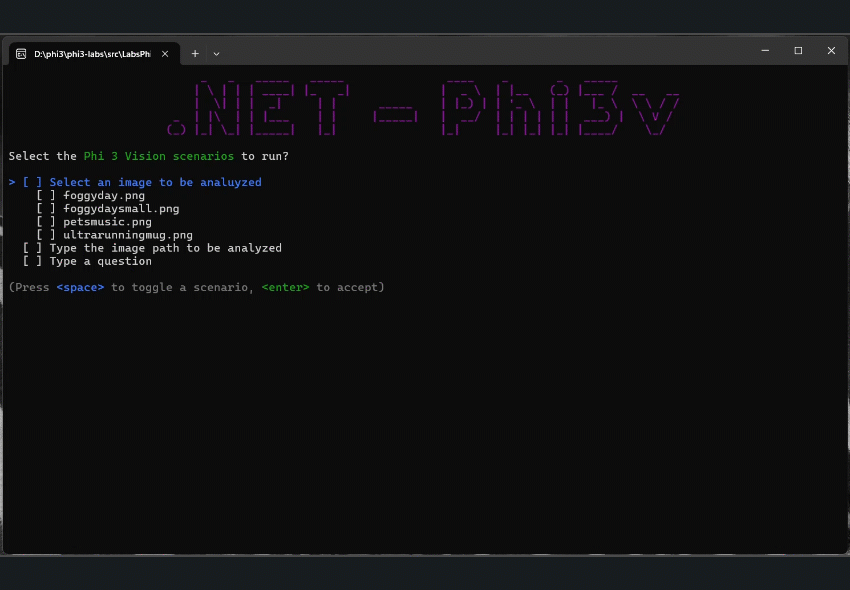
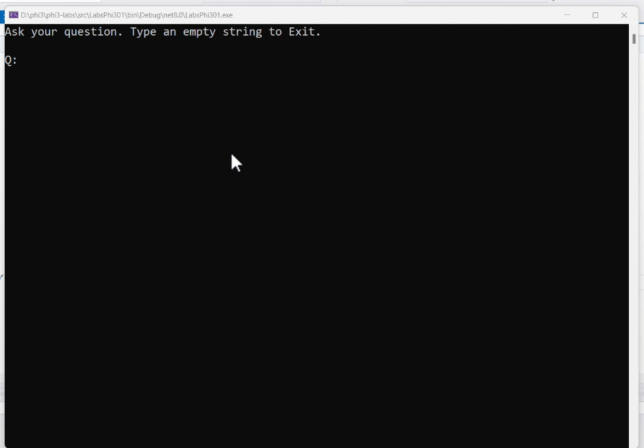

The combination of Small Language Models (SLMs) and ONNX, is a game-changer in AI interoperability. Let's show how you can harness the power of Phi-3 models within your .NET applications with C# and ONNX.

In the [Phi-3 Cookbook repository](https://github.com/microsoft/Phi-3CookBook/blob/main/md/07.Labs/Csharp/csharplabs.md?WT.mc_id=academic-00000-brunocapuano) we can find several samples, including a Console Application that loads a Phi-3 Vision model with ONNX, and analyze and describe an image.



### Introduction to Phi-3 Small Language Model

The Phi-3 Small Language Model (SLM) represents a groundbreaking advancement in AI, developed by Microsoft. It’s part of the Phi-3 family, which includes the most capable and cost-effective SLMs available today. These models outperform others of similar or even larger sizes across various benchmarks, including language, reasoning, coding, and math tasks. The Phi-3 models, including the Phi-3-mini, Phi-3-small, and Phi-3-medium, are designed to be instruction-tuned and optimized for ONNX Runtime, ensuring broad compatibility and high performance.

You can learn more about Phi-3 in:

- [Phi-3 Microsoft Blog](https://aka.ms/phi3blog-april)
- [Phi-3 Technical Report](https://aka.ms/phi3-tech-report)
- [Phi-3 Cookbook](https://aka.ms/Phi-3CookBook)

### Introduction to ONNX

[ONNX, or Open Neural Network Exchange](https://onnx.ai/sklearn-onnx/introduction.html), is an open-source format that allows AI models to be portable and interoperable across different frameworks and hardware. It enables developers to use the same model with various tools, runtimes, and compilers, making it a cornerstone for AI development. ONNX supports a wide range of operators and offers extensibility, which is crucial for evolving AI needs.

### Why to Use ONNX on Local AI Development

Local AI development benefits significantly from ONNX due to its ability to streamline model deployment and enhance performance. ONNX provides a common format for machine learning models, facilitating the exchange between different frameworks and optimizing for various hardware environments.

For C# developers, this is particularly useful because we have a set of libraries specifically created to work with ONNX models. In example: [Microsoft.ML.OnnxRuntime](https://github.com/microsoft/onnxruntime?WT.mc_id=academic-00000-brunocapuano).

### Sample Console Application to use a ONNX model

The main steps to use a model with ONNX in a C# application are:

- The Phi-3 model, stored in the `modelPath`, is loaded into a Model  object.
- This model is then used to create a `Tokenizer`  which will be responsible for converting our text inputs into a format that the model can understand.

In example, this is a chatbot implementation from [/src/LabsPhi301/Program.cs](https://github.com/microsoft/Phi-3CookBook/blob/main/md/07.Labs/Csharp/src/LabsPhi301/Program.cs?WT.mc_id=academic-00000-brunocapuano).

- The chatbot operates in a continuous loop, waiting for user input.
- When a user types a question, the question is combined with a system prompt to form a full prompt.
- The full prompt is then tokenized and passed to a Generator object.
- The generator, configured with specific parameters, generates a response one token at a time.
- Each token is decoded back into text and printed to the console, forming the chatbot's response.
- The loop continues until the user decides to exit by entering an empty string.

```csharp
using Microsoft.ML.OnnxRuntimeGenAI;

var modelPath = @"D:\phi3\models\Phi-3-mini-4k-instruct-onnx\cpu_and_mobile\cpu-int4-rtn-block-32";
var model = new Model(modelPath);
var tokenizer = new Tokenizer(model);

var systemPrompt = "You are an AI assistant that helps people find information. Answer questions using a direct style. Do not share more information that the requested by the users.";

// chat start
Console.WriteLine(@"Ask your question. Type an empty string to Exit.");

// chat loop
while (true)
{
    // Get user question
    Console.WriteLine();
    Console.Write(@"Q: ");
    var userQ = Console.ReadLine();    
    if (string.IsNullOrEmpty(userQ))
    {
        break;
    }

    // show phi3 response
    Console.Write("Phi3: ");
    var fullPrompt = $"<|system|>{systemPrompt}<|end|><|user|>{userQ}<|end|><|assistant|>";
    var tokens = tokenizer.Encode(fullPrompt);

    var generatorParams = new GeneratorParams(model);
    generatorParams.SetSearchOption("max_length", 2048);
    generatorParams.SetSearchOption("past_present_share_buffer", false);
    generatorParams.SetInputSequences(tokens);

    var generator = new Generator(model, generatorParams);
    while (!generator.IsDone())
    {
        generator.ComputeLogits();
        generator.GenerateNextToken();
        var outputTokens = generator.GetSequence(0);
        var newToken = outputTokens.Slice(outputTokens.Length - 1, 1);
        var output = tokenizer.Decode(newToken);
        Console.Write(output);
    }
    Console.WriteLine();
}
```

 The running app is similar to this one:




### C# ONNX and Phi-3 and Phi-3 Vision

The [Phi-3 Cookbook repository](https://github.com/microsoft/Phi-3CookBook/)   showcases how these powerful models can be utilized for tasks like question-answering and image analysis within a .NET environment.

It includes labs and sample projects that demonstrates the [use of Phi-3 mini and Phi-3-Vision models in .NET applications](https://github.com/microsoft/Phi-3CookBook/blob/main/md/07.Labs/Csharp/csharplabs.md?WT.mc_id=academic-00000-brunocapuano).

| Project | Description |
| ------------ | ----------- |
| LabsPhi301    | This is a sample project that uses a local phi3 model to ask a question. The project load a local ONNX Phi-3 model using the `Microsoft.ML.OnnxRuntime` libraries. |
| LabsPhi302    | This is a sample project that implement a Console chat using Semantic Kernel. |
| LabsPhi303 | This is a sample project that uses a local phi3 vision model to analyze images.. The project load a local ONNX Phi-3 Vision model using the `Microsoft.ML.OnnxRuntime` libraries. |
| LabsPhi304 | This is a sample project that uses a local phi3 vision model to analyze images.. The project load a local ONNX Phi-3 Vision model using the `Microsoft.ML.OnnxRuntime` libraries. The project also presents a menu with different options to interacti with the user. |

## Summary

If you want to learn more, check also the Vision samples, which demonstrate the capabilities of AI in visual computing using a SLM, ONNX and C#.

If you want to learn more about .NET and AI, check out our additional AI samples at [Get started with .NET 8 and AI using new quickstart tutorials](https://aka.ms/dotnet-ai).
