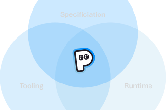
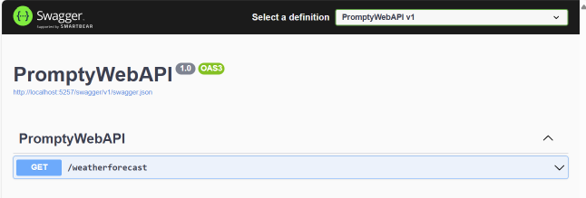
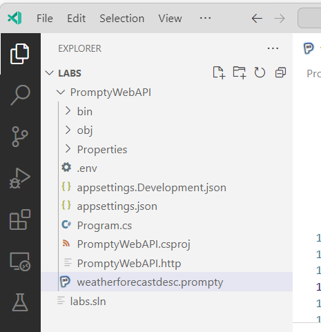
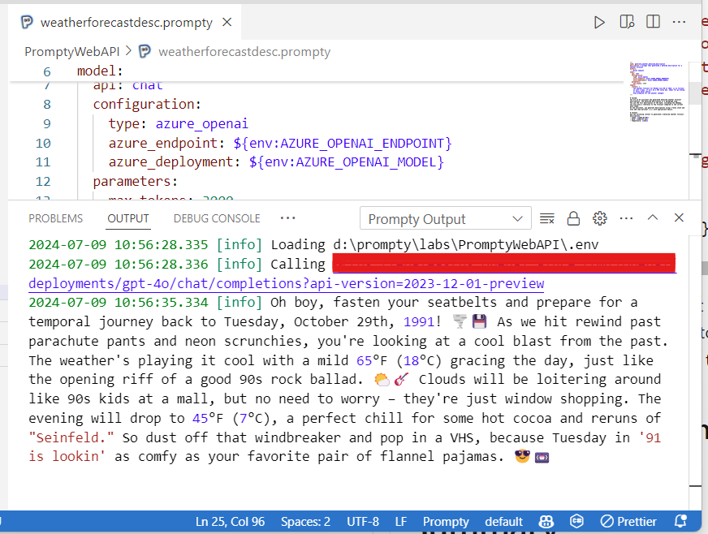
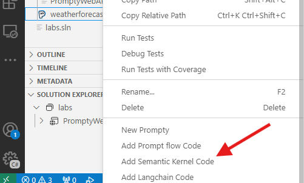

Adding AI features to .NET development is a new and exciting experience. In this blog post, we will explore Prompty and how to use it to integrate a Large Language Model, like GPT-4o, into your development flow and .NET applications.

## Introduction to Prompty

As AI enthusiasts and .NET developers, we constantly seek tools that simplify our workflows and enhance our productivity. One such powerful tool is Prompty, a Visual Studio Code extension designed to facilitate the integration of Large Language Models (LLMs) like GPT-4o into your applications. Prompty provides an intuitive interface to interact with LLMs directly from your development environment, making it easier than ever to add AI features to your projects.

Prompty is developed by Microsoft and is available for free on the Visual Studio Code marketplace. Whether you are building chatbots, creating content generators, or experimenting with other AI-driven applications, Prompty can significantly streamline your development process.

## Description of a Typical Flow of a Developer Using Prompty in Visual Studio Code



Let's take a look at a sample flow on how to use Prompty. This process usually involves a few key steps:

1. **Installation**: Begin by installing the Prompty extension from the [Visual Studio Code Marketplace](https://marketplace.visualstudio.com/items?itemName=ms-toolsai.prompty).

2. **Setup**: After installation, configure the extension by providing your API keys and setting up the necessary parameters to connect to the LLM of your choice, such as GPT-4o.

3. **Integration**: Prompty integrates seamlessly with your development workflow. Start by creating a new file or opening an existing one where you want to use the LLM. Prompty provides commands and snippets to easily insert prompts and handle responses.

4. **Development**: Write prompts directly in your codebase to interact with the LLM. Prompty supports various prompt formats and provides syntax highlighting to make your prompts readable and maintainable.

    You can use the extension to generate code snippets, create documentation, or even debug your applications by asking the LLM specific questions. Once you have your prompt ready, you can use the extension to generate code snippets, create documentation, or even debug your applications by asking the LLM specific questions.

5. **Testing**: Test your prompts and adjust them as needed to get the desired responses from the LLM. Prompty allows you to iterate quickly, refining your prompts to improve the accuracy and relevance of the AI's responses.

## Real Sample Using a WebAPI Application

Let's walk through a practical example of using Prompty in a .NET WebAPI application.

### Step 1: Set up the WebAPI Project

First, create a new WebAPI project, named `PromptyWebAPI`, using the .NET CLI:

```bash
dotnet new webapi -n PromptyWebAPI
cd PromptyWebAPI
```

Add the following dependencies:

```bash
dotnet add package Microsoft.SemanticKernel --version 1.15.1
dotnet add package Microsoft.SemanticKernel.Prompty --version 1.15.1-alpha
dotnet add package Microsoft.Extensions.Configuration.UserSecrets --version 8.0.0
```

Run the project directly from Visual Studio Code or with the command:

```bash
dotnet run
```

We will see the standard Weather Forecast API Endpoint.



**Note:** The WebAPI project uses User Secrets to access the GPT-4o Azure OpenAI Model. Set up the user secrets with the following commands:

```bash
dotnet user-secrets init
dotnet user-secrets set "AZURE_OPENAI_MODEL" "< model >"
dotnet user-secrets set "AZURE_OPENAI_ENDPOINT" "< endpoint >"
dotnet user-secrets set "AZURE_OPENAI_APIKEY" "< api key >"
```


### Step 2: Create a prompty for a more descriptive summary for the Forecast

The weather forecast returns a fictitious forecast including dates, temperatures (C and F) and a summary. Our goal is to create a prompt that can generate a more detailed Summary.

Let's add a new prompty file to the root of the `PromptyWebAPI` folder. This is as easy as `right-click` and `New Prompty`. Rename the created file to `weatherforecastdesc.prompty`.

Our solution should look like this:



Now it's time to complete the sections of our prompty file. Each section has specific information related to the use of the LLM. In example, the **model section** will define the model to be used, the **sample section** will provide a sample for the expected output and finally we have the prompt to be used. 

In the following sample, the prompt defines a **System message**, and in the **Context**, we provide the parameters for the weather.

Replace the content of your prompty file with the following content.  

```yml
---
name: generate_weather_detailed_description
description: A prompt that generated a detaled description for a weather forecast
authors:
  - Bruno Capuano
model:
  api: chat
  configuration:
    type: azure_openai
    azure_endpoint: ${env:AZURE_OPENAI_ENDPOINT}
    azure_deployment: ${env:AZURE_OPENAI_MODEL}
  parameters:
    max_tokens: 3000
sample:
  today: > 
    2024-07-16

  date: > 
    2024-07-17
 
  forecastTemperatureC: >
    25°C
---

# System:
You are an AI assistant who generated detailed weather forecast descriptions. The detailed description is a paragraph long.
You use the full description of the date, including the weekday.
You also give a reference to the forecast compared to the current date today.
As the assistant, you generate descriptions using a funny style and even add some personal flair with appropriate emojis.

# Context
Use the following context to generated a detailed weather forecast descriptions 
- Today: {{today}}
- Date: {{date}}
- TemperatureC: {{forecastTemperatureC}}
```

Once our prompty is ready, we can test the prompt pressing **F5**. Once we run our prompty, we should see the results in the output window:



This is the moment to start to refine our prompt!

***Bonus:** Right click on the prompty file, also allow the generation of C# code using Semantic Kernel to use the current file.*



***Note:** Previous to this, we need to provide the necessary information for the LLM to be used by prompty. Follow the extension configuration to do this. The easiest way is to create a `.env` file with the LLM information.*

### Step 3: Update the endpoint using prompty for the forecast summary

Now we can use this prompty, using Semantic Kernel directly in our project. Let's edit the `program.cs` file and apply the following changes:

- Add the necessary usings to the top of the file.
- Create a Semantic Kernel to generated the forecast summaries.
- Add the new forecast summary in the forecast result.

    To generate the detailed summary, Semantic Kernel will use the prompty file and the weather information.

```csharp
using Microsoft.SemanticKernel;

var builder = WebApplication.CreateBuilder(args);

// Add services to the container.
// Learn more about configuring Swagger/OpenAPI at https://aka.ms/aspnetcore/swashbuckle
builder.Services.AddEndpointsApiExplorer();
builder.Services.AddSwaggerGen();

// Azure OpenAI keys
var config = new ConfigurationBuilder().AddUserSecrets<Program>().Build();
var deploymentName = config["AZURE_OPENAI_MODEL"];
var endpoint = config["AZURE_OPENAI_ENDPOINT"];
var apiKey = config["AZURE_OPENAI_APIKEY"];

// Create a chat completion service
builder.Services.AddKernel();
builder.Services.AddAzureOpenAIChatCompletion(deploymentName, endpoint, apiKey);

var app = builder.Build();

// Configure the HTTP request pipeline.
if (app.Environment.IsDevelopment())
{
    app.UseSwagger();
    app.UseSwaggerUI();
}

app.UseHttpsRedirection();

app.MapGet("/weatherforecast", async (HttpContext context, Kernel kernel) =>
{
    var forecast = new List<WeatherForecast>();
    for (int i = 0; i < 3; i++)
    {
        var forecastDate = DateOnly.FromDateTime(DateTime.Now.AddDays(i));
        var forecastTemperature = Random.Shared.Next(-20, 55);

        var weatherFunc = kernel.CreateFunctionFromPromptyFile("weatherforecastdesc.prompty");
        var forecastSummary = await weatherFunc.InvokeAsync<string>(kernel, new()
        {
            { "today", $"{DateOnly.FromDateTime(DateTime.Now)}" },
            { "date", $"{forecastDate}" },
            { "forecastTemperatureC", $"{forecastTemperature}" }
        });

        forecast.Add(new WeatherForecast(forecastDate, forecastTemperature, forecastSummary));
    }
    return forecast;
})
.WithName("GetWeatherForecast")
.WithOpenApi();

app.Run();

record WeatherForecast(DateOnly Date, int TemperatureC, string? Summary)
{
    public int TemperatureF => 32 + (int)(TemperatureC / 0.5556);
}
```

When we test again the `/weatherforecast` endpoint, the outputs should include more detailed summaries. The following example includes the current date (Jul-16) and 2 more days:

***Note:** These are random generated temperatures. I'm not sure about a temperature change  from -4C/25F to 45C/112F in a single day.*
 
```json
[
  {
    "date": "2024-07-16",
    "temperatureC": -4,
    "summary": "🌬️❄️ Happy Tuesday, July 16th, 2024, folks! Guess what? Today’s weather forecast is brought to you by the Frozen Frappuccino Club, because it’s a chilly one! With a temperature of -4°C, it’s colder than a snowman’s nose out there! 🥶 So, get ready to channel your inner penguin and waddle through the frosty air. Remember to layer up with your snuggiest sweaters and warmest scarves, or you might just turn into an icicle! Compared to good old yesterday, well... there’s not much change, because yesterday was just as brrrrr-tastic. Stay warm, my friends, and maybe keep a hot chocolate handy for emergencies! ☕⛄",
    "temperatureF": 25
  },
  {
    "date": "2024-07-17",
    "temperatureC": 45,
    "summary": "🌞🔥 Well, buckle up, buttercup, because *Wednesday, July 17, 2024*, is coming in hot! If you thought today was toasty, wait until you get a load of tomorrow. With a sizzling temperature of 45°C, it's like Mother Nature cranked the thermostat up to \"sauna mode.\" 🌡️ Don't even think about wearing dark colors or stepping outside without some serious SPF and hydration on standby! Maybe it's a good day to try frying an egg on the sidewalk for breakfast—just kidding, or am I? 🥵 Anyway, stay cool, find a shady spot, and keep your ice cream close; you're gonna need it! 🍦",
    "temperatureF": 112
  },
  {
    "date": "2024-07-18",
    "temperatureC": 35,
    "summary": "Ladies and gentlemen, fasten your seatbelts and hold onto your hats—it’s going to be a sizzling ride! 🕶️🌞 On Thursday, July 18, 2024, just two days from today, Mother Nature cranks up the heat like she’s trying to turn the entire planet into a giant summer barbecue. 🌡️🔥 With the temperature shooting up to a toasty 35°C, it’s the perfect day to channel your inner popsicle in front of the A/C. Water fights, ice cream sundaes, and epic pool floats are all highly recommended survival strategies. And remember, folks, sunscreen is your best friend—don't be caught out there lookin’ like a lobster in a sauna! 🦞☀️ So get ready to sweat but with style, as we dive headfirst into the fantastic scorching adventure that Thursday promises to be! 😎🍧🌴",
    "temperatureF": 94
  }
]
```

## Summary

Prompty offers .NET developers an efficient way to integrate AI capabilities into their applications. By using this Visual Studio Code extension, developers can effortlessly incorporate GPT-4o and other Large Language Models into their workflows.

Prompty and Semantic Kernel simplifies the process of generating code snippets, creating documentation, and debugging applications with AI-driven focus.

To learn more about Prompty and explore its features, visit the **[Prompty main page](https://prompty.ai/)**, check out the **[Prompty Visual Studio Code extension](https://marketplace.visualstudio.com/items?itemName=ms-toolsai.prompty)**, dive into the **[Prompty source code on GitHub](https://github.com/microsoft/prompty)** or watch the Build session **[Practical End-to-End AI Development using Prompty and AI Studio | BRK114](https://www.youtube.com/watch?v=HALMFU7o9Gc)**.
