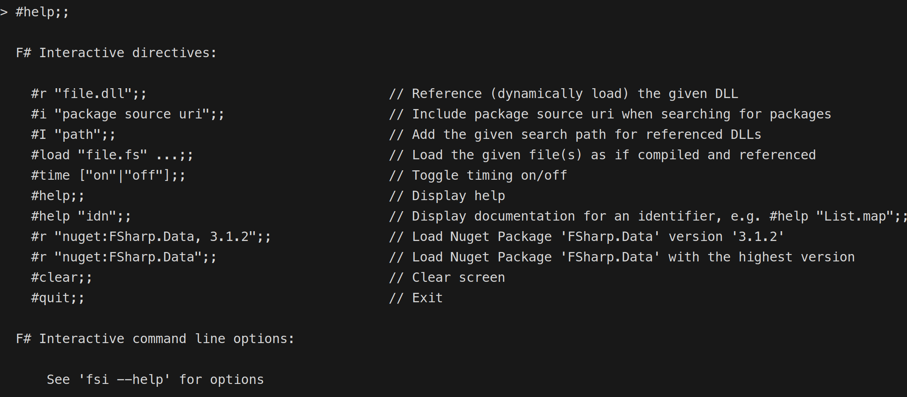
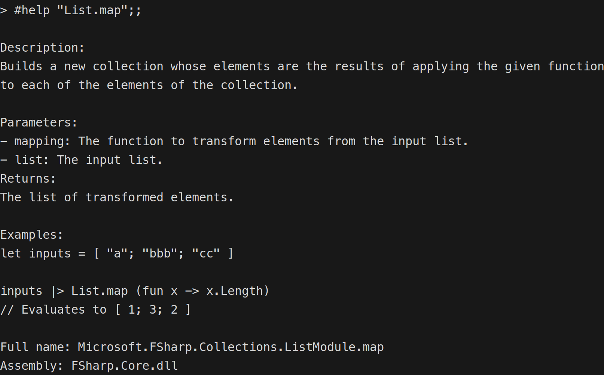
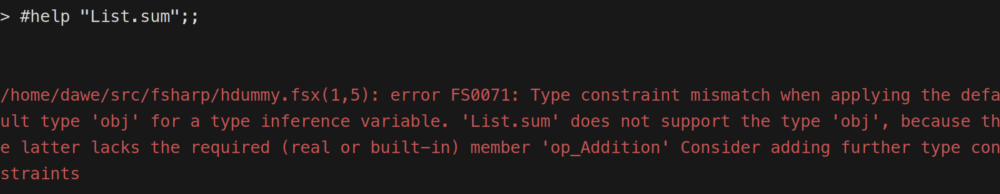
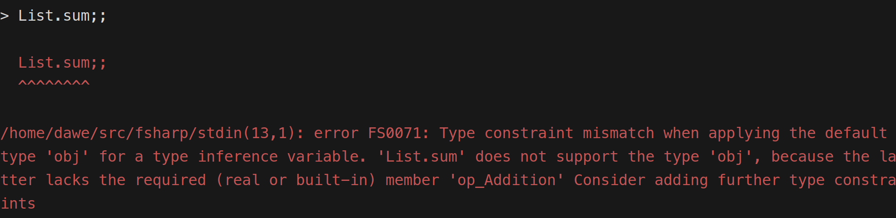
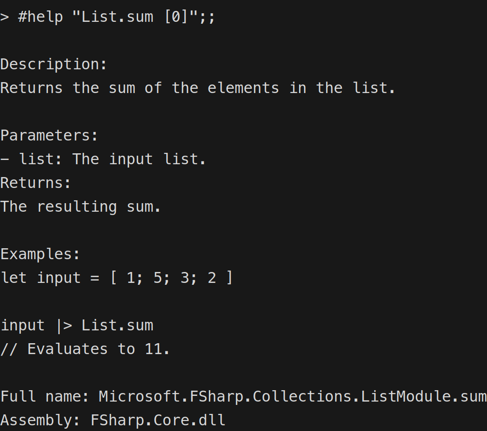

> This is a guest blog post by David Schaefer. David is a freelance software developer with a focus on functional programming. He's a member of [Amplifying F#](https://amplifyingfsharp.io/), a community initiative to improve the F# ecosystem. There he works mainly on developer tooling and helps maintain various open-source projects.

F# interactive, or [fsi](https://learn.microsoft.com/dotnet/fsharp/tools/fsharp-interactive/), is a favorite among F# programmers. This component executes F# scripts and provides a REPL (Read, Evaluate, Print Loop) for F#. The feature is well-established and documented, with extensive configuration opportunities (see `dotnet fsi --help`).

This post describes the most recent addition to `fsi` - the `#help "idn"` directive, which allows users to quickly obtain documentation for things like library functions.

## Background

Some of you might remember our [Unlocking F# Potential](https://amplifyingfsharp.io/sessions/2023/11/24/) session from last November when I showed the first prototype of [fsih](https://github.com/dawedawe/fsih). This small package, modeled after the `h` function of the Elixir [IEx](https://hexdocs.pm/iex/1.16.0/IEx.html) REPL, provides documentation available at your fingertips without the need to context switch to a browser. The feedback I got was very encouraging, I released the package and blogged about it in the [F# Advent](https://amplifyingfsharp.io/blog/2023/12/25/).

The next logical step was to integrate it into `fsi` itself, removing the hassle of referencing the package in every `fsi` session. The first try was made during an Amplifying F# [session](https://amplifyingfsharp.io/sessions/2024/01/26/) back in January. For various reasons I wasn't able to finish it at that time. A second attempt was started in May, this time with financial backing from the [Amplifying F# Open Collective](https://opencollective.com/amplifying-fsharp).

## Implementation and discussion

The [PR](https://github.com/dotnet/fsharp/pull/17140) sparked a good conversation about how to make the functionality available to `fsi` users. My initial port used a new hash directive called `#h`. However, as hash directives in `fsi` are parsed with the regular F# parser, that meant we had to wrap the expression in quotation marks, like `#h "List.map"`.

[Brian](https://github.com/brianrourkeboll) proposed the idea of using a method in the `fsi` object that is available in every `fsi` session. This would allow us to use the method without the need for quotation marks, e.g., `fsi.h List.map`. I liked the idea and made the necessary changes to the PR. 

In parallel, [Kevin](https://github.com/KevinRansom) started to [work on the parser](https://github.com/dotnet/fsharp/pull/17206) to remove the need for quotation marks, as he favored reusing the existing `#help` hash directive for the new functionality. As the primary maintainer of `fsi`, his opinion was the most important one. So, I adapted the PR again to use the `#help` directive. To my great joy, the PR was merged and is already available in the latest .NET 9 preview. With Kevin's PR also merged, quotation marks are now optional.

## The usage

So where does this leave us? Now, when you invoke the `#help` directive in `fsi`, you will see a new entry: `#help "idn"` (where `idn` stands for identifier):

You can use it like this:

Et voilà, you get the functionality from the `fsih` package in `fsi` without any additional dependencies.

To keep things simple and to avoid bloating F#, the dependency of `fsih` on `Spectre.Console` was not ported over. The output is just uncolored plain text. A follow-up PR might add some coloring with the built-in coloring capabilities.

## A few caveats

It's possible to run into type constraint issues when using the functionality with functions like `List.sum`:

You will see something similar when you just type `List.sum` to get the signature of the function:

You can still get the documentation by helping F# infer the type:

## Acknowledgements

Overall, I'm quite happy with the result of the porting effort. It would not have been possible without the generous supporters of the [Amplifying F# Open Collective](https://opencollective.com/amplifying-fsharp). So once again, I want to express my gratitude to all of you and to all reviewers of the PR. If you are interested in getting involved and helping out with continuous improvements in the F# ecosystem please checkout [Amplifying F#](https://amplifyingfsharp.io/).