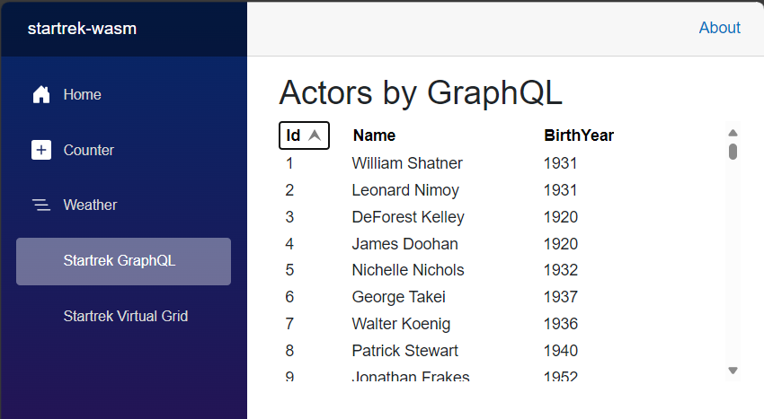
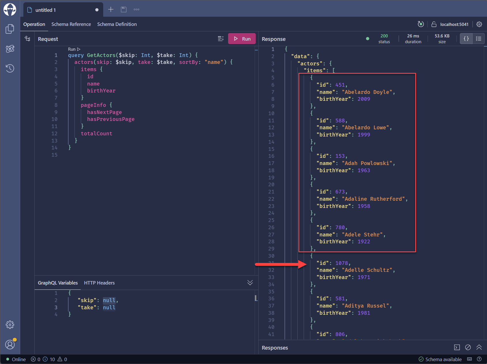
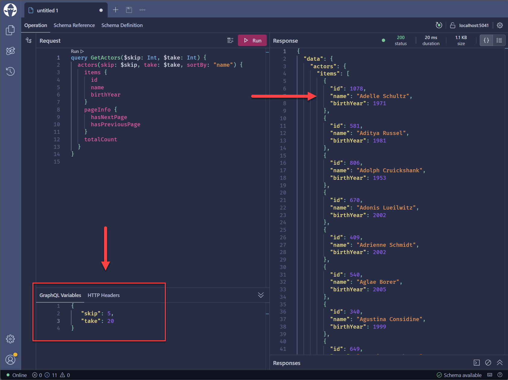
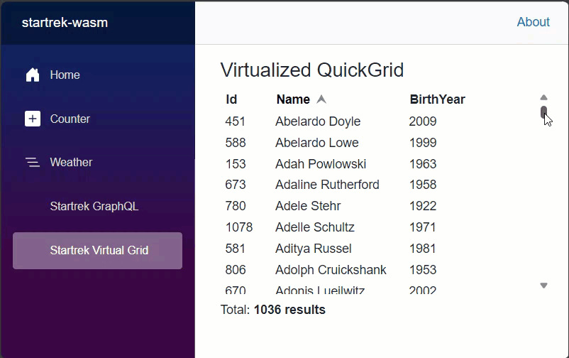
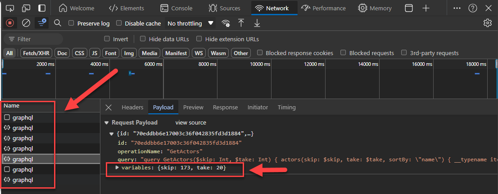

This is the second post in a series of posts about GraphQL and .NET. In the [first post](https://devblogs.microsoft.com/dotnet/why-and-how-to-execute-graph-ql-queries-in-dotnet), we saw how to query a GraphQL API in .NET using Strawberry Shake from a console application. In this post, we will see how to fill a Blazor QuickGrid component with data fetched with GraphQL. We will also use the virtualization feature of the QuickGrid to improve performance.

[alert type="tip" heading="Get the code!"]
You can find the code for this post in the [startrek-demo](https://github.com/fboucher/startrek-demo) GitHub repo. Once more we will be using the StarTrek GraphQL API that was created with Data API Builder (DAB) and is running locally in a Docker container, and accessible at `http://localhost:5000/graphql`. If you really want to follow along you can find the [setup steps and T-SQL script in the repo](https://github.com/FBoucher/startrek-demo#database-and-apis-in-containers). But the important part is that this will work with any data source that you want to expose through GraphQL.
[/alert]

## Adding a GraphQL query to Blazor

Once more we will use [StrawberryShake](https://www.nuget.org/packages/StrawberryShake.Blazor) to generate a client for us based on the schema. Using your favourite method, add the `StrawberryShake.Blazor` package to the project.

Let's create a dotnet-tools manifest, add the GraphQL tool, and download the GraphQL schema to generate the client code specifying the client name "StartrekClient", using the following commands:

```powershell
dotnet new tool-manifest

dotnet tool install StrawberryShake.Tools --local

dotnet graphql init http://localhost:5000/graphql -n StartrekClient
```

For this post demo, we will list all the actors from the StarTrek series. Using the GraphQL IDE for Developers [Banana Cake Pop](https://chillicream.com/products/bananacakepop) we can build a query:

```graphql
query GetActors() {
  actors{
    items {
      id
      name
      birthYear
    }
  }
}
```

We can then save this query in a file named `GetActors.graphql` in the subfolder name 'Queries' to keep things clean. Once the project is built the client `StartrekClient` will be generated and contains `GetActors`.


## Adding the QuickGrid component

[QuickGrid](https://learn.microsoft.com/aspnet/core/blazor/components/quickgrid) is a recent Razor component that provides a simple and convenient data grid component for common grid rendering scenarios. It is highly optimized and uses advanced techniques to achieve optimal rendering performance. Add the package `Microsoft.AspNetCore.Components.QuickGrid` to the project.

Adding a QuickGrid to a Blazor page is straightforward. Assuming that `result` contains our list of `Actor`, here is an example of how to use it:

```razor
<QuickGrid Items="result.Actors!.Items.AsQueryable()">
	<PropertyColumn Property="@(a => a.Id)" Sortable="true" />
	<PropertyColumn Property="@(a => a.Name)" Sortable="true" />
	<PropertyColumn Property="@(a => a.BirthYear)" Sortable="true" />
</QuickGrid>
```

This example is simple and only shows three simple columns mapped directly on properties, but note that much more customization is possible. The `Items` property is an `IQueryable` that allows the QuickGrid to improve performance and the user experience, like being able to sort columns easily, and so much more. One of the differences between `IQueryable` and `IEnumerable` is that `IEnumerable` will retrieve all the rows of the tables and apply the WHERE clause in memory but `IQueryable` will apply the WHERE clause in the source and only retrieve the requested rows.

To bind the QuickGrid `Items` property to the GraphQL query, we can use the `<UseGetActors>` component that was generated by StrawberryShake. `<UseGetActors>`  has a few child components: `<ChildContent>`, `<ErrorContent>`, and `<LoadingContent>` that will be displayed based on the state of the query. Let's have a look at a page that uses this component.

```razor
@page "/graphql"
@using Microsoft.AspNetCore.Components.QuickGrid

@inject IStartrekClient startrekClient

<PageTitle>Actors by GraphQL</PageTitle>

<h1>Actors by GraphQL</h1>

<UseGetActors Context="result">
    <ChildContent>
        <div class="grid">
            <QuickGrid Items="result.Actors!.Items.AsQueryable()">
                <PropertyColumn Property="@(a => a.Id)" Sortable="true" />
                <PropertyColumn Property="@(a => a.Name)" Sortable="true" />
                <PropertyColumn Property="@(a => a.BirthYear)" Sortable="true" />
            </QuickGrid>
        </div>
    </ChildContent>
    <ErrorContent>
        Something went wrong ...<br />
        @result.First().Message
    </ErrorContent>
    <LoadingContent>
        Loading ...
    </LoadingContent>
</UseGetActors>
```

The component will automatically fetch the data using the query and make it available in the context. We can add the QuickGrid component to the `<ChildContent>` and bind the `Items` using the context `result`, provided by the `<UseGetActors>` component. The `<ErrorContent>` and `<LoadingContent>` are very convenient to display messages based on the state of the query.




## QuickGrid virtualization

The QuickGrid component supports [virtualization](https://learn.microsoft.com/dotnet/api/microsoft.aspnetcore.components.quickgrid.quickgrid-1.virtualize), which is a technique that only renders the rows that are visible in the viewport. This can greatly improve the performance of the grid when dealing with a large number of rows. To be able to use virtualization, your data source must support the parameters `StartIndex` (aka skip) and `Count` (aka limit or take). If your data source only uses tokens like a cursor, you can use the pagination feature of the QuickGrid, but not the virtualization. 

[alert type="info" heading="Customizing the GraphQL API to support virtualization"]
For the first part of this post and the previous one, we used Data API Builder (DAB) to create a GraphQL API. Unfortunately, it doesn't support the required parameters, so we cannot be used for the virtualization. However we can use the pagination and all the other features of the QuickGrid. To make it work with virtualization, we used `HotChocolate`, the same package used by DAB to create a custom GraphQL API. If you are interested, the [`code and setup steps`](https://github.com/FBoucher/startrek-demo?tab=readme-ov-file#chocospock-is-a-custom-graphql-endpoint) are available in GitHub repo. 
[/alert]

To enable virtualization, we need to set the `Virtualize` property to `true` on the QuickGrid component. The QuickGrid will require an `ItemsProvider` that will be used to fetch the data. Here is what the QuickGrid looks like with virtualization enabled.

```razor
<div class="grid" tabindex="-1">
    <QuickGrid ItemsProvider="@actorProvider" Virtualize="true">
        <PropertyColumn Property="@(a => a.Id)" Sortable="false" />
        <PropertyColumn Property="@(a => a.Name)"   Sortable="true" 
                                                    IsDefaultSortColumn="true" 
                                                    InitialSortDirection="SortDirection.Ascending"/>
        <PropertyColumn Property="@(a => a.BirthYear)" Sortable="false" />
    </QuickGrid>
</div>

<div class="my-2"
    <div class="inline-block my-1">
        Total: <strong>@numResults results</strong>
    </div>
</div>
```

### Create an ItemsProvider

Now we need to set `actorProvider` so it can be called by the QuickGrid with `StartIndex` and `Count` parameters to fetch the data. 

```razor
@code {
    GridItemsProvider<IGetActors_Actors_Items> actorProvider;

    int numResults = 0;

    protected override async Task OnInitializedAsync()
    {
        actorProvider = async request =>
        {
            var response = await startrekClient.GetActors.ExecuteAsync(request.StartIndex, request.Count, request.CancellationToken);           

            if (numResults == 0 && !request.CancellationToken.IsCancellationRequested)
            {
                numResults = response!.Data.Actors.TotalCount;
                StateHasChanged();
            }

            return GridItemsProviderResult.From(
                    items: new List<IGetActors_Actors_Items>(response!.Data.Actors.Items),
                    totalItemCount: response!.Data.Actors.TotalCount
            );
        };

    }

}
```

On the first call, we update the `numResults` with the total number of items and call `StateHasChanged()` to update the UI. This is optional but it shows that there is more actors than what is displayed.

The `actorProvider` is defined as `GridItemsProvider<IGetActors_Actors_Items>` where the interface was once more generated for us. The provider needs to return two properties: `items` that contains the subset of `Actor` returned by query and `totalItemCount`. The `totalItemCount` is used by the QuickGrid to know how many items are available and to display the scrollbar correctly.


### GraphQL Query with parameters

The last step is to modify the GraphQL query to accept the `skip` and `take` parameters. This way the QuickGrid could ask to return the next 20 Actor after the skipping the first 100 ones. Here is the modified query:

```graphql
query GetActors($skip: Int, $take: Int) {
  actors(skip: $skip, take: $take, sortBy: "name") {
    items {
      id
      name
      birthYear
    }
    pageInfo {
      hasNextPage
      hasPreviousPage
    }
    totalCount
  }
}
```

It's a good idea to test your query in Banana Cake Pop to make sure it works as expected. Here as an example when the query is called without any parameters all actors are returned.



And here is the result of the same query with the parameters `skip: 5` and `take: 20`. Notice that the sixth actor of the first return is now the first one as the first five has been skipped.



### The final result

Here is the final result of the QuickGrid with virtualization enabled. The QuickGrid will only render the rows that are visible, in our case 20 actors. 



As you can see in the animation above `...` is used as a place holder when scrolling. Once you stop scrolling the `actorProvider` will then fetch the actors using the parameters `skip` and `take` and update the QuickGrid with the new data. We look at the Network tab of the browser's Developer Tools, we can see the all the different calls to the GraphQL API with the parameters used.



## Conclusion

In this post, we saw how to bind a Blazor QuickGrid component to a GraphQL query using Strawberry Shake. We also saw how to enable virtualization to improve the performance of the grid when dealing with a large number of rows. The QuickGrid component is very powerful and can be customized in many ways. Let us know in the comments what you would like to see next about the QuickGrid component.

## Video demo

During the [ASP.NET Community Standup - Using GraphQL to enhance Blazor apps](https://www.youtube.com/live/ubX-a6_V_ao) I did a demo of the QuickGrid with GraphQL in a Blazor application. You can watch the video below.

<iframe width="800" height="450" src="https://www.youtube.com/embed/ubX-a6_V_ao?si=F1Mx9sOP-xP3Ehas&amp;start=644" title="YouTube video player" frameborder="0" allow="accelerometer; autoplay; clipboard-write; encrypted-media; gyroscope; picture-in-picture; web-share" referrerpolicy="strict-origin-when-cross-origin" allowfullscreen></iframe>

## References

 - [ASP.NET Core Blazor QuickGrid component](https://learn.microsoft.com/aspnet/core/blazor/components/quickgrid?view=aspnetcore-8.0)
 - [ChilliCream: Strawberry Shake, Banana Cake Pop, Hot Chocolate](https://chillicream.com/docs/strawberryshake)

