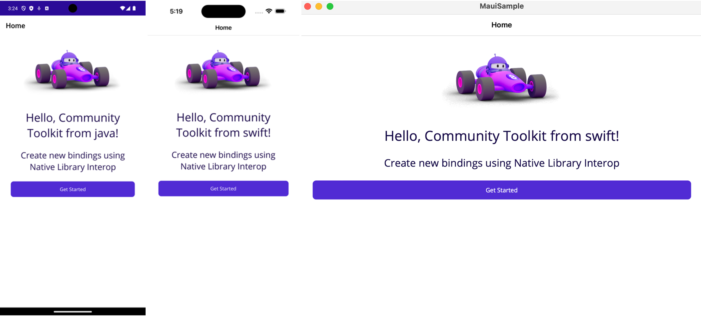
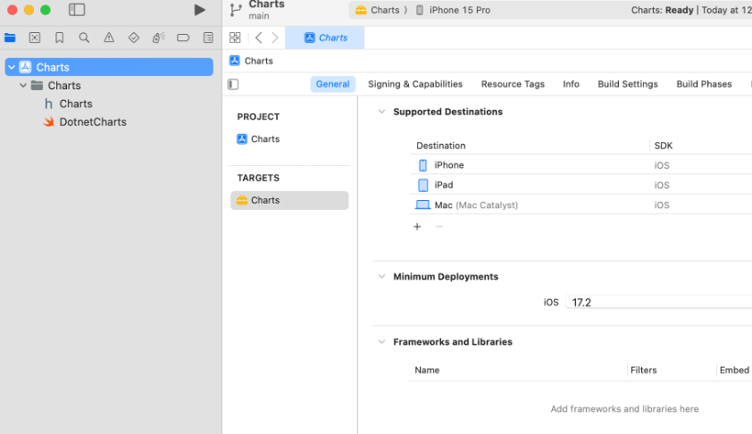
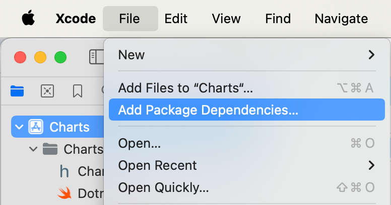
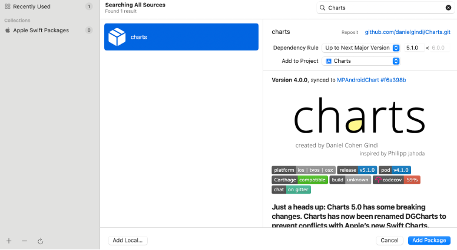
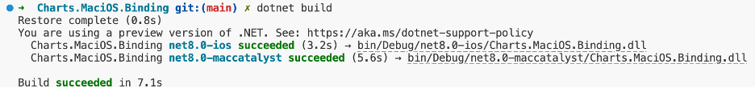
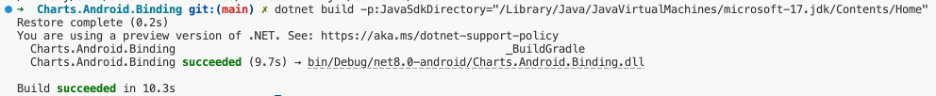
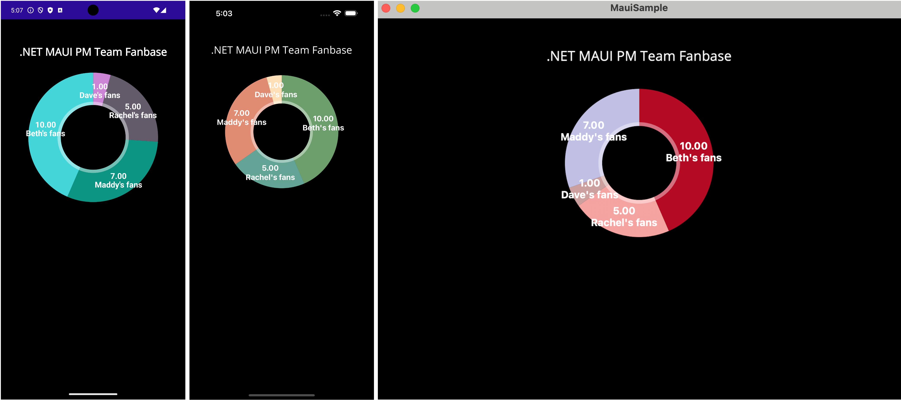

In today's app development landscape, the ability to extend .NET applications by leveraging native capabilities is invaluable. The .NET MAUI handler architecture empowers developers to directly manipulate native controls with .NET code, even allowing for the seamless creation of cross-platform custom controls. Yet, the potential extends beyond just native platform APIs. What if you could also tap into native library APIs, unlocking even more possibilities?

Native Library Interop for .NET MAUI, previously known as the Slim Binding approach, is an alternative method for integrating native libraries into .NET MAUI applications, including .NET for Android, .NET for iOS, and .NET for Mac Catalyst. This approach enables direct access to native library APIs in a way that is both streamlined and maintenance-friendly, eliminating the need to bind entire libraries through traditional methods.

You may be asking yourself, what is a **Binding**? When you want to use a third-party iOS or Android library not written in C#, you need a way to consume it in your .NET MAUI application. This is where **Binding Projects** come in enabling you to create a C# API definition to describe how the native API is exposed in .NET, and how it maps to the underlying library. After you establish this definition, you compile it to generate a "binding" assembly that can be utilized within your .NET MAUI application. This process mirrors the functionality of .NET for iOS and Android; when you use a native iOS or Android API in C#, it's accessible due to the bindings created for the core APIs.

The [Maui.NativeLibraryInterop repository](https://github.com/CommunityToolkit/maui.nativelibraryinterop) serves as a valuable resource of community-curated samples, offering .NET developers an opportunity to delve into and benefit from shared knowledge, as well as contribute their own insights. With a ready-to-use template for creating new bindings, it serves as an excellent foundation for developers embarking on their journey from concept to execution. The great part about Native Library Interop is that it is a more general way of creating bindings, not limited to just binding libraries, and can technically be used to tap deeper into the native platform SDKs.

In this post, I am excited to share my own journey with Native Library Interop for .NET MAUI, presenting a practical example to illustrate how this innovative approach can be leveraged in your .NET MAUI applications. Join me as I implement a binding, using the template and following the guidance in the [Getting Started documentation](https://learn.microsoft.com/dotnet/communitytoolkit/maui/native-library-interop/get-started).

## Getting started with the Native Library Interop template

To get started, I first cloned the [Maui.NativeLibraryInterop repository](https://github.com/CommunityToolkit/maui.nativelibraryinterop). If interested in building off one of the existing bindings samples (Facebook, Firebase, GoogleCast), I would start from the samples contained in the respective folders. As I am interested in creating a binding from a completely different library, however, I'm going to start with the template! The template contains the foundation for getting started with using Native Library Interop to create an Android binding, iOS and Mac Catalyst binding, and a .NET MAUI sample app that uses both.

[alert type="tip" heading="Getting the prerequisites"]
Before proceeding, make sure you have all the prerequisites installed. If you are a long-time .NET MAUI developer, it is likely you already have most if not all of them installed like myself, but be sure to check the [full list of prerequisites](https://learn.microsoft.com/dotnet/communitytoolkit/maui/native-library-interop/get-started#prerequisites).
[/alert]

I copy and paste the template into my desired location, deploy the sample to all three platforms, and tada! Everything works as expected. I see "Hello, Community Toolkit from java!" on the Android app, demonstrating the Android binding working as expected, and "Hello, Community Toolkit from swift!" on the iOS and Mac Catalyst apps, demonstrating the MaciOS binding working as expected.



## What will I bind?

So what am I looking to bind? Well, I want to include a nice pie chart in my app! And the .NET MAUI SDK does not currently have a built-in control for that.

While all the charts I can create using the Charts library are so beautiful, I have chosen the Native Library Interop approach because I only need a pie chart in my .NET MAUI app right now, so I want to bind the APIs I need just for the pie chart, and nothing more.

To create my binding for charts, I will be using the [MPAndroidChart library](https://github.com/PhilJay/MPAndroidChart) for Android and the equivalent [Charts library](https://github.com/ChartsOrg/Charts) for iOS and Mac Catalyst.

As such, I would like the name of my binding to reflect that. For Android, I rename the class, file name, and all references of `DotnetNewBinding` at _android/native/newbinding/src/main/java/com/example/newbinding/DotnetNewBinding.java_. For MaciOS, I do the same for _macios/native/NewBinding/NewBinding/DotnetNewBinding.swift_. While optional, I took the liberty to rename all folders, files, and instances of “newBinding” to “charts” in my project as well.

Cool, easy enough. What's next?

### Setting up the .NET binding libraries

I’m planning on binding libraries for Android, iOS, and Mac Catalyst, and I'm lucky to have the option to support all three with the libraries I found! If not interested in all platforms, I'd simply delete the folder, target framework, and references for the one I'm not interested in.

As for the .NET version, I'm going to stick with using .NET 8 for now. When I'm ready to use .NET 9, however, I will eventually update the TargetFrameworks and versions in [_Charts.MaciOS.Binding.csproj_](https://github.com/rachelkang/MauiCharts/blob/0f88a1f6b76ee29e8f8bc05c040fbeca48270414/charts/macios/Charts.MaciOS.Binding/Charts.MaciOS.Binding.csproj#L3) and [_Charts.Android.Binding.csproj_](https://github.com/rachelkang/MauiCharts/blob/0f88a1f6b76ee29e8f8bc05c040fbeca48270414/charts/android/Charts.Android.Binding/Charts.Android.Binding.csproj#L3) respectively.

And that's it! While I have the choice to customize here, I did not need to take any extra steps to set up the .NET binding libraries beyond what the template has already set up for me.

### Setting up the native wrapper projects and libraries

Now, let's make sure the same is reflected in the native projects, and bring in the native libraries!

#### iOS & Mac Catalyst

First, I open the native project _macios/native/Charts/Charts.xcodeproj_ in Xcode. I check in **Targets > General** that the supported destinations and iOS version match what I need, so once again, I’m already good to go here.



Now, it's time to bring in the native Charts library! As there are various options for bringing in a native library, this step will vary based on what works best with the specific library and personal preferences. In my case, I’m going to opt to use Swift Package Manager by navigating to **File > Add Package Dependencies...**



searching for the Charts library package,



and clicking **Add Package**. The Charts library has been added to my native Xcode project!

#### Android

Now, it's time to do the same thing in Android land! First, I open the native project _android/native_ in Android Studio. Once the project loads, I open _build.gradle.kts (:charts)_ and confirm that the `compileSdk` version reflects my needs.

Now, to bring in the native Charts library, I make the following edits in [_build.gradle.kts_](https://github.com/rachelkang/MauiCharts/blob/0f88a1f6b76ee29e8f8bc05c040fbeca48270414/charts/android/native/charts/build.gradle.kts#L33-L40):

```json
dependencies {

    // Add package dependency for binding library
    implementation("com.github.PhilJay:MPAndroidChart:v3.1.0")

    // Copy dependencies for binding library
     "copyDependencies"("com.github.PhilJay:MPAndroidChart:v3.1.0")
}
```

I also add the relevant maven repository in [_settings.gradle.kts_](https://github.com/rachelkang/MauiCharts/blob/0f88a1f6b76ee29e8f8bc05c040fbeca48270414/charts/android/native/settings.gradle.kts#L15-L17):

```json
dependencyResolutionManagement {
    ...
    repositories {
        ...
        // Add repository here
        maven { url = uri("https://jitpack.io") }
    }
}
 ```

Last but not least, I click on the **Sync Project with Gradle Files** button in the upper-right-hand corner to make the cute gradle elephant happy.

## Creating the API interface

Now that we have brought in the native libraries, it's time to build the APIs we will be using in our .NET apps! The cool part of the Native Library Interop approach is that all of this happens on the native side. This means we can leverage any existing documentation that the libraries provide to write in the native languages directly - Swift / Objective-C for iOS and Mac Catalyst, and Java / Kotlin for Android. It also means we can update those APIs a lot more easily with less of the overhead that comes with manually translating everything into .NET terms.

###  iOS & Mac Catalyst

In [_DotnetCharts.swift_](https://github.com/rachelkang/MauiCharts/blob/main/charts/macios/native/Charts/Charts/DotnetCharts.swift), I define all the APIs my heart desires. While that quite literally means I can define _any_ API in Swift, as the template string example also shows, I will stay focused for now on my mission of creating an API interface for Charts, and will `import DGCharts` at the top of the file.

Then, I write up the API definition for creating a pie chart. As a .NET developer, I can't say I'm the biggest Swift expert, but being able to leverage the Swift samples directly from the Charts library repo, and getting assistance from GitHub Copilot is certainly a game changer that makes this part so much less daunting.

Once I ensure my Swift code is valid by building the Xcode project successfully, I run back as quickly as I can to the .NET side of things to make sure the native library indeed interops.

From _macios/Charts.MaciOS.Binding_ I run `dotnet build`. This generates the .NET API definitions in _macios/native/Charts/bin/Release/net8.0-ios/sharpie/Charts/ApiDefinitions.cs_ which I then copy into [_charts/macios/Charts.MaciOS.Binding/ApiDefinition.cs_](https://github.com/rachelkang/MauiCharts/blob/main/charts/macios/Charts.MaciOS.Binding/ApiDefinition.cs).

Then, I run `dotnet build` once more to ensure everything is happy. :)



### Android

Back again now in Android world! In _DotnetCharts.java_, I can define _any_ API in Java, as the template string examples shows here as well. To stay focused on Charts, however, I will import everything I need. While the libraries are pretty parallel, they are implemented slightly differently, which will affect how I import and define my APIs here as well.

As such, I import the following from `com.github.mikephil.charting`:

```java
import com.github.mikephil.charting.charts.PieChart;
import com.github.mikephil.charting.data.PieData;
import com.github.mikephil.charting.data.PieDataSet;
import com.github.mikephil.charting.data.PieEntry;
import com.github.mikephil.charting.utils.ColorTemplate;
```

Then, I once again write up the API definition for creating a pie chart. Just as I'm not the biggest Swift expert, I am also not the biggest Android expert... but I am still a mobile app developer! Being able to directly leverage online resources and GitHub Copilot makes this all very feasible. :)

Running back again to the comfort of .NET, I navigate to _android/Charts.Android.Binding_ and run `dotnet build`.



This generates a copy of the dependencies at _android/native/charts/bin/Release/net8.0-android/outputs/deps/MPAndroidChart-v3.1.0.aar_ which, unlike with iOS and Mac Catalyst, I will need to directly reference in my .NET sample app by adding the following to _MauiSample.csproj_:

```xml
<!-- Reference the Android binding dependencies -->
<ItemGroup Condition="$(TargetFramework.Contains('android'))">
    <AndroidLibrary Include="..\android\native\charts\bin\Release\net8.0-android\outputs\deps\MPAndroidChart-v3.1.0.aar">
        <Bind>false</Bind>
        <Visible>false</Visible>
    </AndroidLibrary>
</ItemGroup>
```

## Consuming the APIs in your .NET app

It's time for the moment of truth! The Charts binding can now be used in any new or existing .NET MAUI apps, including any .NET for iOS, .NET for Mac Catalyst, and .NET for Android apps. For simplicity, I will use it in the .NET MAUI sample app that came with the template which already references the .NET binding libraries for me in the [_MauiSample.csproj_](https://github.com/rachelkang/MauiCharts/blob/0f88a1f6b76ee29e8f8bc05c040fbeca48270414/charts/sample/MauiSample.csproj#L72-L78):

```xml
<!-- Reference to MaciOS Binding project -->
<ItemGroup Condition="$(TargetFramework.Contains('ios')) Or $(TargetFramework.Contains('maccatalyst'))">
    <ProjectReference Include="..\macios\Charts.MaciOS.Binding\Charts.MaciOS.Binding.csproj" />
</ItemGroup>

<!-- Reference to Android Binding project -->
<ItemGroup Condition="$(TargetFramework.Contains('android'))">
    <ProjectReference Include="..\android\Charts.Android.Binding\Charts.Android.Binding.csproj" />
</ItemGroup>
```

In _MainPage.xaml.cs_, I import `ChartsMaciOS.DotnetCharts` and `ChartsAndroid.DotnetCharts` and use platform directives to directly leverage the APIs I created, just as I would with any other platform-specific implementation in .NET MAUI.

```csharp
public class MauiPieChart : View
{
	public List<PieChartSlice> Slices { get; set; } = new List<PieChartSlice>();
}

public class PieChartSlice
{
	public string Name { get; set; } = string.Empty;

	public int Count { get; set; }
	
    public Color Color
    {
        get => _color ??= GenerateRandomColor();
        set => _color = value;
    }

	private Color? _color = null;

    private Color GenerateRandomColor()
    {
        Random random = new Random();
        return new Color(random.Next(256), random.Next(256), random.Next(256));
    }
}

public partial class MauiPieChartHandler
{
	public static IPropertyMapper<MauiPieChart, MauiPieChartHandler> PropertyMapper = new PropertyMapper<MauiPieChart, MauiPieChartHandler>(ViewHandler.ViewMapper)
	{
	};

	public MauiPieChartHandler() : base(PropertyMapper)
	{
	}
}

#if IOS || MACCATALYST
public partial class MauiPieChartHandler : ViewHandler<MauiPieChart, UIKit.UIView>
{
	protected override UIKit.UIView CreatePlatformView()
	{	
		var data = Foundation.NSDictionary<Foundation.NSString, Foundation.NSNumber>.FromObjectsAndKeys (
			VirtualView.Slices.Select(s => new Foundation.NSNumber(s.Count)).ToArray(),
			VirtualView.Slices.Select(s => s.Name).ToArray()
		);
		var colors = VirtualView.Slices.Select(s => s.Color.ToPlatform()).ToArray();

		var pieChart = Charts.CreatePieChartWithData(data, colors);
		return pieChart;
	}
}

#elif ANDROID
public partial class MauiPieChartHandler : ViewHandler<MauiPieChart, Android.Views.View>
{
	protected override Android.Views.View CreatePlatformView()
	{
		var data = new Java.Util.LinkedHashMap();
		var colors = new List<Java.Lang.Integer>();
		foreach (var slice in VirtualView.Slices) {
			data.Put(slice.Name, slice.Count);
			colors.Add(new Java.Lang.Integer(slice.Color.ToPlatform().ToArgb()));
		}

		var pieChart = Charts.CreatePieChart(Microsoft.Maui.ApplicationModel.Platform.CurrentActivity, data, colors);
		return pieChart;
	}
}
#endif
```

Now, I can access this new `MauiPieChart` from my user interface:

```xml
<local:MauiPieChart WidthRequest="300" HeightRequest="300">
    <local:MauiPieChart.Slices>
        <local:PieChartSlice Name="Dave's fans" Count="1" />
        <local:PieChartSlice Name="Rachel's fans" Count="5" />
        <local:PieChartSlice Name="Maddy's fans" Count="7" />
        <local:PieChartSlice Name="Beth's fans" Count="10" />
    </local:MauiPieChart.Slices>
</local:MauiPieChart>
```

And voila! I present to you beautiful pie charts in .NET MAUI!



## What will you bind?

Thanks for following along on my journey of creating a charts binding with Native Library Interop! To check out all of the code, including the details of my API definitions and sample usage, you can find the full sample at https://github.com/rachelkang/MauiCharts. To learn more about the Native Library Interop approach, uncover the magic built in to simplify this process, and better understand when to use it, be sure to check out our [documentation](https://learn.microsoft.com/dotnet/communitytoolkit/maui/native-library-interop/).

I hope that seeing my process gives you some exciting ideas for the endless possibilities that using Native Library Interop has in store for you!

Be sure to check it out yourself at [CommunityToolkit/Maui.NativeLibraryInterop](https://github.com/CommunityToolkit/maui.nativelibraryinterop). I'd love to see what bindings you create, and hear about how this process goes for you!
