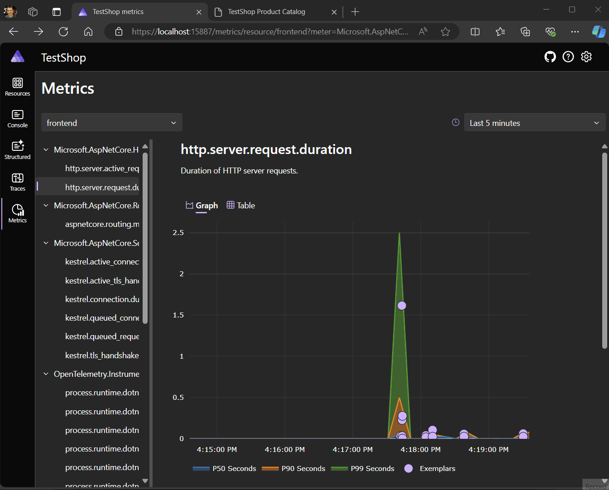
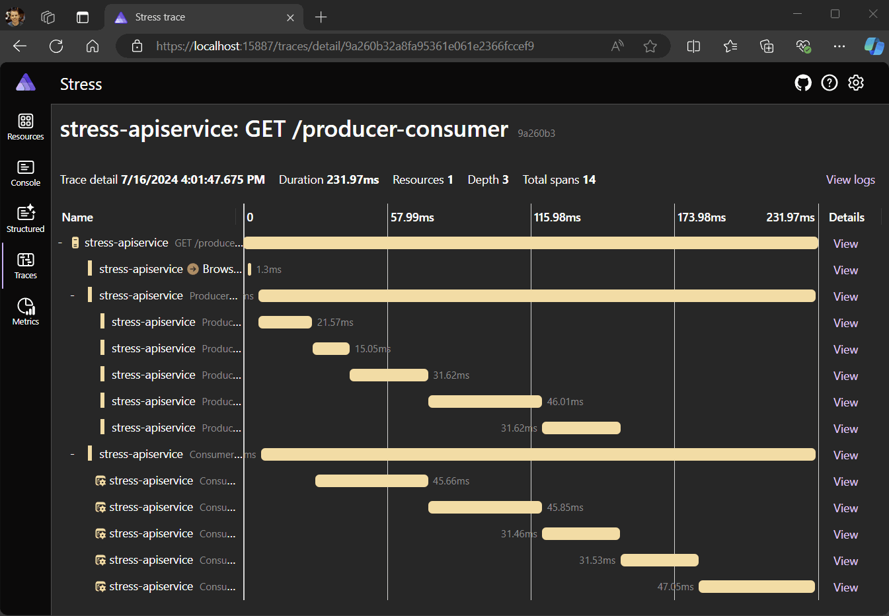
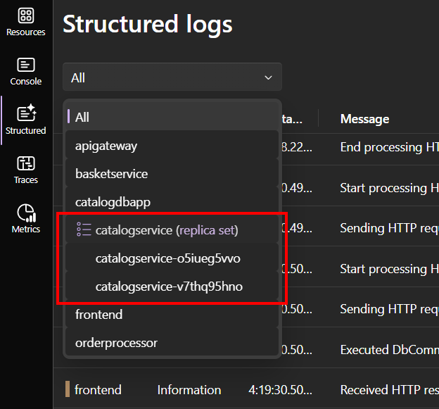

In May, we released the first official release of [.NET Aspire](https://learn.microsoft.com/dotnet/aspire/get-started/aspire-overview) to the world. We've been encouraged by the enthusiastic response from the .NET community, and we've been actively listening and interacting with developers as you all try it out for the first time.

Today, we are pleased to announce the release of .NET Aspire 8.1. This release includes several new features and quality of life improvements based on feedback from developers using .NET Aspire in production applications. There are two specific features that I will go deeper on in this post which are [support for building container images](https://learn.microsoft.com/dotnet/aspire/app-host/withdockerfile) with `AddDockerfile(...)` and [orchestrating Python code](https://learn.microsoft.com/dotnet/aspire/get-started/build-aspire-apps-with-python) with `AddPythonProject(...)`. 

In addition to these two large new features, there are enhancements to the .NET Aspire dashboard and telemetry including support for metrics exemplars, span links, and improved instance ID names. Finally, we have shipped new .NET Aspire components for Keykcloak, Elasticsearch, Valkey, Milvus, Garnet, and Kafka UI for you to integrate into your applications. Let's get into some details for these key features.

## Getting .NET Aspire 8.1

To get started using .NET Aspire 8.1 visit our [installation and setup](https://learn.microsoft.com/dotnet/aspire/fundamentals/setup-tooling?pivots=dotnet-cli&tabs=windows#install-net-aspire) documentation for the latest instructions on installing the .NET Aspire workload. With this release of .NET Aspire we are not simultaneously shipping an updated version of Visual Studio that includes the new workload so you should use the .NET CLI version of the installation instructions to update and install the workload.

## Support for building container images with `AddDockerfile(...)`

A common request from developers who were already using Docker Compose to automate the building of their containers was for .NET Aspire to [automatically build a Dockerfile](https://learn.microsoft.com/dotnet/aspire/app-host/withdockerfile) when the App Host runs.  We have introduced two new extension methods (`AddDockerfile(...)` and `WithDockerfile(...)`) to help with this scenario. This means that you can quickly edit your Dockerfiles and rely on .NET Aspire to build them without having to manually build them yourself. Let's take a look to see how these new extension methods work.

The `AddDockerfile(...)` method is best used when you are creating a container resource which is not based on one of the pre-existing container resources built into .NET Aspire.

```csharp
var builder = DistributedApplication.CreateBuilder(args);
builder.AddDockerfile("mycontainer", contextPath);
```

If you wish to modify the container image that is used for an existing resource (such as PostgreSQL) you can use the `WithDockerfile(...)` extension method.

```csharp
var builder = DistributedApplication.CreateBuilder(args);
builder.AddSqlServer("sql")
       .WithDockerfile(contextPath); // Use Dockerfile to customize image
```

The benefit of using `WithDockerfile(...)` on typed resource builders is that any extension for that specific resource builder remain available. This can be useful for injecting startup scripts or placing files in well-known directories without having to build a completely new resource type.

By default, the context path argument for both methods is relative to the AppHost directory unless it is an absolute path. An optional argument is available to specify the Dockerfile context, which can be useful when the Dockerfile does not have the typical name (`Dockerfile`).

In addition to basic Dockerfile build support we've added the ability to provide both build arguments and build secrets. Build arguments can be added using the `WithBuildArg(...)` method an accepts strings, booleans, integers and .NET Aspire parameters. Here is an example using parameters to control the version of the base image for a container.

```csharp
var builder = DistributedApplication.CreateBuilder(...);

var goVersion = builder.AddParameter("goversion");

builder.AddDockerfile("mycontainer", contextPath)
       .WithBuildArg("GO_VERSION", goVersion);
```

To use build arguments, the Dockerfile needs to declare the `ARG` as per usual in the Dockerfile. In the below example you can see that we have a multi-stage build of a Go program that we are using in our distributed applications. The following example shows using the `GO_VERSION` build argument used in the sample above within the Dockerfile to control the image that is being used to build a Go program.

```Dockerfile
ARG GO_VERSION=1.22.5
FROM golang:${GO_VERSION} AS builder
WORKDIR /app
COPY . .
RUN go build qots.go

FROM mcr.microsoft.com/cbl-mariner/base/core:2.0
WORKDIR /app
COPY --from=builder /app/qots .
CMD ["./qots"]
```

Using build secrets is similar except by design we do not allow literal values to be used for secrets. This is to avoid accidental disclosure of secrets in the .NET Aspire application manifest when it is used for publishing. Here is an example passing parameter-based build secret.

```csharp
var builder = DistributedApplication.CreateBuilder(...);

var token = builder.AddParameter("token", secret: true);

builder.AddDockerfile("mycontainer", contextPath)
       .WithBuildSecret("TOKEN", token);
```

Inside the Dockerfile, `RUN` commands can be modified to expose secrets to processes that run during the build phase of a Docker image. In the following example we are running a `helloworld` program which takes a token that is used during the container. Note the use of `--mounttype=type=secret,id=ARG` prefixes on the command to cause the specific secrets to be exposed to the command.

```Dockerfile
RUN --mount=type=secret,id=TOKEN helloworld
```

[alert type="note" heading="Note"]
You should be careful that secret values and files are not inadvertently copied into the final container image as that may lead to exposure of those secrets. Build secrets can be especially useful if you need to build source within a container and you need access to a centralized package feed.
[/alert]


## Orchestrating Python code with `AddPythonProject(...)`

We continue to increase our support for polyglot micro-service architectures with the addition of support for [launching Python-based services](https://learn.microsoft.com/dotnet/aspire/get-started/build-aspire-apps-with-python). We already have support for Node.js apps and in .NET Aspire 8.1 we are adding the `AddPythonProject(...)` extension method was contributed by [Willem Meints](https://github.com/wmeints). To get started launching Python projects from .NET Aspire you need to make sure that you have the Python hosting package installed:

```console
$ dotnet add package Aspire.Hosting.Python
```

Then add a Python resource to the application model using the following API:

```csharp
var builder = DistributedApplication.CreateBuilder(args);
builder.AddPythonProject("flaskapp", pathToPythonCode, "main.py")
```

Python support in .NET Aspire builds upon the virtual environment (`venv`) tool. .NET Asire will look (by default) for `.venv` folder under the folder specified by the `pathToPythonCode` variable above. The `main.py` script name will be appended to the path and defines the specific entry point script that will be used.

Developers should first use the `pip install -r requirements.txt` within the activated virtual environment to restore packages specified in the `requirements.txt` file as .NET Aspire does not trigger installation of these dependencies for you at this point in time.

If the `requirements.txt` file specifies the `opentelemetry-distro[otlp]` dependency it will attempt to launch the Python with instrumentation enabled which will result in the telemetry appearing in the .NET Aspire dashboard.

[alert type="info" heading="Limitation"]
The OpenTelemetry libraries cannot validate the certificate used for the .NET Aspire dashboards OTLP endpoint. As a result, when using Python apps with .NET Aspire the application must be run with the `ASPIRE_ALLOW_UNSECURED_TRANSPORT` environment variable set to `true`.
[/alert]

## New resource types and components

We've added or improved support for many of the containerized extensions to .NET Aspire. We are very excited about the number of community contributions in .NET Aspire 8.1 and we thank you all for your contributions!

- [Keycloak](https://aka.ms/aspire/keycloak); community member [@julioct](https://github.com/julioct) contributed a hosting package for Keycloak (in preview for 8.1).
- [Elasticsearch](https://aka.ms/aspire/elasticsearch); community member [@Alirexaa](https://github.com/Alirexaa) contributed a hosting package and component for Elasticsearch (in preview for 8.1)
- [Garnet](https://aka.ms/aspire/garnet); community member [@Zombach](https://github.com/Zombach) added a hosting package for Garnet, a remote cache storage by Microsoft Research which is compatable with the RESP protocol.
- [Valkey](https://aka.ms/aspire/valkey); community member [@Zombach](https://github.com/Zombach) added a hosting package for Valkey, a fork of the Redis project.
- [Kafka UI](https://aka.ms/aspire/kafkaui); community member [@g7ed6e](https://github.com/g7ed6e) extended the Kafka hosting package to support configuring Kafka UI.
- [Milvus support](https://aka.ms/aspire/milvus); we've added a hosting package and component for Milvus, a popular vector database.
- [Azure Web PubSub](https://aka.ms/aspire/azurewebpubsub); we added support for Azure Web PubSub.
- [EventHubs Emulator](https://aka.ms/aspire/eventhubsemulator); we added support for the recently released EventHubs emulator to improve the local development experience for EventHubs.

## Testing improvements

There are several new features for you to take advantage of as it relates to testing applications that use .NET Aspire. First is the new `WaitForResourceAsync(...)` API,  which makes it easier to write test cases that need to wait for resources to initialize. Additionally, community member [@Evangelink](https://github.com/Evangelink) added support for MSTest and NUnit (in addition to Xunit) in our test project templates!

The team has also invested in improvements across the board as it relates to telemetry and how it shows up in the .NET Aspire Dashboard. 

## Metrics exemplars

Exemplars are example data points for aggregated data. They're [an OpenTelemetry feature](https://github.com/open-telemetry/opentelemetry-dotnet/blob/main/docs/metrics/customizing-the-sdk/README.md#exemplars) that link metrics telemetry to distributed tracing.

HTTP requests are an example of an exemplars. ASP.NET Core records the request duration as a metric and the exemple data point is the request that recorded that value.



Exemplars are displayed on .NET Aspire's metrics graphs as points, and clicking on a point takes you to the span that recorded the value. Currently, they're only supported on histogram graphs.

Exemplars are a great improvement because they allow you to view a graph of aggregate data and then drill down to the operations that recorded those values.

## Span links

Spans links create relationships between spans. For example, an asynchronous system could link the operation that consumes data to the operation that created it.



.NET Aspire now allows you to view how spans are linked together. The span details UI includes a list of links and backlinks (backlines are the spans that link to the current span) that can be used to navigate between operations.

## Improved instance ID names

Previously, if there were multiple instances of an app, Aspire displayed the instance ID. However, often the instance ID is a GUID, and no one wants to read GUIDs in a UI. This issue impacted developers who used the [.NET Aspire dashboard standalone to view telemetry](https://learn.microsoft.com/dotnet/aspire/fundamentals/dashboard/standalone).



.NET Aspire now creates a friendly name by combining the app name and subset of the instance ID.

## Learn More
There are so many additional enhancements and optimizations in this release, so be sure to read through our [What's new in .NET Aspire documentation](https://learn.microsoft.com/dotnet/aspire/whats-new/) to learn more.  If you are new to .NET Aspire, be sure to checkout the following resources:

* [.NET Aspire Training on Microsoft Learn](https://learn.microsoft.com/training/paths/dotnet-aspire/)
* [.NET Aspire Video Series](https://www.youtube.com/playlist?list=PLdo4fOcmZ0oUfIayQMrRqaSL55Rkck-GD)
* [.NET Aspire Documentation](https://learn.microsoft.com/dotnet/aspire/)
* [.NET Aspire Samples](https://github.com/dotnet/aspire-samples)

We hope you will try it out and continue to provide us feedback.
