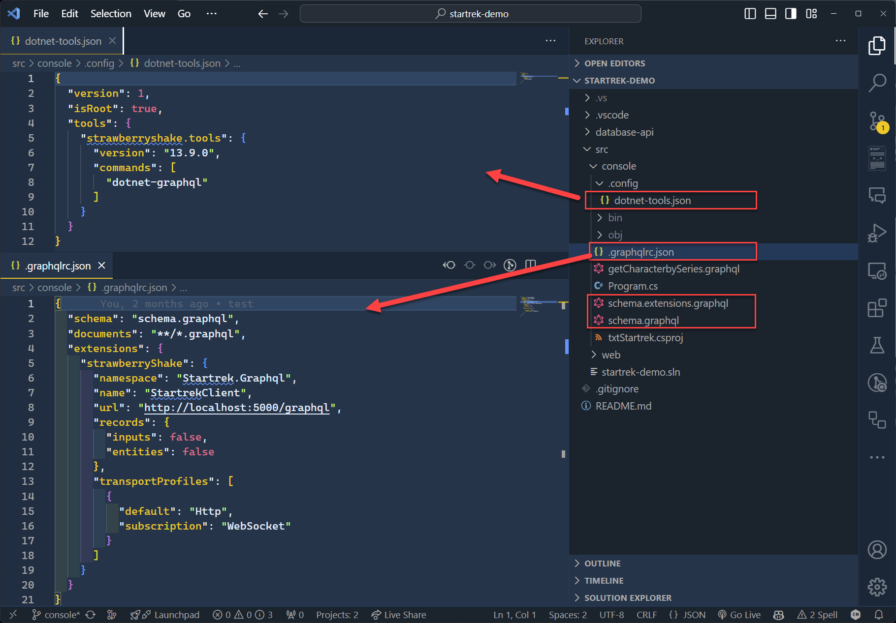
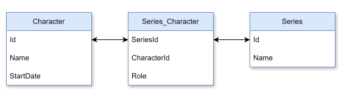
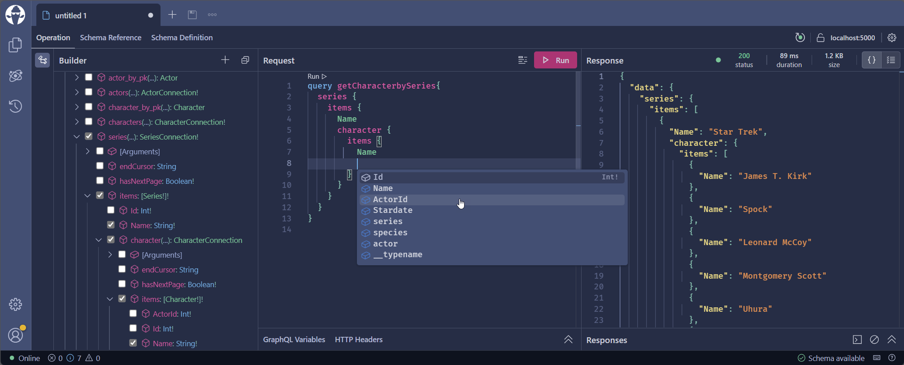
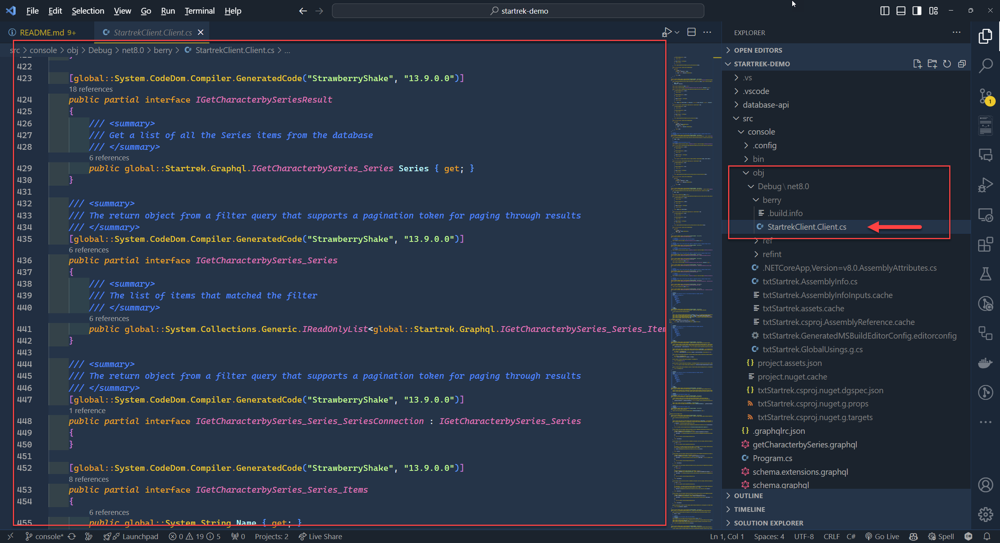
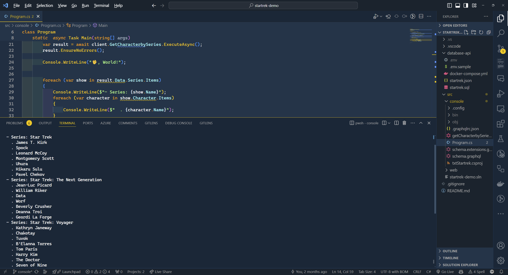

Most (if not all) projects are consuming APIs to get data, and there many ways to do it. One of the most popular ways is to use REST APIs. However, REST APIs have some limitations, such as over-fetching (forcing the client to load all properties even when only a few are needed for the UI). GraphQL is a great alternative to REST APIs because it allows you to request only the data you need, which can help reduce the amount of data transferred over the network and improve performance. It also allows you to request information coming from multiple resources in a single request, thus avoiding multiple "round trips" that can negatively impact performance and the user experience.

In this post, I will show you how to query a GraphQL API in .NET using Strawberry Shake GraphQL client. With Strawberry Shake version 13 there are now 3 packages:
 - **StrawberryShake.Server**: For consoles or backend-to-backend.
 - **StrawberryShake.Blazor**: For Blazor projects, use this package in your project, and we pre-configured it to generate Razor components automatically and use a client-side store for reactive web applications.
 - **StrawberryShake.Maui**: For Maui projects.

This post will familiarize you with GraphQL in a .NET application, and will provide you with context to better understand the Blazor and Maui implementations if you are using those technologies.

## The API and the Database

For this post, I really want to focus on the GraphQL implementation. The sample is using a SQL Server instance paired with a GraphQL API genarated with Data API Builder both running locally in Docker containers - if you really want to follow along you can find the [setup steps and T-SQL script in the repo](https://github.com/FBoucher/startrek-demo#database-and-apis-in-containers). But the important part is that this will work with any data source that you want to expose through GraphQL.

You can also find the code for this post in the [startrek-demo](https://github.com/fboucher/startrek-demo) GitHub repo.

## Let's create the console application

In a terminal, execute the following command to create a new project, move into the new folder created, and add Strawberry Shake **nuget** package to the project.

```powershell
dotnet new console -n GraphqlDemo  --use-program-main
cd .\startrekdemo\
dotnet add package StrawberryShake.Server
```

Strawberry Shake comes with tools to help improve your experience building a GraphQL client. You install tools in .NET projects by providing a manifest. Let's create a dotnet-tools manifest and add the GraphQL tool locally. We will see what is created in a few steps.

```powershell
dotnet new tool-manifest
dotnet tool install StrawberryShake.Tools --local
```

In GraphQL, APIs are defined by a schema. This is similar to how OpenAPI is used to document REST endpoints. Like OpenAPI, you can use the schema to generate the code for .NET clients that are ready "out of the box" to consume their owned data. This is how Strawberry Shake will generate a client for us based on the schema. The Startrek GraphQL API is running locally, and accessible at `http://localhost:5000/graphql`. To download the GraphQL schema, and generate the client code specifying the client name "StartrekClient", run the following command:

```powershell
dotnet graphql init http://localhost:5000/graphql -n StartrekClient
```

It's finally time to open the project and look at what we have... 

Note the generated files:

- `.config\dotnet-tools.json`
- `.graphqlrc.json` with our client's name **StartrekClient**
- `schema.extensions.graphql`
- `schema.graphql`




## Adding a new query

In the current database I have 3 tables: Series, Character, and a relation table Series_Character. The schema is as follows:



With a REST API, the typical design is to provide an endpoint with a list of series and another with a list of characters in the series. A client would need to make multiple requests in order to get the characters for multiple series. GraphQL enables you to retrieve all of this data in a single call! [Banana Cake Pop](https://chillicream.com/products/bananacakepop) is a nice GraphQL IDE for Developers, a bit like Swagger for REST APIs. You can learn more about it and Data API Builder in this session [The most minimal API code of all... none](https://www.youtube.com/watch?v=A1H1kVPHs3w) that I did with Jerry Nixon during Developer .NET Day .



To add a new query, create a new file `getCharacterbySeries.graphql` in the root of the project. Here is a query that will return a list of series with the characters for each series.
 
```graphql
query getCharacterbySeries{
	series {
		items {
			Name
			character {
				items {
					Name
				}
			}
		}
	}
}
```

The syntax looks similar to JSON, but is in fact specific to GraphQL. Looking at the tables diagram, notice that the query doesn't contain the property `StartDate` from the `Character` table. With bigger tables, this can be a huge performance gain, as the client avoid over-fetching data that isn't used.

After compiling the project `dotnet build`, you can see the generated the GraphQL client in `obj\Debug\net8.0\berry\GraphqlDemo.Client.cs`. This is one of the changes that Strawberry Shake made in version 13. The generated code is now in a folder called `berry` and not in the `Generated` folder as before.



## Using the generated GraphQL client

Open the file `Program.cs` file. Add the using for dependency injection at the top of the file.

```csharp
using Microsoft.Extensions.DependencyInjection;
```

Let's modify `Main` with the following code to create an instance of the StartrekClient (aka the GraphQL client).

```csharp
static async Task Main(string[] args)
{
	var servicesCollection = new ServiceCollection();
	servicesCollection.AddStartrekClient().ConfigureHttpClient(client =>
	{
		client.BaseAddress = new Uri("http://localhost:5000/graphql");
	});

	var services = servicesCollection.BuildServiceProvider();
	var client = services.GetRequiredService<IStartrekClient>();

	// Execute the query GetCharacterbySeries
	var result = await client.GetCharacterbySeries.ExecuteAsync();

	// Loop through the series and characters to display the results
	foreach (var tvShow in result.Data.Series.Items)
	{
		Console.WriteLine($"Series: {tvShow.Name}");
		foreach (var character in tvShow.Character.Items)
		{
			Console.WriteLine($" . {character.Name}");
		}
	}
}

```

The few last lines of `Main` are looping through query results and display the information. Executing the code `dotnet run`, will write a list of series with the characters for each series.



## What's Next?

In this post, I showed you how to query a GraphQL API in .NET using Strawberry Shake from a console application. I hope you found this post helpful and that you are now ready to start using GraphQL in your .NET projects. In the next post, let's explore how we can execute GraphQL queries in a Blazor project and display the result using the new QuickGrid.