[.NET Aspire](https://learn.microsoft.com/dotnet/aspire) is a new cloud-ready stack tailored for .NET, enabling developers to quickly and easily develop distributed applications. You've probably seen demos showing large .NET solutions with lots of fancy cloud dependencies and thought, well, maybe I'd use that someday if I'm starting on a giant enterprise Redis Kafka Postgres cloud-a-ganza, but it's not really something I can use today.

But .NET Aspire is not just about cutting-edge technology and green-field apps; it's also about making your current applications more straightforward. With .NET Aspire, you can streamline the startup process, improve monitoring, and increase the reliability of your applications. Plus, you can use service discovery to enhance your apps, even if you're not ready to use more complex features or services like Redis or containerized deployment.

In this post, we'll look at how easy it is to **make your existing solutions better** – just easier to maintain and add the kind of features you're already working on. And, sure, it's nice that you can more easily integrate more sophisticated cloud dependencies and features… but even if you never do it's still a win.

**TLDR**: In under 5 minutes you can add .NET Aspire to your existing apps and get a dashboard, health checks, and more... all without changing how your apps work, your CI/CD pipeline, or deployment process.

## What even is .NET Aspire?

If you ask five people, you will most likely get five different answers. Honestly, it's a little hard to describe, and attempts to do it briefly can turn into a bit of buzzword bingo. Really, it's just a way to solve a problem: **building distributed applications is hard**. Even just running your app requires starting up one or more services and a front-end and making sure they can talk to each other can be frustrating. Wouldn't it be nice if that was easier? That is what .NET Aspire aims to do, be your building blocks for your distributed applications making them more observable, resilient, scalable, and manageable.

Let's take a look at how a lot of applications evolve over time. A lot start as a single monolithic proof of concept. You've got an app with a database.

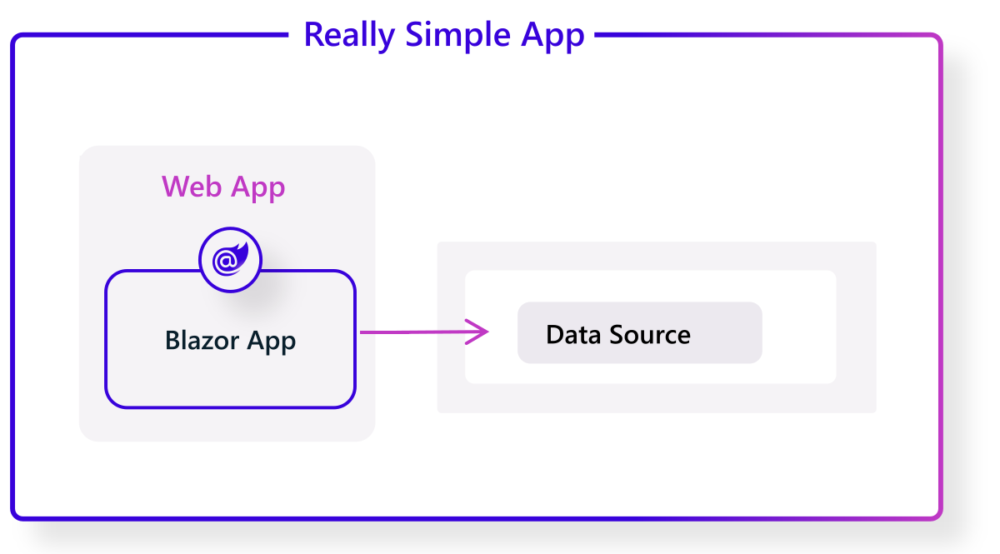

Assuming your proof of concept is successful, just about every modern app evolves to include at least a front and back-end, in addition to the database.

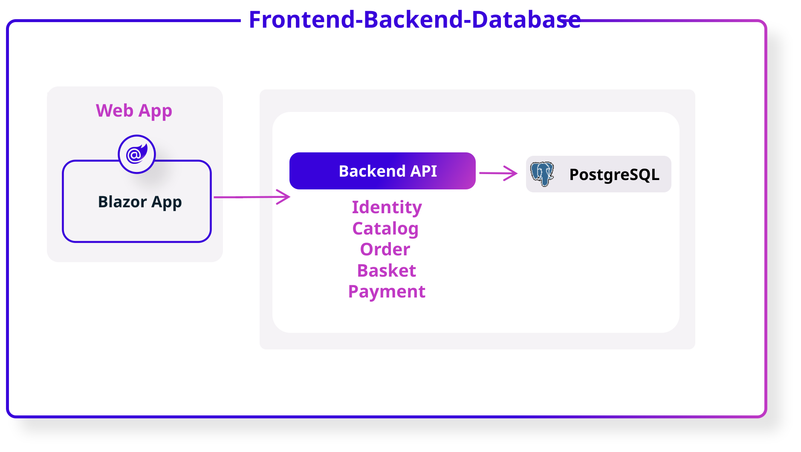

And then, maybe, if our app's usage and functionality keeps growing over time, the app will become really distributed, relying on a large set of distributed dependencies.

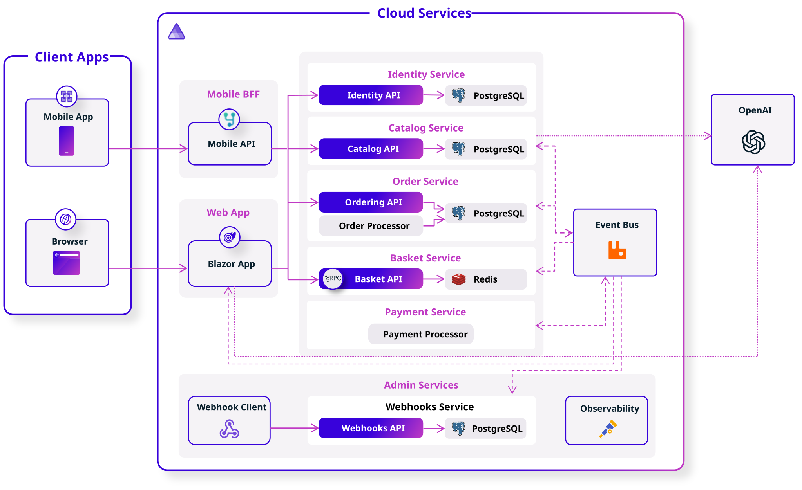

But here's the important thing! Even in the really simple Proof Of Concept phase, and definitely in the Frontend-Backend-Database phase, we can benefit from .NET Aspire! With just a few lines of code, and without messing with our CI or deployment, we can really simplify our day-to-day developer experience.

## Step 1: Turn on .NET features we've been too busy to turn on with ServiceDefaults

The ASP.NET Core team has been lighting up features for cool features for things like tracing, health checks, and resiliency for years. I've done half a dozen conference talks on "The One Hour ASP.NET Makeover" where we just turn on and configure all these cool features that have been in the box for years. But here's the thing... it takes an hour to do that talk, after reading the docs and practicing! What if I could just flip an "Enable Pro Mode" switch instead?

That's what Service Defaults does for you. You can just turn on Service Defaults and you've got smart logging, health checks, resiliency, etc. based on what the .NET team recommends for ASP.NET Core apps and services. If you want, you can easily edit the `Program.cs` file in the *ServiceDefaults* project, but you don't have to. Just turn it on.

### Adding a ServiceDefaults project

Let's look at an example with a simple Frontend – Backend app. I'll use Jeff Fritz's new *MyWeatherHub* sample from the [Let's Learn .NET Aspire](https://devblogs.microsoft.com/dotnet/lets-learn-dotnet-aspire/) event series, starting with the [start-with-api](https://github.com/dotnet-presentations/letslearn-dotnet-aspire/tree/main/start-with-api) code.

Opening the solution, we'll see that we've got two projects:

- **MyWeatherHub** – Web front-end project which displays live weather data
- **API** – Minimal API project which exposes live weather data from the US National Weather Service via a set of HTTP API endpoint

Let's add Service Defaults to this solution so we get health checks, logging, and other recommended features to both our front and back ends.

In Visual Studio 2022 or Visual Studio Code with the C# Dev Kit installed, here's all we need to do:

1. Right-click on the solution and select **Add** > **New Project**.
1. Select the *.NET Aspire Service Defaults* project template.
1. Name the project *ServiceDefaults* (any name would work if you're feeling creative, but the instructions in this post assume you're using *ServiceDefaults*).
1. Click **Next** > **Create**.

Here's how that looks in Visual Studio 2022:

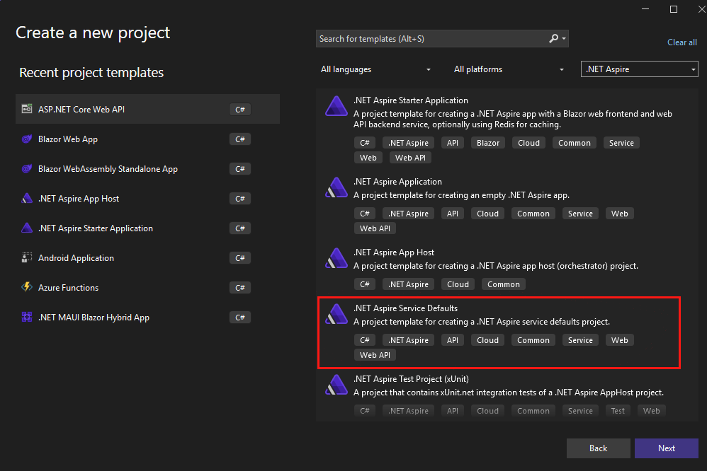

And in Visual Studio Code, it looks like this:

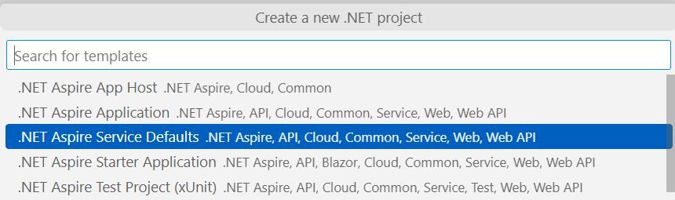

You can also add Service Defaults from the command line by using:

```console
dotnet new aspire-servicedefaults -n ServiceDefaults
```

All the above options just drop a new project that knows the best settings for most ASP.NET Core distributed apps into your solution. However, none of your existing apps are using it yet. We'll hook that up next.

### Configure Service Defaults

Add a reference to the ServiceDefaults project in the Api and *MyWeatherHub* projects:

1. Right-click on the Api project and select **Add** > **Reference**.
1. Check the *ServiceDefaults* project and click OK.
1. Right-click on the Api project and select **Add** > **Reference**.
1. Check the *MyWeatherHub* project and click OK.

   [alert type="tip" heading="Visual Studio 2022 tip"]
   In Visual Studio 2022, you can drag and drop the project onto another project to add a reference.
   [/alert]

1. In both the Api and *MyWeatherHub* projects, update their `Program.cs` files, adding the following line immediately after their `var builder = WebApplication.CreateBuilder(args);` line:

    ```console
    builder.AddServiceDefaults();
    ```

1. In both the Api and *MyWeatherHub* projects, update their `Program.cs` files,adding the following line immediately after their `var app = builder.Build();` line:

    ```csharp
    app.MapDefaultEndpoints();
    ```

### Run the application

To start with, we're going to the application using a multiple-project launch configuration. This is *fine*, it's how we've been doing things for years, but I have to admit I don't really love it. Keep in mind that we're going to make this easier in the next step. We're doing this in two steps to make it clear what's going on in Service Defaults and which parts are added by the AppHost.

If you're using Visual Studio 2022, right click on the *MyWeatherHub* solution and go to properties. Select the Api and *MyWeatherHub* as startup projects, select OK.

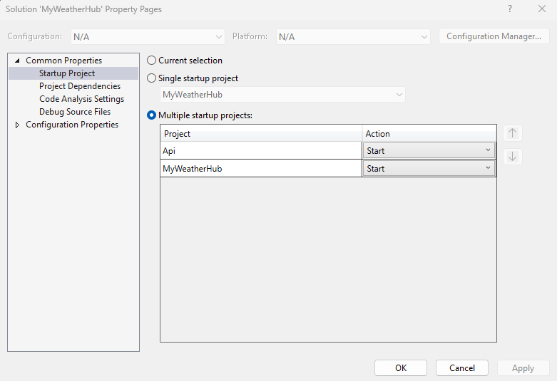

Now click **Start** to start and debug both projects.

If you're using Visual Studio Code, run the Api and *MyWeatherHub* projects using the Run and Debug panel. The sample project already includes a [launch.json file](https://github.com/dotnet-presentations/letslearn-dotnet-aspire/blob/main/start-with-api/.vscode/launch.json) with the necessary configurations to run both.

### Test the Service Defaults changes

1. Test the application by navigating to the following URLs:
    - <https://localhost:7032/swagger/index.html> - API
    - <https://localhost:7274/> - MyWeatherHub
1. You should see the Swagger UI for the API and the *MyWeatherHub* home page.
1. You can also view the health checks for the API by navigating to <https://localhost:7032/health>.
1. You can also view the health checks for the *MyWeatherHub* by navigating to <https://localhost:7274/health>.
1. View the logs in the terminal to see the health checks and other telemetry data such as resiliency with Polly:

 ```console
 Polly: Information: Execution attempt. Source: '-standard//Standard-Retry', Operation Key: '', Result: '200', Handled: 'False', Attempt: '0', Execution Time: '13.0649'
 ```

1. Click on 5 different cities and a "random" error will be thrown. You will see the Polly retry policy in action.

 ```console
 Polly: Warning: Execution attempt. Source: '-standard//Standard-Retry', Operation Key: '', Result: '500', Handled: 'True', Attempt: '0', Execution Time: '9732.8258'
 Polly: Warning: Resilience event occurred. EventName: 'OnRetry', Source: '-standard//Standard-Retry', Operation Key: '', Result: '500'
 System.Net.Http.HttpClient.NwsManager.ClientHandler: Information: Sending HTTP request GET http://localhost:5271/forecast/AKZ318
 ```

And that all works... the output for each application pops up in a separate console window, and we can see the health checks and logs in the terminal. So, it's great that we've got all these features turned on, but it's a bit of a pain to manage all these URLs, browser tabs, and console windows. You end up alt-tabbing between them all, and it's a really disjointed experience.

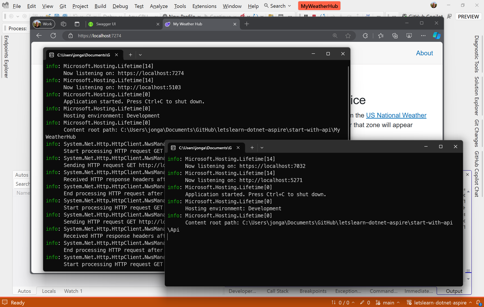

Service Defaults works great on the individual project level, but it doesn't help us manage multiple projects in a solution. That's where the AppHost comes in.

## Step 2. Simplify launch and add a fancy dashboard with AppHost

Okay, that was pretty cool! We added a project to our solution and two lines of code, and we got health checks, logging, resiliency, and more.

But we can make that even better by adding an AppHost. That multiple-project configuration thing works, but it's a bit annoying to set up and keep updated as we add other projects to the solution. Once we're running we have to browse to a bunch of urls with different ports and manage each project separately. For instance, if we want to see logs or output, we have to check in each project's console window. This gets even worse as we add more APIs and services to the solution – more URLs to manage, more console windows to check, etc. We've probably got some fancy dashboards and monitoring set up in production, but that doesn't help me while I'm developing.

The *AppHost* has a lot of great features, but two of my favorite are the solutions to the problems above: it simplifies project launch and it adds an amazing dashboard to monitor and manage my app in my development environment. The best way to understand what it's doing it to just add it to our solution.

### Adding an *AppHost* project

This is the standard "add project" steps we ran through before with ServiceDefaults, but this time we're going to pick ".NET Aspire App Host" as the project template. In Visual Studio 2022 or Visual Studio Code with the C# DevKit installed:

1. Right-click on the solution and select **Add** > **New Project**.
1. Select the *.NET Aspire App Host* project template.
1. Name the project *AppHost* (again, any name would work).
1. Click **Next** > **Create**.

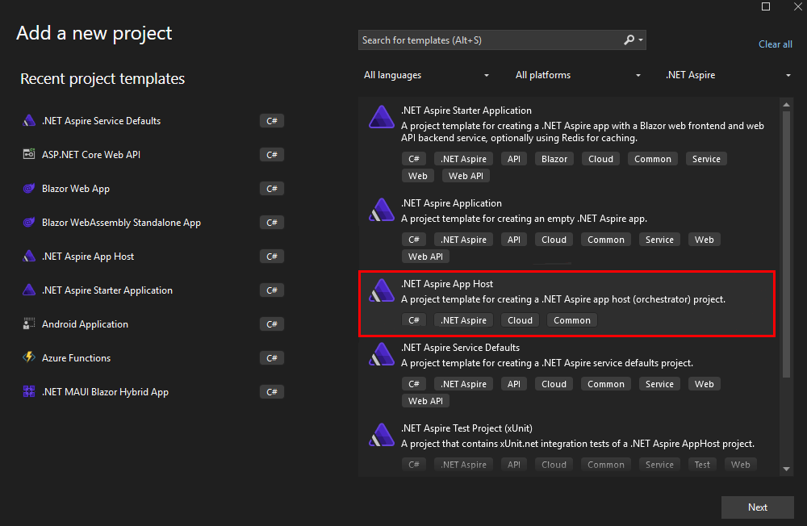

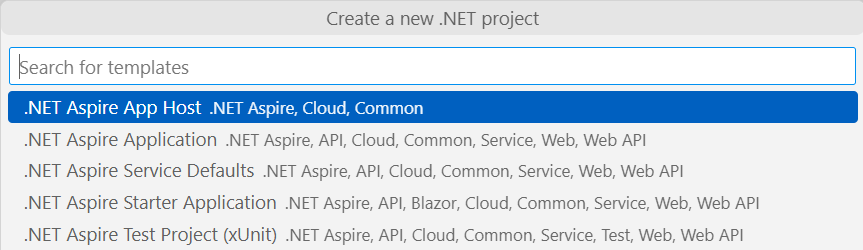

And from the command-line, you can do that with:

```console
dotnet new aspire-apphost -n AppHost
```

Just like when we added the Service Defaults, we need to add project references and a few lines of code to put the *AppHost* to work.

### Add project references

Add a reference to the Api and *MyWeatherHub* projects in the new *AppHost* project:

1. Right-click on the *AppHost* project and select Add > Reference.
1. Check the Api and *MyWeatherHub* projects and click OK.

Note: Bonus points if you remembered the earlier tip that you can drag and drop the project onto another project to add a reference.

When these references are added Source Generators automatically generate the necessary code to reference the projects in the App Host.

### Orchestrate the Application

In the *AppHost* project, update the `Program.cs` file, adding the following line immediately after the var builder = DistributedApplication.CreateBuilder(args); line:

 ```csharp
 var api = builder.AddProject<Projects.Api>("api");
 var web = builder.AddProject<Projects.MyWeatherHub>("myweatherhub");
 ```

**Run the application... the easy way!**

Previously, we set up a multi-project launch profile. That still works, but from now on, you won't have to bother with that. Instead, set the *AppHost* project as the startup project. It knows about all the other projects, and will launch them all automatically. That means that if you add an *AppHost* at the beginning (or use either the .NET Aspire Starter Application template or the .NET Aspire Application template), you never need to set up a multi-project launch profile again. And even better, if you add more services to your solution, the *AppHost* will automatically pick them up, too.

In Visual Studio, you can set the *AppHost* project as the startup project in Visual Studio by right clicking on the *AppHost* and clicking Set Default Project and hitting Start.

If you're using Visual Studio Code, replace the contents of your launch.json file with the following and then hitting Run in the Run and Debug panel.

 ```json
 {
        "version": "0.2.0",
        "configurations": [
            {
                "name": "Run AppHost",
                "type": "dotnet",
                "request": "launch",
                "projectPath": "${workspaceFolder}\\AppHost\\AppHost.csproj"
            }
        ]
    }
 ```

### Hey, we've got a dashboard!

Remember how we had to browse to a bunch of different URLs to see our app and its health checks? Now, the *AppHost* will automatically launch a dashboard with all our services and their dependencies. It rolls up all the health checks, traces, logs, and information like environment variables in one place. And, if we add more services to our solution, they'll automatically show up in the dashboard. Let's take a look.

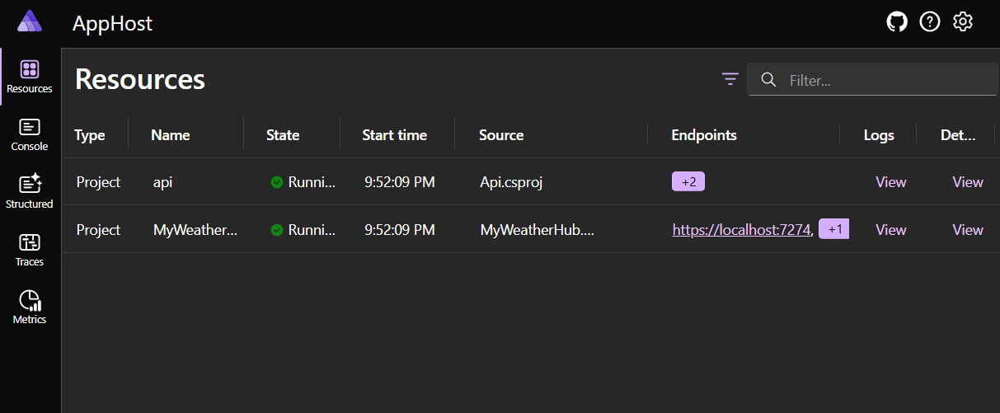

First, let's take a look at the resources. This is a handy listing of all the resources in our solution. We can see the API and *MyWeatherHub* projects and watch their state as they start up. We also get clickable links to their endpoints, logs, and traces.

The ServiceDefaults project we added earlier automatically configures tracing for all of our projects. We can see that in the Traces tab. This is a great way to understanding timing and dependencies in our app.

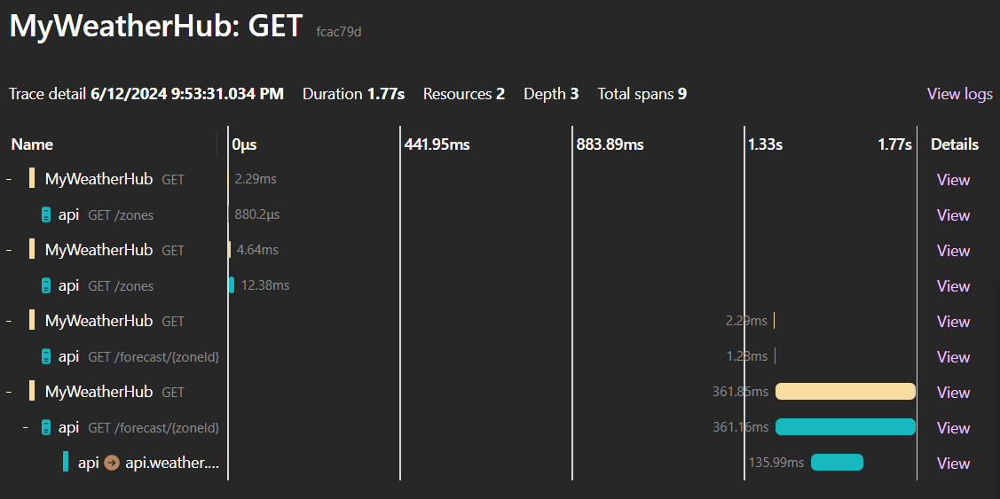]

The *Metrics* tab shows us a lot of information about our app, including CPU and memory usage, and the number of requests and errors. Again, this is all automatically set up for us by the ServiceDefaults project and exposed in the *AppHost* dashboard.


The *Structured* tab shows us all the structured logs from our app. This is a great way to see errors and other important information in our app.

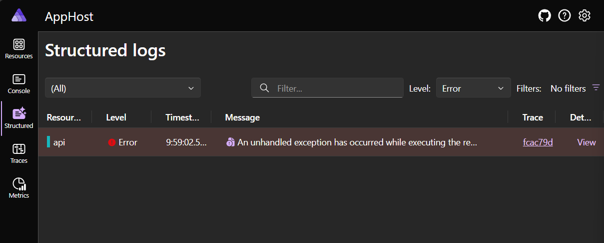

## Summary

The point is, .NET Aspire isn't just for new apps or giant enterprise solutions. It's for you, right now, to make your existing apps better. You can add it to your existing solutions and get a lot of benefits with just a few lines of code. And, if you're not ready to use more advanced features like service discovery or containerized deployment, that's okay. You can still benefit from the simplicity and reliability that .NET Aspire brings to your apps.
