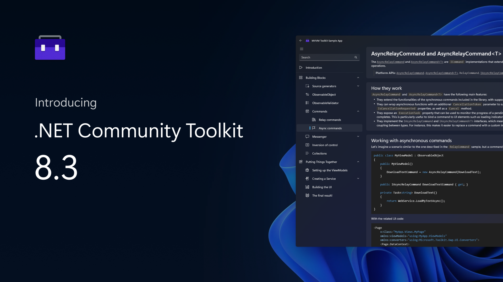
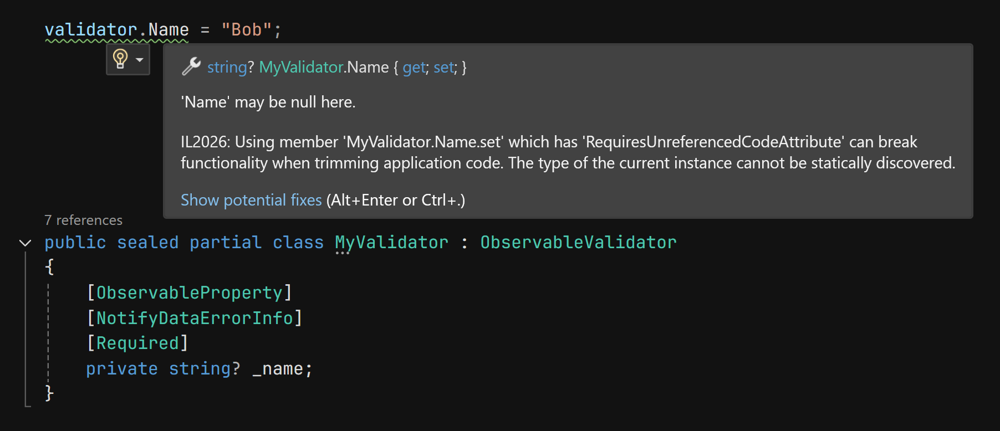

We're happy to announce the official launch of the 8.3 release of the .NET Community Toolkit! This new version includes .NET 8 and NativeAOT support for all libraries, performance improvements, several bug fixes and enhancements, and more!

[](https://aka.ms/toolkit/dotnet/)

As always, we deeply appreciate all the feedback received both by teams here at Microsoft using the Toolkit, as well as other developers in the community. All the issues, bug reports, comments and feedback continue to be extremely useful for us to plan and prioritize feature work across the entire .NET Community Toolkit. Thank you to everyone contributing to this project and helping make the .NET Community Toolkit better! 🎉

## What's in the .NET Community Toolkit? 👀

The .NET Community Toolkit includes the following libraries:

- `CommunityToolkit.Common`
- `CommunityToolkit.Mvvm` (aka "Microsoft MVVM Toolkit")
- `CommunityToolkit.Diagnostics`
- `CommunityToolkit.HighPerformance`

These components are also widely used in several inbox apps that ship with Windows, such as the Microsoft Store and the Photos app! 🚀

> For more details on the history of the .NET Community Toolkit, [here is a link to our previous 8.0.0 announcement post](https://devblogs.microsoft.com/dotnet/announcing-the-dotnet-community-toolkit-800/).

Here is a breakdown of the main changes that are included in this new 8.3 release of the .NET Community Toolkit.

## .NET 8 and NativeAOT support 🚀

The main change in this new release of the .NET Community Toolkit is support for .NET 8 and NativeAOT! As part of this, all APIs across all packages have been annotated to fully support trimming and AOT compatibility, to ensure using any part of the .NET Community Toolkit goes smoothly even in those scenarios. Here you can see an example of a new trim annotation, that correctly shows up in the IDE to warn about potentially unsafe code (even from code generated by `[ObservableProperty]`!):

[](https://aka.ms/toolkit/dotnet/)

Additionally, this new release of the MVVM Toolkit adds support for the `net8.0-windows10.0.17763.0` target as well, to be fully trim and AOT compatible with WinAppSDK (WinUI 3) as well! Adding this new target framework is necessary to ensure that all types that might be marshalled to WinRT will have all needed interop code generated for them, via [CsWinRT](https://github.com/microsoft/CsWinRT). This is all fully transparent for consumers of the package: just reference the MVVM Toolkit from any project, publish with NativeAOT, and it will work as expected!

## Removing overhead for unused MVVM Toolkit features (ie. making it "more pay-for-play") 🎈

This release also includes more performance improvements for the MVVM Toolkit. This time, the focus was on making the support for [`INotifyPropertyChanging`](https://learn.microsoft.com/dotnet/api/system.componentmodel.inotifypropertychanging) fully pay-for-play: meaning that when this interface is not needed, there will be no additional overhead because of it. For instance, frameworks such as UWP and WinUI 3 don't need viewmodels to implement this property. In those scenarios, you can set this in your .csproj file:

```xml
<PropertyGroup>
  <MvvmToolkitEnableINotifyPropertyChangingSupport>false</MvvmToolkitEnableINotifyPropertyChangingSupport>
</PropertyGroup>
```

When this property is set to `false` (it defaults to `true` for backwards compatibility), all code associated with `INotifyPropertyChanging` in `ObservableObject` will be trimmed out (the event will never be raised, and event args will never be allocated). Additionally, the MVVM Toolkit source generator will also detect and respect the value of this property, and it will optimize the code to avoid generating all the code that was meant to implement that functionality!

## Other changes and improvements ✅

- **Fix generation for OnPropertyChanging for `[NotifyPropertyChangedFor]`** ([#722](https://github.com/CommunityToolkit/dotnet/pull/722)): when using `[NotifyPropertyChangedFor]`, the generated `OnPropertyChanging` methods were not being invoked for dependent properties. This has now been fixed.
- **Include `sizeof(T)` in offset calculation for `Memory2D<T>` from `MemoryManager`** ([#841](https://github.com/CommunityToolkit/dotnet/pull/841)): creating a `Memory2D<T>` instance wrapping a `MemoryManager` incorrectly tracked the data offset. This is no longer the case, thank you [@Lillenne](https://github.com/Lillenne)!
- **Avoid auto-generating `ObservableValidator.HasError`** ([#844](https://github.com/CommunityToolkit/dotnet/pull/884)): the `ObservableValidator.HasError` property will no longer automatically show up in table views in frameworks that dynamically generate columns from declared properties. Thank you [@arivoir](https://github.com/arivoir)!
- **Fix `IBufferWriterExtensions.Write` for unmanaged types** ([#799](https://github.com/CommunityToolkit/dotnet/pull/799)): fixed an incorrect length calculation in the `Write` extension for unmanaged types. Thank you [@pziezio](https://github.com/pziezio)!

You can see the full changelog for this release from the [GitHub release page](https://github.com/CommunityToolkit/dotnet/releases/tag/v8.3.0).

## Get started today! 🎉

You can find all source code in our [GitHub repo](https://aka.ms/toolkit/dotnet/), some handwritten docs on [MS learn](https://aka.ms/toolkit/docs/), and complete API references in the .NET API browser website. If you would like to contribute, feel free to open issues or to reach out to let us know about your experience! To follow the conversation on Twitter, use the #CommunityToolkit hashtag. All your feedback greatly helped shape the direction of these libraries, so make sure to share them!

Happy coding! 💻