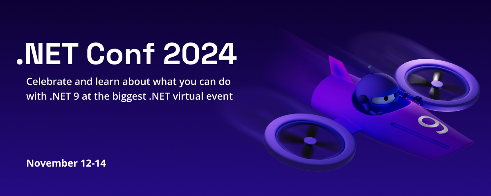

We are thrilled to announce the highly anticipated **.NET Conf 2024**, a free, three-day virtual developer event celebrating the release of .NET 9. Co-organized by the .NET community and Microsoft, this annual tradition continues to grow, and we’re more excited than ever to bring you the latest innovations in .NET. Mark your calendars for **November 12th to 14th, 2024**, and prepare to be inspired by a wealth of knowledge, creativity, and community engagement.

[cta-button align='center' text='Save the date!' url='https://www.dotnetconf.net/' color='#5c33b8']

## Elevate Your Development Experience with .NET 9

.NET Conf 2024 is your gateway to exploring the cutting-edge advancements in the .NET ecosystem. With the release of .NET 9, we’re introducing features that elevate cloud-native and intelligent app development, focusing on productivity enhancements, streamlined deployments, and accelerated AI integration. Whether you’re a seasoned developer or just starting your .NET journey, this conference will offer something valuable for everyone.

## A Diverse Array of Live Sessions

Get ready for an immersive experience with a dynamic selection of live sessions featuring esteemed speakers from the .NET community and Microsoft’s .NET team. These sessions will dive deep into the topics that matter most, helping you stay ahead of the curve with insights and tips from industry leaders. To ensure global participation, we’re continuing our tradition of a 24-hour continuous broadcast, accommodating developers from every time zone.

## Call for Content – Submit Now

The call for content for .NET Conf 2024 is now open on [Sessionize](https://sessionize.com/net-conf-2024/)!

We are seeking 30-minute talks (including a 5-minute audience Q&A) covering .NET, Visual Studio, GitHub, and the Azure Developer Experience. This is your chance to share your expertise and insights on the latest .NET 9 features with the global .NET community. To maximize your chances, please submit sessions focus on things you're doing with .NET rather than duplicating product team announcements. Examples of top community session topics in previous years include architecture, open-source .NET libraries, design tips, lessons learned, and fun side projects.

All sessions **MUST** be submitted through [Sessionize](https://sessionize.com/net-conf-2024/), and we will curate the best and most engaging sessions to be broadcast live during the event.

We’re looking forward to your submissions that will inspire and excite the .NET developer community!

## Explore Exciting Themes

.NET Conf 2024 will captivate developers with themes that are both relevant and forward-looking. Topics include:

- **Cloud Native:** Learn how to leverage .NET 9 in cloud-native environments, unlocking unparalleled scalability, performance, and resilience.
- **AI-Powered Apps:** Discover how .NET 9 accelerates AI integration, enabling you to build intelligent applications with ease and efficiency.
- **Blazor and Beyond:** Explore the latest advancements in Blazor and how it continues to bridge the gap between client and server-side development.
- **Cross-Platform Excellence:** Dive into the multi-platform capabilities of .NET MAUI, empowering you to create beautiful applications across desktop, mobile, and more.

## Engage and Win Prizes

.NET Conf 2024 is not just about learning; it’s about connecting with fellow developers and having fun. Join the excitement on our website, YouTube, and Twitch channels, where you can ask questions live on social media, interact with speakers, and engage in lively discussions. Don’t miss our virtual attendee party, where you can win fantastic prizes generously provided by our sponsors.

## Worldwide Local Events

We believe in the power of community, which is why .NET Conf doesn’t end with the three-day event. We extend our support to organizers worldwide, enabling them to present to their local communities for months after the conference, ensuring the momentum and knowledge-sharing continue.

## Conclusion

.NET Conf 2024 promises to be an extraordinary event, bringing together developers from around the world to celebrate the release of .NET 9. With a wide selection of live sessions, engaging interactions, and exciting virtual parties, this is an event you won’t want to miss. Mark your calendars for **November 12th to 14th**, and join us as we explore the future of .NET. Let’s come together to learn, connect, and celebrate the incredible achievements of the .NET community.

[cta-button align='center' text='Save the date!' url='https://www.dotnetconf.net'  color='#5c33b8']

Stay tuned for more updates, and don’t forget to spread the word among your developer friends and colleagues. Together, let’s make .NET Conf 2024 a resounding success!
