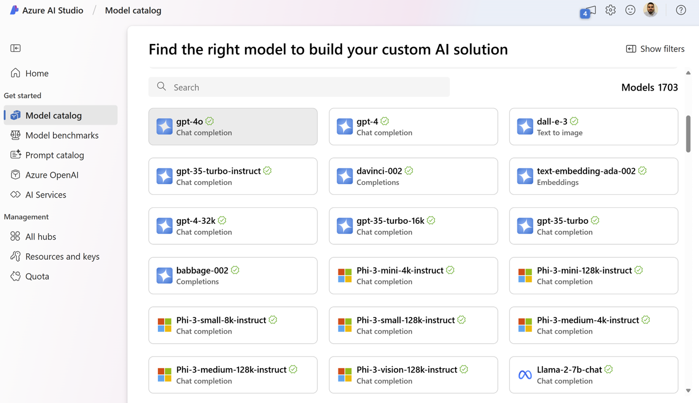
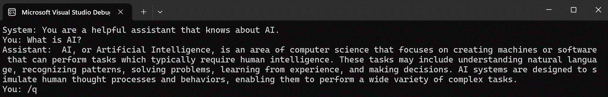

AI models are constantly evolving and improving, but keeping up with the latest developments can be challenging.

That's why we're introducing the Azure AI Inference SDK for .NET.

This SDK lets you easily access and use a wide range of AI models from the Azure AI Model Catalog for inference tasks like chat, so you can seamlessly integrate AI into your applications that meet your needs.

## What is the Azure AI Model Catalog?



The Model Catalog in Azure AI Studio makes it easy to browse through various AI models and deploy them.

Models from the catalog can be deployed to Managed Compute or as a Serverless API.

Some key features include:

- **Model Availability**: The model catalog features a diverse collection of models from providers such as Microsoft, Azure OpenAI, Mistral, Meta, and Cohere. This ensures you can find the right model to satisfy your requirements.
- **Easy to deploy**: Serverless API deployments remove the complexity about hosting and provisioning the hardware to run cutting edge models. When deploying models with serverless API, you don't need quota to host them and you are billed per token.
- **Responsible AI Built-In**: Safety is a priority. Language models from the catalog come with default configurations of Azure AI Content Safety moderation filters which detect harmful content.

For more details, see the [Azure AI Model Catalog documentation](https://learn.microsoft.com/azure/ai-studio/how-to/model-catalog-overview).

## Get Started

1. Deploy a model like [Phi-3](https://ai.azure.com/explore/models?selectedCollection=phi&tid=72f988bf-86f1-41af-91ab-2d7cd011db47). For more details, see the [Azure AI Model Catalog deployment documentation](https://learn.microsoft.com/azure/ai-studio/how-to/deploy-models-serverless?tabs=azure-ai-studio).
1. Create a C# console application and install the [Azure.AI.Inference](https://www.nuget.org/packages/Azure.AI.Inference/) SDK from NuGet.
1. Add the following code to your application to start making requests to your model service. Make sure to replace your key and endpoint with those provided with your deployment.

```csharp
var key = "YOUR-MODEL-API-KEY";
var endpoint = "YOUR-MODEL-ENDPOINT";

var chatClient = new ChatCompletionsClient(
    new Uri(endpoint), 
    new Azure.AzureKeyCredential(key));

var chatHistory = new List<ChatRequestMessage>()
{
    new ChatRequestSystemMessage("You are a helpful assistant that knows about AI.")
};

Console.WriteLine($"System: {
    chatHistory
    .Where(x => x.GetType() == typeof(ChatRequestSystemMessage))
    .Select(x => ((ChatRequestSystemMessage)x).Content)
    .First()}");

while(true)
{
    Console.Write("You: ");
    var userMessage = Console.ReadLine();

    // Exit loop
    if (userMessage.StartsWith("/q"))
    {
        break;
    }

    chatHistory.Add(new ChatRequestUserMessage(userMessage));

    ChatCompletions? response = await chatClient.CompleteAsync(chatHistory);
    ChatResponseMessage? assistantMessage = response.Choices.First().Message;
    chatHistory.Add(new ChatRequestAssistantMessage(assistantMessage));

    Console.WriteLine($"Assistant: {assistantMessage.Content}");
}
```



For more details, see the [Azure AI Model Inference API documentation](https://aka.ms/azsdk/azure-ai-inference/csharp/reference).

## Conclusion

We're excited to see what you build! Try out the Azure AI Inference SDK and give us feedback.  