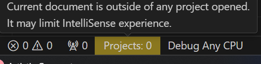
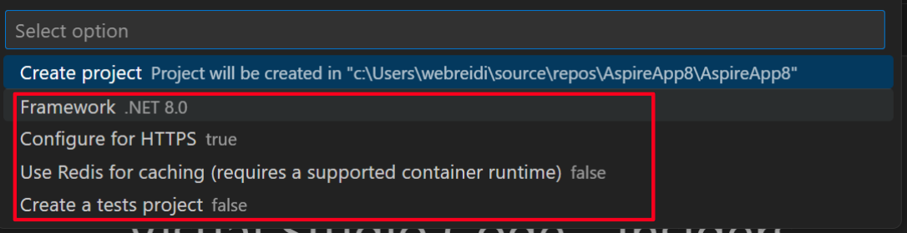
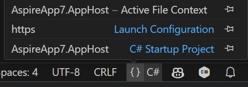

Whether you're a seasoned C# developer or just getting started with C#, the August 2024 release of C# Dev Kit extension for Visual Studio Code is here to enhance your productivity. 

Many developers find that using Visual Studio alongside VS Code provides a versatile and powerful development workflow. This update (v1.9.55) brings significant quality improvements and exciting new features to C# Dev Kit, designed to make your coding experience in VS Code smoother and more efficient than ever.

## Quality Improvements

Top feedback that we’ve heard from you is we should focus on quality and to make the experience more reliable for your C# development.  Listening to your feedback, we've focused on making the C# Dev Kit more reliable and intuitive, addressing over 72 developer-reported issues last month alone. With the August release, we're continuing this commitment by resolving more of the most pressing challenges you face.

### Razor

One of the top developer requests is that we improve Razor IntelliSense and Razor error management in C# Dev Kit, and we're listening.  With the August stable release, working with Razor files just got a lot smoother. Say goodbye to annoying flashing error messages and welcome improved IntelliSense that helps you code faster and with greater confidence. 

### Project Status

Another top feedback item is IntelliSense doesn’t work. Investigations into most of these issues show this usually happens when there is a problem with the project or the solution in C# Dev Kit. To help you better understand the status of your project and help make you aware if there is something not working or configured correctly with your projects, we have updated the Project Status bar.  

Imagine you're working on a large solution and IntelliSense suddenly stops working. The updated Project Status bar can now pinpoint exactly where the active file fits in your project structure, helping you quickly identify and resolve any misconfigurations. If IntelliSense isn’t working as expected, check the status bar to make sure it knows which project the active file belongs to. If everything looks good there and IntelliSense still isn’t working as expected, please submit an issue so that we can take the next step in improving your experience.

### Create New Project Configuration Options

Developers have been asking for the ability to specify project configuration options when creating a new project. With the August stable release of C# Dev Kit, you now get an improved project creation experience that provides you access to the same options you can use when creating a new project through the Command Line Interface (CLI).  Now, when you create a .NET project, you have full control over the configuration options, from selecting your target framework to enabling HTTPS. This ensures that your new projects are perfectly tailored to your development needs right from the start. To enable this experience, set the C# Dev Kit setting, *csharp.experimental.dotnetNewIntegration* to true.

## Set Launch/Debug Configuration

Do you have a large .NET Solution with lots of projects and want an easy way to configure your startup project and your launch configuration? Then you’ll love the improvements we’ve made to the launch and debug experience in C# Dev Kit.  You can use this feature to set/update your startup project and to set/update your launch configuration. Just click on the {} in the lower right corner of VS Code to see/update your configurations. Once you’ve set it up, just F5 and you will be off and debugging. To enable this, set the C# Dev Kit setting, *csharp.preview.improvedLaunchExperience* to true.

## Drag/drop

Do you love Solution Explorer, and hate having to move back to the File Explorer to drag and drop files from one folder/project to another? Now available in C# Dev Kit, you can drag and drop files within Solution Explorer, both within and between projects. 

## Summary

We can’t wait for you to try these new features in the [C# Dev Kit](https://marketplace.visualstudio.com/items?itemName=ms-dotnettools.csdevkit). Download the update today, explore the new possibilities, and [share your thoughts with us](https://github.com/microsoft/vscode-dotnettools/issues/new)—your feedback drives our innovation!
