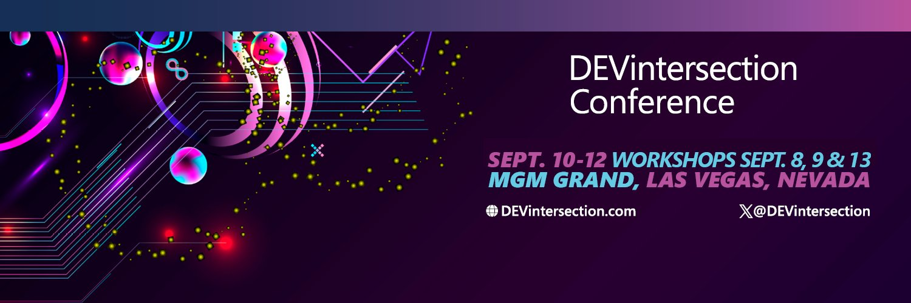

From September 9-12, 2024, DevIntersection Las Vegas brings you an in-person-only event packed with the latest in .NET and Azure technologies. This is your chance to join experts from the .NET team and community, dive deep into the newest advancements, and get your questions answered directly by the people who build the tools you use every day.

**Featured .NET Sessions and Speakers**

Here’s a selection of key .NET sessions that you won’t want to miss:

| **Session Title**                                  | **Speaker(s)**                                                    | **Date**            | **Description**                                                                                      |
|----------------------------------------------------|-------------------------------------------------------------------|---------------------|------------------------------------------------------------------------------------------------------|
| Introduction to .NET Aspire                        | Damian Edwards                                                   | September 10        | Learn about the new features and capabilities of .NET Aspire for cloud-native development.           |
| Practical Real-World AI for Developers             | Scott Hanselman, Safia Abdalla                                    | September 10        | Discover how to integrate AI into your applications using .NET and Azure AI.                         |
| Innovating with Azure AI: The Power and Possibilities of GenAI | Eric Boyd                                           | September 10        | Explore the latest advancements in Azure AI and how to apply them in your projects.                  |
| Get Started with the Full Stack Web Using Blazor   | Jeff Fritz                                                        | September 10        | A hands-on session on building dynamic web applications with Blazor and .NET 8.                      |
| Implementing Web Security in Your ASP.NET Applications | Javier Lozano                                                 | September 10        | Learn best practices for securing your ASP.NET applications against common threats.                  |
| Introducing .NET Aspire – Cloud Native Development | Scott Hunter, Maddy Montaquila                                    | September 11        | An in-depth look at .NET Aspire and its tools for developing cloud-native applications.              |
| Building AI Applications from Scratch             | Luis Quintanilla                                                 | September 12        | A workshop focusing on creating AI-powered applications using .NET and Azure.                        |

In addition to all of these .NET sessions, the .NET team at Microsoft will be presenting some great hands-on workshops. Jeff Fritz will be leading a workshop on building your first application with Blazor and .NET 8, where you'll learn how Blazor works with Web Assembly, webservers, and hybrid applications to deliver a great experience for your users. Additionally, Damian Edwards, Jon Galloway, and Maddy Montaquila will be presenting a session on building distributed applications with .NET Aspire & ASP.NET Core 8. This workshop will teach you how to bring together Blazor, Minimal APIs, Identity Endpoints, Containers, and more as we assemble a large application that you can run and test locally in development mode using .NET Aspire.

**Why Attend?**

This in-person event offers unique benefits: face-to-face interactions with Microsoft engineers and industry experts, hands-on workshops, and live discussions that go beyond virtual experiences. It’s an unparalleled opportunity to get immediate feedback, ask detailed questions, and network with peers and leaders in the .NET community.

Richard Campbell, founder of DevIntersection, shares his thoughts on the value and importance of this event in his latest video, [Whis is the DEVintersection Conference important to you?](https://www.youtube.com/watch?v=BZLBS7mbuKQ)

<iframe width="800" height="450" src="https://www.youtube.com/embed/BZLBS7mbuKQ?si=jYnY2hSBoow7zvj5" title="YouTube video player" frameborder="0" allow="accelerometer; autoplay; clipboard-write; encrypted-media; gyroscope; picture-in-picture; web-share" referrerpolicy="strict-origin-when-cross-origin" allowfullscreen></iframe>

Join us in Las Vegas to connect with the .NET community, learn from the experts, and explore the future of technology together. Don’t miss this opportunity to be part of an inspiring and informative event!
