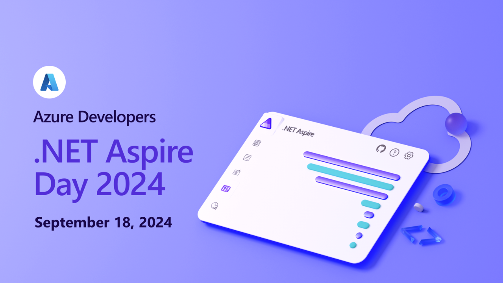

Are you ready to take your .NET development skills to the next level and fully embrace the power of cloud development? Join us at the **[Azure Developers - .NET Aspire Day 2024](https://aka.ms/azuredevelopers/dotnetaspireday)**, a virtual event happening on **September 18th, 2024**, designed specifically for developers eager to build, optimize, and deploy modern cloud applications using .NET on Azure.

This half-day event is packed with sessions led by industry experts and seasoned developers who will guide you through a variety of topics, from integrating Azure services with .NET Aspire to optimizing cloud-native applications. Whether you’re new to cloud development or looking to expand your knowledge, Azure Developers - .NET Aspire Day 2024 has something for everyone.

### What to Expect

**Azure Developers - .NET Aspire Day 2024** is tailored to provide you with the skills and knowledge you need to build scalable, secure, and high-performance cloud applications using .NET and Azure. Here are some of the exciting sessions and speakers you can look forward to:

- **Building new (and retrofitting old) apps with .NET Aspire to streamline your development process**  
  *Speaker: Brady Gaster*  
  Hear about how you can use the tooling experiences in Visual Studio to create a new .NET Aspire app OR add .NET Aspire to an existing app, no matter where you're deploying it to today.

- **Aspiring .NET Applications with Azure OpenAI**  
  *Speaker: Chris Ayers*  
  Dive into the future of .NET development with .NET Aspire by learning how to integrate AI capabilities into your applications using Azure OpenAI. In this session, we will walk through building an Aspire Application from scratch, leveraging the power of local Azure deployments to enhance functionality and performance.

- **Aspireify: Building and Deploying with .NET Aspire on Azure**  
  *Speaker: Jeff Fritz*  
  Aspireify.net is a one stop shop for all things .NET Aspire and build with .NET Aspire! Come see how I built it, how I deploy it, and some lessons learned along the way.

- **Introduction to Azure Redis Cache and .NET Aspire**  
  *Speaker: Catherine Wang*  
  An introduction to Azure Redis Cache and its integration with .NET Aspire.

- **Introduction to Azure SQL and .NET Aspire**  
  *Speaker: Jerry Nixon*  
  Learn about Azure SQL and how it integrates with .NET Aspire.

- **Introduction to Azure Monitor and .NET Aspire**  
  *Speaker: Matthew McCleary*  
  An introduction to Azure Monitor and its integration with .NET Aspire.

- **Introduction to Azure Key Vault and .NET Aspire**  
  *Speaker: David Pine*  
  Learn about Azure Key Vault and how it integrates with .NET Aspire.

- **.NET Aspire Manifest + azd + Bicep == 🤯**  
  *Speaker: James Montemagno*  
  How does .NET Aspire and AZD figure out WHAT to deploy to Azure Container Apps when you azd up? Let me show you under the hood how this all works.

- **Client Side JavaScript OpenTelemetry Integration with .NET Aspire**  
  *Speaker: Aaron Powell*  
  Learn about integrating Client-Side JavaScript OpenTelemetry with .NET Aspire.

*Plus more sessions being added...*

### Why Attend?

- **Learn from the Experts:** Gain insights from some of the most knowledgeable professionals in the industry, sharing their experiences and best practices for developing cloud applications with .NET and Azure.

- **Hands-On Learning:** Participate in practical sessions and workshops designed to give you hands-on experience with the tools and techniques necessary to build and deploy modern cloud applications.

- **Network with Peers:** Connect with other developers from around the world, share your experiences, and learn from others in the .NET community.

- **Stay Ahead of the Curve:** Keep up with the latest trends and advancements in .NET and Azure, ensuring your skills remain relevant and cutting-edge.

### Save the Date!

Don’t miss this opportunity to enhance your cloud development skills with .NET and Azure. Join us on **September 18, 2024**, for a half-day filled with learning, inspiration, and community engagement. Whether you're looking to deepen your technical knowledge, explore new tools, or connect with fellow developers, **Azure Developers - .NET Aspire Day 2024** has something for everyone.

**Register now** and secure your spot for this exciting event. For more details and to stay updated on the latest news, visit our website and follow us on social media.

[cta-button align='center' text='Save the date!' url='https://aka.ms/azuredevelopers/dotnetaspireday' color='#5c33b8']

We look forward to seeing you there and helping you unlock the full potential of .NET and Azure!
