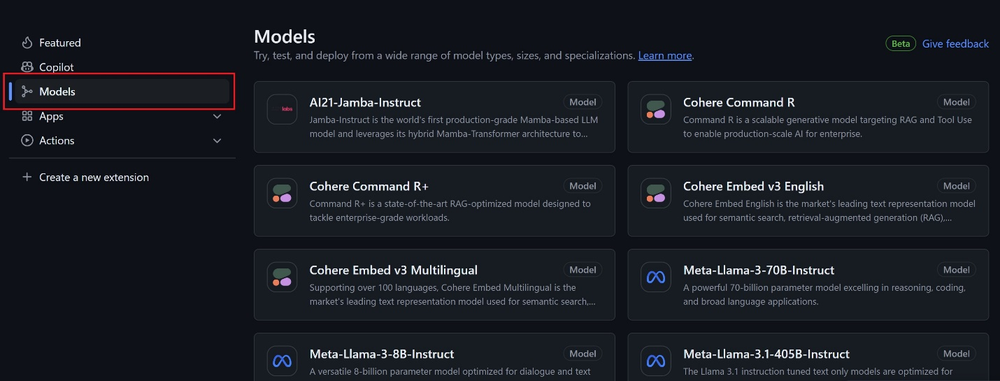
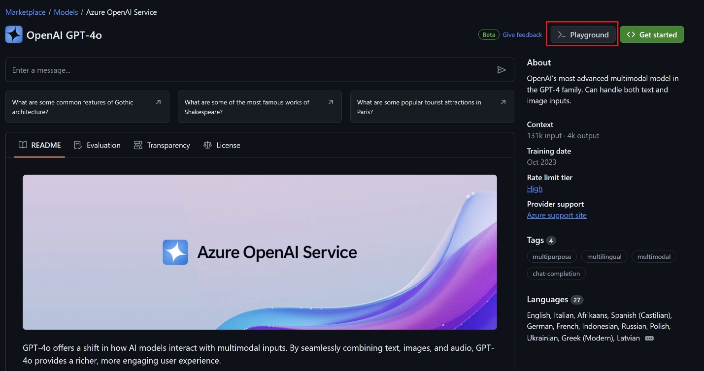
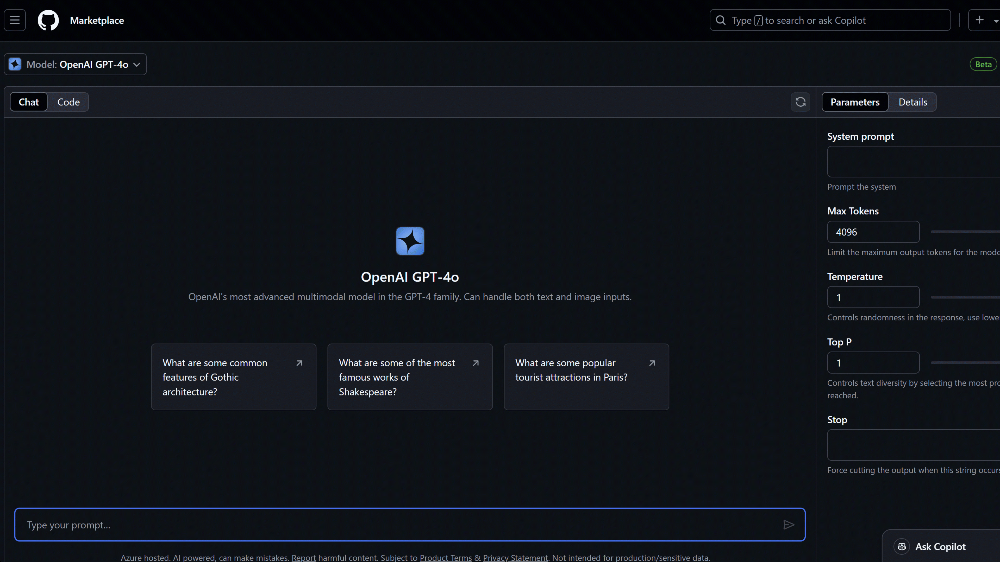
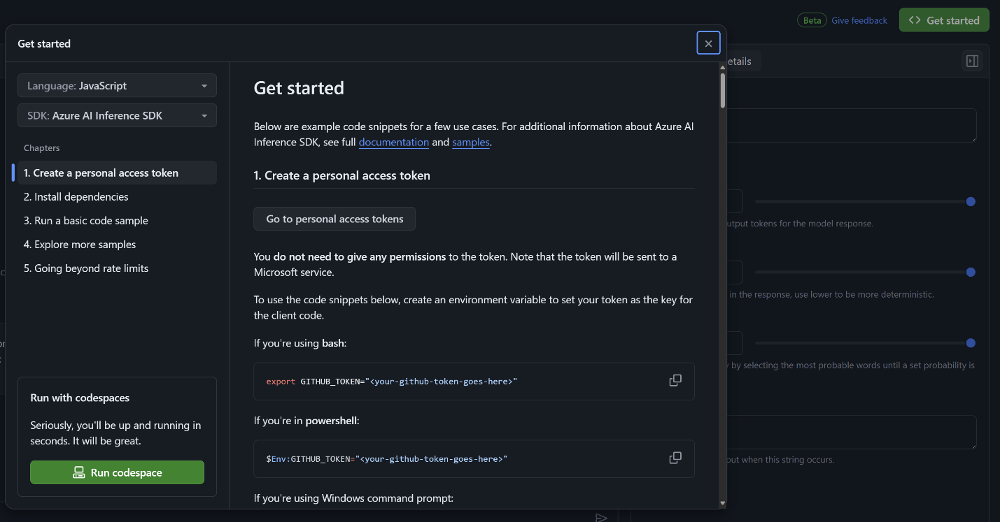

As full stack engineers, we often need to integrate backend and frontend code with AI models. However, accessing these models has been a major challenge. One of the major blockers is the lack of easy access to open and closed models. Here at GitHub, we are breaking down the barriers of access and launching [GitHub Models](https://github.com/marketplace). Giving you, the developer, access to various AI models from GPT-4o, Phi 3, Mistral Large 2, or Llama 3.1. While GitHub Models is in private beta today, you can [join the waitlist.](https://github.com/marketplace/models/waitlist/join)

Getting started is extremely easy as GitHub provides you with built-in playground that lets you test different prompts and model parameters for free, right in the GitHub UI. Once you have been successful in the playground, GitHub has created a seamless path that allows you to bring your models to your favorite development environment: GitHub Codespaces or VS Code.

GitHub Models is production ready as it leverages Azure AI that has built-in responsible AI, enterprise-grade security and data privacy. Offering global availability across over 25 Azure regions for some of the models. Read more about the [Responsible use of GitHub Models](https://docs.github.com/github-models/responsible-use-of-github-models).

While GitHub Models offers a seamless way to experiment with AI models directly in the GitHub UI, .NET developers can leverage the powerful [Azure AI Inference SDK](https://devblogs.microsoft.com/dotnet/azure-ai-model-catalog-dotnet-inference-sdk/) to integrate these models into their applications. With the recent addition of .NET support, the Azure AI Inference SDK provides a robust path to incorporating AI, ensuring that .NET developers are not left behind as this technology evolves. Let's explore how you can start experimenting with GitHub Models today, with additional support from the Azure AI Inference SDK.

## Getting Started with GitHub Models

To get started using GitHub Models, it takes a very short time to play. In reality, code is play and that is how we, as developers, learn best. Let’s get started below by using a C# Semantic Kernel to combine with prompts to connect to an existing API to perform actions.

To get started using AI with .NET, reference the [AI for .NET developers documentation](https://learn.microsoft.com/dotnet/ai/)

1. To find the AI models available, go to the [GitHub Marketplace.](https://github.com/marketplace/models) Select Models in the sidebar. You can read details about a model by clicking on the model’s name.

    

1. Start experimenting by opening a free playground where you can adjust the model parameters and submit prompts to see how the model responds. To open the playground, select the Playground button from the screen of that model

    

1. To adjust the parameters for the model, select Parameters in the sidebar. Once you’ve selected the parameters that suit your requirements, type in the prompt bar in the bottom of what you would like to create:

    

1. In order to see code that corresponds to the parameters that you selected, switch from the Chat tab to the Code Tab. You can also select the specific programming language that you would like to use or select the specific SDK to use.

1. Once you're comfortable experimenting, it's time to bring your models into your development environment. Select the Get Started button in the top right corner. You can quickly select Run Codespace and be up and running in seconds.

    To run you code locally in VS Code, follow the steps outlined to create a personal access token.

    

[alert type="note" heading="Note"]The free API usage is rate limited. You can reference the rate limits in the [GitHub Models documentation](https://docs.github.com/github-models/prototyping-with-ai-models#rate-limits).

We recognize the importance of fully integrating .NET into the GitHub Models ecosystem and are actively working on ensuring that .NET developers have the best tools at their disposal. As we continue to enhance this integration, stay tuned for updates that will make [building AI-powered .NET applications](https://dotnet.microsoft.com/apps/machinelearning-ai) even more seamless.[/alert]

## Using Azure AI Inference SDK with .NET

Below is a C# code example demonstrating how to use the Azure AI Inference SDK to interact with the Phi 3 model. This script sets up a simple chat interface where you can send messages to the AI model and receive responses. The code illustrates how to initialize the client, set up authentication with your GitHub access token, and handle chat interactions with the model.

For example, the following C# code demonstrates how to use the Azure AI Inference SDK to interact with the Phi 3 model:

```C#
using Azure;
using Azure.AI.Inference;
using Azure.Identity;

var endpoint = "https://models.inference.ai.azure.com";
var token = Environment.GetEnvironmentVariable("GH-TOKEN"); // Your GitHub Access Token
var client = new ChatCompletionsClient(new Uri(endpoint), new AzureKeyCredential(token));
var chatHistory = new List<ChatRequestMessage>
{
    new ChatRequestSystemMessage("You are a helpful assistant that knows about AI")
};

while(true)
{
    Console.Write("You: ");
    var userMessage = Console.ReadLine();

    // Exit loop
    if (userMessage.StartsWith("/q"))
    {
        break;
    }

    chatHistory.Add(new ChatRequestUserMessage(userMessage));
    var options = new ChatCompletionsOptions(chatHistory)
    {
        Model = "Phi-3-medium-4k-instruct"
    };

    ChatCompletions? response = await client.CompleteAsync(options);
    ChatResponseMessage? assistantMessage = response.Choices.First().Message;

    chatHistory.Add(new ChatRequestAssistantMessage(assistantMessage));

    Console.WriteLine($"Assistant: {assistantMessage.Content}");
}
```

This code snippet provides a straightforward way to interact with the Phi 3 model using C#. By setting up your environment and following these steps, you can quickly start integrating AI models into your .NET applications.

To run this code, you'll need to set up your environment correctly:

1. **Create a GitHub Access Token:** Generate a personal access token in GitHub and save it as an environment variable named \`GH-TOKEN\`. This token allows your application to authenticate securely with GitHub.

2. **Install Necessary SDKs:** Ensure you have the Azure AI Inference SDK installed in your project. You can do this by adding the SDK through the NuGet Package Manager in Visual Studio.

3. **Test Your Setup:** Run the script in your development environment to verify everything is working correctly. You can adjust the prompts and model parameters in the script to explore different capabilities of the AI model.

Feel free to experiment with the code by trying out different models, prompts, and parameters. The Azure AI Inference SDK provides flexibility to customize your AI interactions, making it a powerful tool for .NET developers exploring AI capabilities.

Now that you have seen how to integrate AI models into your .NET applications using the Azure AI Inference SDK, let's explore how you can further leverage GitHub Models to expand your AI capabilities.

## Summary

GitHub offers a full platform of end-to-end tooling to enable every engineer to become an AI engineer. The public beta release of GitHub Models brings forward the ability to play and learn to code as an AI engineer. Also bringing in the wider power of the GitHub platform for every .NET developer.

Spin up your code seamlessly and in seconds using GitHub Codespaces to provide you and your team a safe and secure environment to try out a multitude of scenarios. The days of saying, ‘but it works on my machine’ are long gone. GitHub provides this new model playground to encourage any person: student, startup, enterprise or open-source .NET developer the ability to develop your AI applications where you manage your source code.

Get started today with the [Azure AI Inference SDK](https://devblogs.microsoft.com/dotnet/azure-ai-model-catalog-dotnet-inference-sdk/) to bring cutting-edge AI capabilities into your .NET applications. [Join the GitHub Models private beta waitlist](https://github.com/marketplace/models/waitlist/join) and be among the first to experience these powerful tools as they continue to evolve.

[Get started and learn to prototype with AI models](https://docs.github.com/github-models/prototyping-with-ai-models)

[Learn about GitHub’s Responsible use of GitHub Models](https://docs.github.com/github-models/responsible-use-of-github-models)