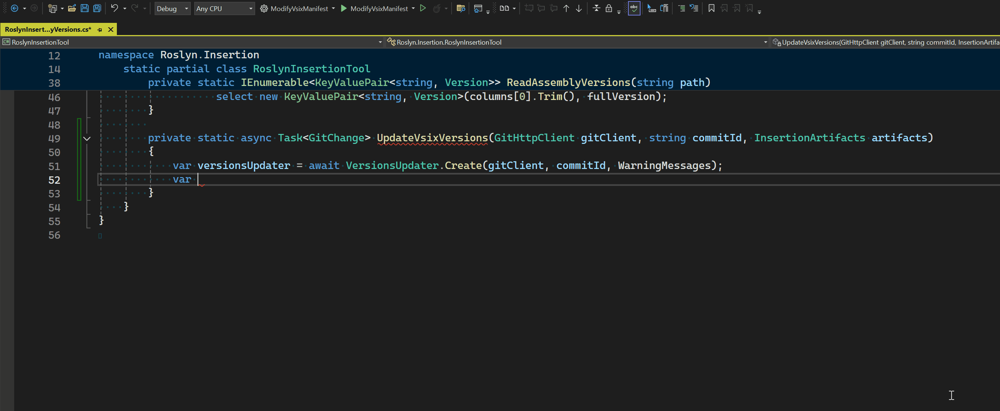
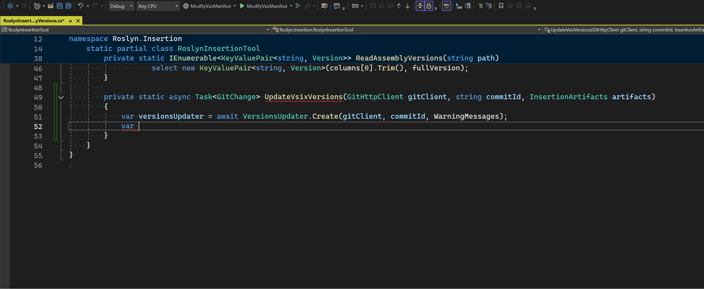

GitHub Copilot code completions provide autocomplete suggestions inline as you code. These suggestions are generated based on the content from your currently active file and any other open files in your editor. However, we have discovered that incorporating more relevant context significantly improves these suggestions.

We are excited to announce that in Visual Studio 2022 17.11, our team has made changes to ensure that additional relevant C# context, such as available types and methods, is now included in Copilot completions.

With the latest version of Visual Studio, Copilot now automatically considers semantically relevant files for additional context, even if these files are not open in your editor. This improvement helps reduce hallucinations while offering more relevant and accurate suggestions.

## Before: Semantically relevant files are not considered as context for GitHub Copilot Completions

Consider a scenario where you’re trying to call a method defined in another file. Previously, GitHub Copilot might have suggested an incorrect method name like `GetVsixPaths`:

## After: Semantically relevant files are considered as context for GitHub Copilot Completions

Now, with semantically relevant files included as context, GitHub Copilot suggests the correct method name, `GetVsixPathFromVsmanFiles`:

## Let us know what you think!

We hope this enhancement improves your experience with GitHub Copilot in Visual Studio. Our team is committed to improving Copilot support for C# developers in both Visual Studio and VS Code, with similar updates coming to VS Code soon.

We would love to hear about your experiences with this enhancement. Your feedback is essential in helping us improve the Copilot experience for C# developers. You can provide feedback on GitHub Copilot by opening a [GitHub discussion](https://github.com/orgs/community/discussions/categories/copilot).
