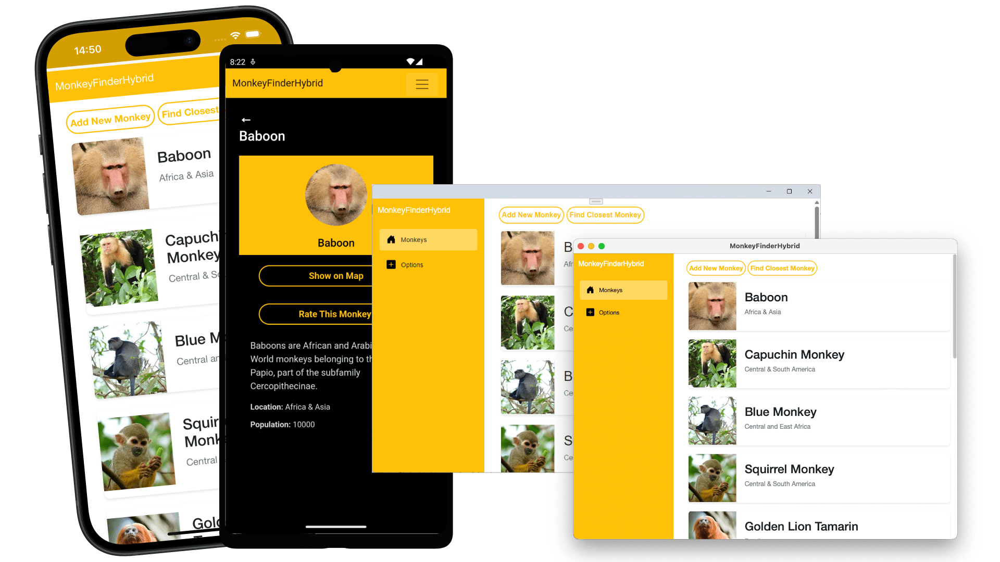

Today, we're happy to introduce to you the official Blazor Hybrid workshop! With this self-paced workshop you will learn all the basics of building a cross-platform app using Blazor Hybrid.

You can find all the materials on [aka.ms/blazor-hybrid-workshop](https://aka.ms/blazor-hybrid-workshop).

## What you will learn

During the workshop you will be building a sample app called MonkeyFinder. This app is a simple project that locates monkeys around the world. We start completely from scratch all the way to a complete, functional app.

While following this workshop, you'll learn:

* All about the Blazor Hybrid project structure and which file does what
* Loading data from a remote source and visualize it in the Monkey Finder app
* Add third-party libraries and work with reusable components
* Leverage platform functionalities such as checking for device connectivity, determining the device location and opening operating systems default applications
* Theming the app and make sure it looks great with light mode and dark mode
* Mixing and matching Blazor and .NET MAUI native pages and controls
* Much more!

The workshop consists of 6 parts, each part with its own description and starting point project. This way you can easily peek ahead if you're unsure how to proceed, and you will always have a working, finished example of each section to start the next one with.

## Already familiar with Blazor Hybrid?

If you already know about Blazor Hybrid yourself, then you might be looking for opportunities to teach others, and with this workshop you can!

Feel free to take this repository and use it to run a workshop of your own. We've given you the code, slides, descriptions, and extensive instructions for each part.

Depending on how you deliver the content, we estimate this workshop taking 4-6 hours.

### Blazor Hybrid <3 .NET MAUI

Blazor Hybrid is built on top of .NET MAUI, so it makes sense that you maybe want to teach people about that too. The Blazor Hybrid workshop is built with this scenario in mind as well.

You can teach this workshop either as a standalone or together with the existing [.NET MAUI workshop](https://github.com/dotnet-presentations/dotnet-maui-workshop/). The .NET MAUI workshop follows the same general flow and even builds the same sample app - the MonkeyFinder app!

Combining these two workshops is the perfect way to demonstrate the differences and similarities between building a .NET MAUI app with native vs Blazor Hybrid UI.

### Extend this workshop

Maybe you have some more ideas on what you would like to add to this workshop. Those can be found under the **Community Modules** folder in the workshop repo. If you have an idea in mind, please open an issue on the repository and let's talk!

We do kindly ask that you help us keeping your addition up to date.

## Learn Blazor Hybrid with Gerald!

Gerald also recorded a [full 4-hour course](https://youtu.be/Ou0k5XKcIh4) on his YouTube that will teach you everything that is to know about this workshop.

For this video, Gerald has also partnered with Holopin, a platform that allows you to create and collect digital badges. We know how much our community loves using Holopin during Hacktoberfest, so upon completion of this course, you can claim a [badge](https://www.holopin.io/sticker/cm02dfp2410980cjtsfmalh8w) that you can proudly share with the world!

<iframe width="800" height="450" src="https://www.youtube.com/embed/Ou0k5XKcIh4?si=dVleotY5n3UloAIr" title="YouTube video player" frameborder="0" allow="accelerometer; autoplay; clipboard-write; encrypted-media; gyroscope; picture-in-picture; web-share" referrerpolicy="strict-origin-when-cross-origin" allowfullscreen></iframe>

Please note that this YouTube video is brought to you by Gerald in his own time and is not endorsed or supported by Microsoft in any way.

## Get started today!

Head over to [aka.ms/blazor-hybrid-workshop](https://aka.ms/blazor-hybrid-workshop) and start coding now!

We hope you will have fun exploring Blazor Hybrid and .NET MAUI while building your very first Blazor Hybrid app.

### Resources

Below, you can find a number of relevant resources that might be interesting for you to explore in this context as well.

- [Blazor Hybrid Workshop](https://github.com/dotnet-presentations/blazor-hybrid-workshop)
- [.NET MAUI Workshop](https://github.com/dotnet-presentations/dotnet-maui-workshop)
- [Blazor Workshop](https://github.com/dotnet-presentations/blazor-workshop)
- [Building your first .NET MAUI app](https://dotnet.microsoft.com/learn/maui/first-app-tutorial/intro)
- [Build Web Apps with Blazor](https://learn.microsoft.com/training/paths/build-web-apps-with-blazor/)