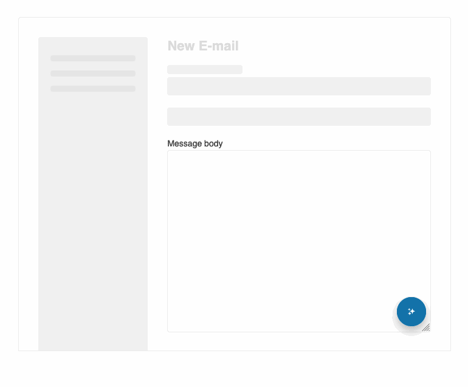
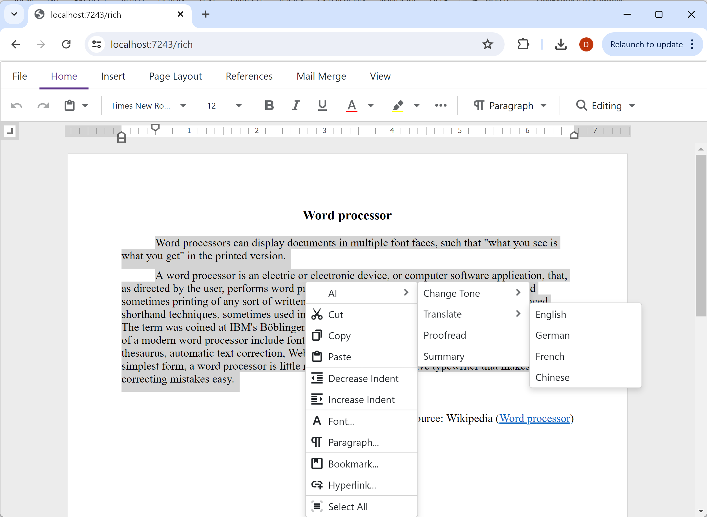
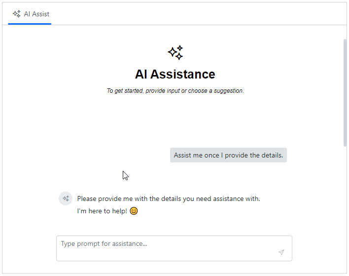

The .NET Smart Components are a set of sample drop-in UI components that make it easy to add AI-enabled features for useful scenarios, like auto-filling forms from clipboard data, smart text completions, and semantic search. The .NET Smart Components demonstrate how prepackaging AI-based functionality into reusable components makes it easier to integrate these features into existing apps. We're making the .NET Smart Components source code available as reference sample implementations to help bootstrap a vibrant ecosystem of reusable .NET AI-powered components.

## Now open source

The .NET Smart Components have a new home on GitHub in the [dotnet/smartcomponents](https://github.com/dotnet/smartcomponents) repo that contains the implementation source code, docs, and sample apps. Library authors can use the sample components for inspiration and as reference implementations for how to package AI-powered features for easy consumption. If you have thoughts on how to improve the .NET Smart Components, or ideas for new AI-powered components that you'd like to see added, please share them with us by [opening an issue](https://github.com/dotnet/smartcomponents/issues/new) on GitHub.

## Local embeddings using Semantic Kernel

The .NET Smart Components include sample convenience APIs for calculating [embeddings](https://github.com/dotnet/smartcomponents/blob/main/docs/local-embeddings.md) (`LocalEmbeddings`) locally on your server. These can be used to compare the semantic similarity of text. These APIs have now been updated to wrap the [ONNX-based embeddings support in Semantic Kernel](https://learn.microsoft.com/dotnet/api/microsoft.semantickernel.connectors.onnx.bertonnxtextembeddinggenerationservice) and then demonstrate how you can build further capabilities on top, such as automatic model acquisition, simplified semantic search, and alternative embedding representations. If you find these [additions](https://github.com/dotnet/smartcomponents/blob/main/docs/local-embeddings.md#relationship-to-semantic-kernel) useful, you can include them in your own apps and libraries. Otherwise, you can just use the Semantic Kernel APIs directly.

## Smart components from popular component vendors

Several popular component vendors have already started investing in building their own smart components, building on the ideas in the .NET Smart Components as well as adding their own unique innovations and features. Let's take a look at a few examples of what they've been working on.

### Progress Telerik

Progress Telerik provides a prebuilt [AI Prompt](https://www.telerik.com/blazor-ui/ai-prompt) component to streamline integrating AI services in your ASP.NET Core, Blazor, and .NET MAUI apps. It's fully customizable through templates and events, and it supports globalization, localization, and right-to-left rendering.

Telerik is also working on their own [Smart (AI) Components](https://github.com/telerik/smart-ai-components) for [ASP.NET Core](https://demos.telerik.com/aspnet-core/corelab/grid-smart-ai-search), [Blazor](https://demos.telerik.com/blazor-ui/blazorlab/grid-smart-ai-search), [WPF](hhttps://docs.telerik.com/devtools/wpf/wpflab/smart-ai-components), and [Windows Forms](https://docs.telerik.com/devtools/winforms/winformslab/smart-ai-components). The Telerik Smart (AI) Components include semantic search integration in their grid and combo box controls as well as AI assistant integration with their PDF viewer.

### DevExpress

DevExpress is working on a bunch of [AI-powered enhancements](https://devexpress.com/go/AI.aspx) for their upcoming release in December.

These AI enhancements include:

- AI-assisted text processing in text editing components for Blazor, Windows Forms, and WPF, with integrated support for large input text via a chunking strategy.
- A prebuilt AI-powered Blazor chat component for creating intelligent chat assistants, with Blazor Hybrid support, allowing reuse in Windows Forms, WPF, and .NET MAUI apps.
- AI-powered Smart Paste and Smart Search for Data Grid, Layout, and Ribbon.
- Support for offline model execution using Ollama.

Here's an example of the DevExpress AI Assistant integrated with their Blazor report viewer:

And here's DevExpress's AI-powered text processing in their rich text editor:

DevExpress Early Access Previews are now available for both the AI-powered [text editor extensions](https://community.devexpress.com/blogs/news/archive/2024/09/03/devexpress-ai-powered-extensions-extending-text-editors-with-ai-eap-v24-2.aspx) and [Blazor chat component](https://community.devexpress.com/blogs/aspnet/archive/2024/09/03/new-devexpress-ai-focused-blazor-chat-control-early-access-preview-v24-2.aspx), so be sure to give them a try!

### Syncfusion

Syncfusion just shipped a variety of new AI features for .NET in their [Essential Studio 2024 Volume 3 release](https://www.syncfusion.com/blogs/post/syncfusion-essential-studio-2024-vol3), including a new AI AssistView component for [Blazor](https://www.syncfusion.com/blazor-components/blazor-ai-assistview), [MVC & Razor Pages](https://www.syncfusion.com/aspnet-core-ui-controls/ai-assistview), [.NET MAUI](https://www.syncfusion.com/maui-controls/maui-aiassistview), and [WinUI](https://www.syncfusion.com/winui-controls/ai-assistview) as well as their own [Smart Paste Button](https://www.syncfusion.com/blazor-components/blazor-smartpaste-button) and [Smart TextArea](https://www.syncfusion.com/blazor-components/blazor-textarea) components for Blazor.

The AI AssistView component integrates seamlessly with AI services. It can send & suggest prompts, execute commands using toolbar options, and display responses in an easy-to-use interface. It provides Toolbar options for copy, edit, link/unlike, and you can add custom options and views.

Here's the Syncfusion AI AssistView in action:

Be sure to also check out these other AI-powered use cases for .NET from Syncfusion:

- [Syncfusion AI samples for Blazor](https://github.com/syncfusion/smart-ai-samples/tree/master/blazor)
- [Integrating AI-Powered Smart Paste in .NET MAUI DataForm for Easy Data Entry](https://www.syncfusion.com/blogs/post/ai-powered-smart-paste-maui-dataform)
- [AI-Powered Smart Searching in .NET MAUI Autocomplete](https://www.syncfusion.com/blogs/post/smart-ai-search-in-maui-autocomplete)
- [Sneak Peek 2024 Volume 3: AI-Powered Smart .NET MAUI controls](https://www.syncfusion.com/blogs/post/sneak-peek-2024-vol-3-maui-smart-ai-controls)

## Join the ecosystem

It's still early days when it comes to building with AI. We're excited to see what new AI-powered .NET smart components the community comes up with. If you come up with a cool new smart component for .NET, be sure to let us know!
