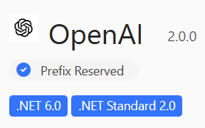

Back in June, [we launched](https://devblogs.microsoft.com/dotnet/openai-dotnet-library/) the first beta of the OpenAI library for .NET, empowering developers to integrate advanced AI models into their applications. Today, we are excited to share that the **stable release** of the **[official OpenAI library for .NET](https://www.nuget.org/packages/OpenAI/2.0.0)** is now live. This release ensures a smooth and reliable integration experience for developers working with OpenAI and Azure OpenAI services in their .NET applications.

[](https://www.nuget.org/packages/OpenAI/)

## Key features

The official OpenAI library for .NET provides powerful tools that simplify integrating OpenAI's cutting-edge models into your .NET applications, offering developers a streamlined experience:

- **Full OpenAI REST API support**: Includes Assistants v2 and Chat Completions, enabling flexible and advanced interactions.
- **Support for latest models**: OpenAI’s latest flagship models, including GPT-4o, GPT-4o mini, o1-preview, and o1-mini, are fully supported, ensuring developers have access to cutting-edge AI capabilities.
- **Extensibility**: The library is designed with extensibility in mind, allowing the community to build additional libraries on top of it.
- **Sync and async APIs**: These ensure developers have the flexibility to use synchronous or asynchronous patterns depending on their application's needs.
- **Streaming completions**: Access to streaming completions via `IAsyncEnumerable<T>`, offering more dynamic interaction models.
- **Quality-of-life improvements**: Numerous improvements have been made throughout the beta cycle based on community feedback.
- **.NET Standard 2.0 compatibility**: This library, written in C#, supports all .NET variants that implement [.NET Standard 2.0](https://learn.microsoft.com/dotnet/standard/net-standard?tabs=net-standard-2-0#select-net-standard-version), ensuring compatibility with the latest .NET platforms.

This official .NET library ensures a smooth and supported [integration with OpenAI and Azure OpenAI](https://github.com/openai/openai-dotnet?tab=readme-ov-file#how-to-work-with-azure-openai). It also complements OpenAI’s official libraries for Python and TypeScript/JavaScript developers. 

The library is open-source, developed, and supported on [GitHub](https://github.com/openai/openai-dotnet). It will be kept up to date with the latest features from OpenAI.

## Sample code

Here’s a quick look at how easy it is to use the OpenAI library in a .NET application. The following code snippet demonstrates how to create an OpenAI client and use it to complete a chat interaction:

```csharp
using OpenAI.Chat;

ChatClient client = new(
    model: "gpt-4o",
    apiKey: Environment.GetEnvironmentVariable("OPENAI_API_KEY"));
ChatCompletion completion = client.CompleteChat("Say 'this is a test.'");

Console.WriteLine($"[ASSISTANT]: {completion.Content[0].Text}");
```

## Thank you to the .NET community

This stable release wouldn’t have been possible without the continued support and feedback from the .NET community. Over the course of the beta, we’ve seen significant engagement and contributions that helped shape this release. We're committed to continuing this collaboration as the library evolves.

## Get started today

- **Try the library**: Install the NuGet package for the [official OpenAI library for .NET](https://www.nuget.org/packages/OpenAI/2.0.0) and start experimenting with its features.
- **Join the community**: Engage with us and other developers on [GitHub](https://github.com/openai/openai-dotnet). Share your experiences, report issues, and contribute to discussions.
