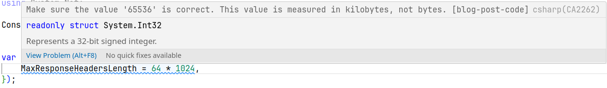
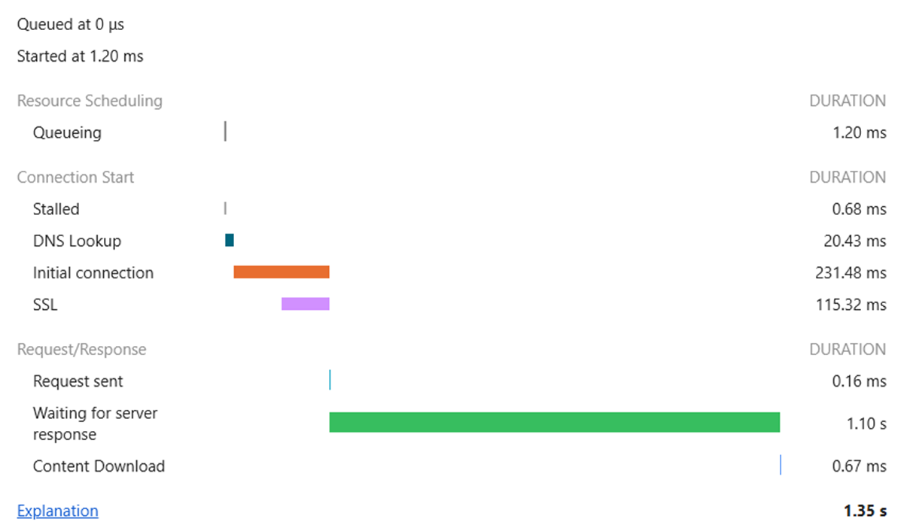
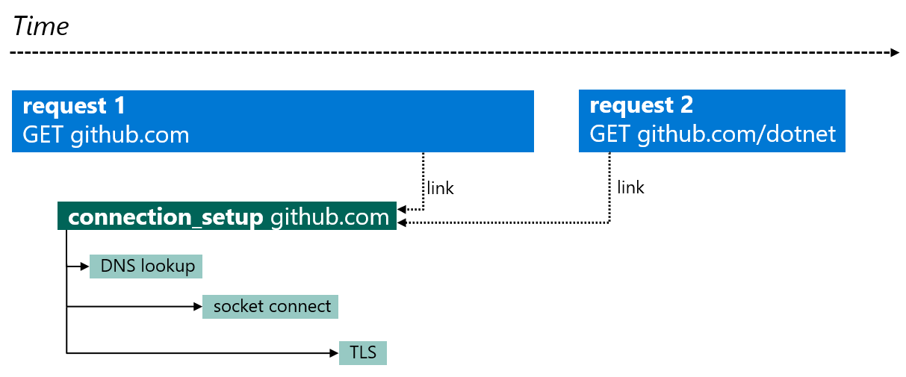
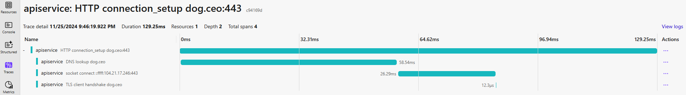

As in the previous years, we publish a blog post about new interesting changes in networking space with new [.NET release](https://devblogs.microsoft.com/dotnet/announcing-dotnet-9/). This year, we're introducing changes in [HTTP](#http) space, new [`HttpClientFactory`](#httpclientfactory) APIs, .NET framework compatibility improvements and more.

## HTTP

### Connection Pooling

In this release, we've made two impactful performance improvements in HTTP connection pooling.

The first one is the support of multiple HTTP/3 connections. Using more than one HTTP/3 connection to the peer is discouraged by the [RFC 9114](https://datatracker.ietf.org/doc/html/rfc9114#section-3.3) since the connection can multiplex multiple parallel requests. However, in certain scenarios like server-to-server, one connection might become a bottleneck even with the multiplexing. We've seen such limitations with HTTP/2 ([dotnet/runtime#35088](https://github.com/dotnet/runtime/issues/35088)), which has the same concept of multiplexing over one connection. For the same reasons ([dotnet/runtime#51775](https://github.com/dotnet/runtime/issues/51775)), we decided to implement multiple connection support for HTTP/3 ([dotnet/runtime#101535](https://github.com/dotnet/runtime/issues/101535)).

The implementation itself tries to closely match the behavior of HTTP/2 multiple connections. Which at the moment always prefer to saturate existing connections with as many requests as allowed by the peer before opening a new one. Note that this is an implementation detail and the behavior might change in the future.

As a result, [our benchmarks](https://github.com/aspnet/Benchmarks/tree/main/src/BenchmarksApps/HttpClientBenchmarks) showed a non-trivial increase in RPS (requests per seconds), comparison for 10,000 parallel requests:

| client                      | single HTTP/3 connection              | multiple HTTP/3 connections           |
| --------------------------- | ------------------------------------- | ------------------------------------- |
| Max CPU Usage (%)           | 35                                    | 92                                    |
| Max Cores usage (%)         | 971                                   | 2,572                                 |
| Max Working Set (MB)        | 3,810                                 | 6,491                                 |
| Max Private Memory (MB)     | 4,415                                 | 7,228                                 |
| Processor Count             | 28                                    | 28                                    |
| First request duration (ms) | 519                                   | 594                                   |
| Requests                    | 345,446                               | 4,325,325                             |
| Mean RPS                    | 23,069                                | 288,664                               |

This feature can be turned on via a property on [`SocketsHttpHandler`](https://learn.microsoft.com/dotnet/api/system.net.http.socketshttphandler.enablemultiplehttp3connections):
```c#
var client = new HttpClient(new SocketsHttpHandler()
{
    EnableMultipleHttp3Connections = true
});
```


The second change is fixing the lock contention in HTTP 1.1 connection pooling ([dotnet/runtime#70098](https://github.com/dotnet/runtime/issues/70098)). The HTTP 1.1 connection pool used a single lock to manage the list of connections and the queue of pending requests. With high throughput scenarios on machines with high number of CPU cores, this lock became a bottleneck. In the fix ([dotnet/runtime#99364](https://github.com/dotnet/runtime/pull/99364)), the ordinary list with a lock was replaced by a concurrent collection instead. Specifically by [`ConcurrentStack`](https://learn.microsoft.com/dotnet/api/system.collections.concurrent.concurrentstack-1) as it preserves the observable behavior when requests are handled by the newest available connection - to be able to collect older connections on their configured [lifetime](https://learn.microsoft.com/dotnet/api/system.net.http.socketshttphandler.pooledconnectionlifetime). As a result, the throughput of HTTP 1.1 requests in our benchmarks increased by more than 30%:
| client             | .net 8.0    | .net 9.0     | increase |
| ------------------ | ----------- | ------------ | -------- |
| Requests           |  80,028,791 |  107,128,778 |  +33.86% |
| Mean RPS           |     666,886 |      892,749 |  +33.87% |


### Proxy Auto Update on Windows

One of the main pain points when debugging HTTP traffic with .NET applications was that the application didn't react to changes in Windows proxy settings ([dotnet/runtime#70098](https://github.com/dotnet/runtime/issues/46910)). The proxy settings was initialized once per process and it wasn't possible to refresh it in any reasonable manner until the application got restarted. Properties like [`HttpClient.DefaultProxy`](https://learn.microsoft.com/dotnet/api/system.net.http.httpclient.defaultproxy) would return the same instance upon repeated access and never re-fetch the settings. As a result, tools like Fiddler, that set themselves as system proxy to listen for the traffic, weren't able to capture traffic from already running processes. This was mitigated in [dotnet/runtime#103364](https://github.com/dotnet/runtime/pull/103364), where the `HttpClient.DefaultProxy` is always initialized to an instance of Windows proxy that listens for registry changes and reloads the proxy settings when notified. Now the following code:
```c#
while (true)
{
    using var resp = await client.GetAsync("https://httpbin.org/");
    Console.WriteLine(HttpClient.DefaultProxy.GetProxy(new Uri("https://httpbin.org/"))?.ToString() ?? "null");
    await Task.Delay(1_000);
}
```
will produce output like this:
```text
null
// After Fiddler's "System Proxy" is turned on.
http://127.0.0.1:8866/
```

Note that this change applies only for Windows as it has a unique concept of [machine wide proxy settings](https://support.microsoft.com/windows/use-a-proxy-server-in-windows-03096c53-0554-4ffe-b6ab-8b1deee8dae1). Whereas Linux and other UNIX based systems allow setting up proxy via environment variables, which cannot be changed during process lifetime.

### Community contributions

In HTTP space, there were two community contributions we'd like to call out. One was an addition of missing [`HttpContent.LoadIntoBufferAsync`](https://learn.microsoft.com/dotnet/api/system.net.http.httpcontent.loadintobufferasync) overloads taking in [`CancellationToken`](https://learn.microsoft.com/dotnet/api/system.threading.cancellationtoken) parameter as is a standard for async methods. The API proposal ([dotnet/runtime#102659](https://github.com/dotnet/runtime/issues/102659)) was prepared by [andrewhickman-aveva](https://github.com/andrewhickman-aveva) and the implementation ([dotnet/runtime#103991](https://github.com/dotnet/runtime/pull/103991)) was done by [manandre](https://github.com/manandre).

The other change tries to alleviate a unit discrepancy in units of `MaxResponseHeadersLength` property on [`SocketsHttpHandler`](https://learn.microsoft.com/dotnet/api/system.net.http.socketshttphandler) and [`HttpClientHandler`](https://learn.microsoft.com/dotnet/api/system.net.http.httpclienthandler) ([dotnet/runtime#75137](https://github.com/dotnet/runtime/issues/75137)). All the other size and length properties are interpreted as being in bytes, this one is interpreted as kilobytes. And since the actual behavior cannot be changed due to backward compatibility, the problem was solved by implementing an analyzer ([dotnet/roslyn-analyzers#6796](https://github.com/dotnet/roslyn-analyzers/pull/6796)). The analyzer tries to make sure the user is aware that the value provided is interpreted as kilobytes and will warn if the usage suggests otherwise. If the value is higher than a certain threshold, it will look like this:

The analyzer was implemented by [amiru3f](https://github.com/amiru3f).


// Natalia
## WebSockets
- https://github.com/dotnet/runtime/pull/105841

// Mana
## .NET Framework Compatibility
- HttpWebRequest (https://github.com/dotnet/runtime/pull/95001, https://github.com/dotnet/runtime/pull/94664, https://github.com/dotnet/runtime/pull/97537)
- WebRequest impersonation (https://github.com/dotnet/runtime/pull/102038)
- ServicePoint obsoletion (https://github.com/dotnet/runtime/pull/103456)
- AuthenticationManager obsoletion (https://github.com/dotnet/runtime/pull/93171) community

## Uri Query Redaction in `IHttpClientFactory` Logs

For versions lower than 9.0, the default logging logic of `IHttpClientFactory` emits the full request URI in the `RequestStart` and `RequestPipelineStart` events. In cases where some components of the URI contain sensitive information, this can lead to privacy incidents by leaking such data into logs. 

Version 8.0 introduced the ability to secure `HttpClientFactory` usage by [customizing logging](https://devblogs.microsoft.com/dotnet/dotnet-8-networking-improvements/#modify-httpclient-logging). However, this does not change the fact that the default behavior might be risky for unaware users.

In most problematic cases, sensitive information resides in the query component. Therefore, a [breaking change](https://learn.microsoft.com/dotnet/core/compatibility/networking/9.0/query-redaction-logs) was introduced, removing the entire query string from `IHttpClientFactory` logs by default. A global [opt-out switch](https://learn.microsoft.com/en-us/dotnet/core/compatibility/networking/9.0/query-redaction-logs#recommended-action) is available for services/apps where it is safe to log the full URI.

For consistency and maximum safety, a [similar change](https://learn.microsoft.com/dotnet/core/compatibility/networking/9.0/query-redaction-events) was implemented for EventSource events.

We recognize that this solution might not suit all users. Ideally, there should be a fine-grained URI filtering mechanism, allowing users to retain non-sensitive query entries or filter other URI components (e.g., the path). [We plan to explore](https://github.com/dotnet/runtime/issues/110018) such a feature for future versions.

## Distributed Tracing Improvements

[Distributed tracing](https://learn.microsoft.com/en-us/dotnet/core/diagnostics/distributed-tracing) is a diagnostic technique for tracking the path of a specific transaction across multiple processes and machines, helping identify bottlenecks and failures. This technique models the transaction as a hierarchical tree of [`Activities`](https://learn.microsoft.com/en-us/dotnet/core/diagnostics/distributed-tracing-concepts#traces-and-activities), also referred to as [spans](https://opentelemetry.io/docs/concepts/signals/traces/#spans) in OpenTelemetry terminology.

`HttpClientHandler` and `SocketsHttpHandler` are instrumented to start an `Activity` for each request and propagate the [trace context](https://www.w3.org/TR/trace-context/) via standard W3C headers when tracing is enabled.

Before .NET 9, users needed the OpenTelemetry .NET SDK to produce useful OpenTelemetry-compliant traces. This SDK was required not just for collection and export but also to [extend the instrumentation](https://github.com/open-telemetry/opentelemetry-dotnet-contrib/blob/85afc5dd1bd7deef9b8949f36a14cd3fd1aacecb/src/OpenTelemetry.Instrumentation.Http/README.md), as the built-in logic did not populate the `Activity` with request data.

Starting with .NET 9, the instrumentation dependency (`OpenTelemetry.Instrumentation.Http`) can be omitted unless advanced features like enrichment are required. [dotnet/runtime#104251](https://github.com/dotnet/runtime/pull/104251) extends the built-in tracing to ensure that the shape of the `Activity` is [OTel-compliant](https://opentelemetry.io/docs/specs/semconv/http/http-spans/#http-client), with the name, status, and most required tags populated according to the standard.

### Experimental Connection Tracing

When investigating bottlenecks, you might want to zoom into specific HTTP requests to identify where most of the time is spent. Is it during content download, DNS lookup, or the TLS handshake? A breakdown similar to what is seen in a browser's developer tools networking tab can be invaluable:



Is it possible to create a similar experience for analyzing `HttpClient` request traces by emitting a trace hierarchy with connection setup activities? Due to `SocketsHttpHandler`'s connection pooling logic, the answer is more nuanced than many would expect. When there is no connection available in the pool for an incoming request, a connection attempt will be initiated, executing the usual DNS, TCP, and TLS setup steps. However, the request might not use the connection it initiated *if another connection becomes available sooner* (eg. because it finished serving an unrelated request).

This behavior reduces latency but complicates telemetry. If we introduce a `connection_setup` activity (with `DNS lookup`, `socket connect`, and `TLS` sub-activities), it cannot be modeled as a child of the originating request activity since requests and connections are only associated when a connection is dispatched to serve a request.

Fortunately, this relationship can still be represented using [Span Links](https://opentelemetry.io/docs/concepts/signals/traces/#span-links), also known as Activity Links. When .NET 9 connection tracing is enabled, a separate `connection_setup` root activity is created for each connection attempt. At the moment a pooled connection is picked up by a request, we create a link from the request activity to the connection setup activity:



Typically, this results in numerous links from request activities to the same connection setup activity. Unfortunately, monitoring tools like Azure Monitor Application Insights struggle to visualize such links effectively, as they aggregate all `connection_setup → request` backlinks into a single view. For this reason, the ActivitySources producing connection activities are marked experimental and the activity source names are prefixed with `Experimental.` eg. (`Experimental.System.Net.NameResolution` for DNS). We plan to collaborate with OTel to help improving the user experience in monitoring tools and may adjust the design based on feedback.

The simplest way to set up and try connection trace collection is by using .NET Aspire. Using Aspire Dashboards it's possible to expand the `connection_setup` activity and see a breakdown of the connection initialization.



If you think the .NET 9 tracing additions might bring you valuable diagnostic insights, and you want to get some hands-on experience, don't hesitate to read our full article about [Networking distributed traces in .NET](https://github.com/dotnet/docs/blob/108f1e75cb1e83654d5b52980a3181ce61ef8cc2/docs/fundamentals/networking/telemetry/tracing.md).


// Natalia
## HttpClientFactory

## QUIC

### Public APIs

From this release on, `System.Net.Quic` is not hidden behind [`PreviewFeature`](https://learn.microsoft.com/dotnet/fundamentals/apicompat/preview-apis#requirespreviewfeaturesattribute) anymore and all the APIs are generally available without any opt-int switches ([dotnet/runtime#104227](https://github.com/dotnet/runtime/pull/104227)).


### QUIC Connection Options

One of the new additions to `System.Net.Quic` are expanded configuration options for [`QuicConnection`](https://learn.microsoft.com/dotnet/api/system.net.quic.quicconnection) proposed in [dotnet/runtime#72984](https://github.com/dotnet/runtime/issues/72984). The change ([dotnet/runtime#94211](https://github.com/dotnet/runtime/pull/94211)) adds three new properties to [`QuicConnectionOptions`](https://learn.microsoft.com/dotnet/api/system.net.quic.quicconnectionoptions):
- [`HandshakeTimeout`](https://learn.microsoft.com/dotnet/api/system.net.quic.quicconnectionoptions.handshaketimeout) - we were already imposing a limit on how long a connection establishment can take, this property just enables the user to adjust it.
- [`KeepAliveInterval`](https://learn.microsoft.com/dotnet/api/system.net.quic.quicconnectionoptions.keepaliveinterval) - if this property is set up to a positive value, [PING frames](https://www.rfc-editor.org/rfc/rfc9000#name-ping-frames) will be sent out regularly in this interval (in case no other activity is happening on the connection) to prevent the connection from being closed on [idle timeout](https://www.rfc-editor.org/rfc/rfc9000#name-idle-timeout).
- [`InitialReceiveWindowSizes`](https://learn.microsoft.com/dotnet/api/system.net.quic.quicconnectionoptions.initialreceivewindowsizes) - a set of parameters to adjust the initial receive limits for data flow control sent in [transport parameters](https://www.rfc-editor.org/rfc/rfc9000#transport-parameter-definitions). These apply only until the dynamic flow control algorithm starts adjusting the data limits based on the speed in which the data are read by the user code. And due to [MsQuic](https://github.com/microsoft/msquic/blob/main/docs/api/QUIC_SETTINGS.md) limitations, these can only be set to values that are power of 2.

All of these parameters are optional. Their default values are derived from [MsQuic defaults](https://github.com/microsoft/msquic/blob/main/docs/Settings.md). The following code will report the defaults programmatically:
```c#
var options = new QuicClientConnectionOptions();
Console.WriteLine($"KeepAliveInterval = {PrettyPrintTimeStamp(options.KeepAliveInterval)}");
Console.WriteLine($"HandshakeTimeout = {PrettyPrintTimeStamp(options.HandshakeTimeout)}");
Console.WriteLine(@$"InitialReceiveWindowSizes =
{{
    Connection = {PrettyPrintInt(options.InitialReceiveWindowSizes.Connection)},
    LocallyInitiatedBidirectionalStream = {PrettyPrintInt(options.InitialReceiveWindowSizes.LocallyInitiatedBidirectionalStream)},
    RemotelyInitiatedBidirectionalStream = {PrettyPrintInt(options.InitialReceiveWindowSizes.RemotelyInitiatedBidirectionalStream)},
    UnidirectionalStream = {PrettyPrintInt(options.InitialReceiveWindowSizes.UnidirectionalStream)}
}}");

static string PrettyPrintTimeStamp(TimeSpan timeSpan)
    => timeSpan == Timeout.InfiniteTimeSpan ? "infinite" : timeSpan.ToString();

static string PrettyPrintInt(int sizeB)
    => sizeB % 1024 == 0 ? $"{sizeB / 1024} * 1024" : sizeB.ToString();

// Prints:
KeepAliveInterval = infinite
HandshakeTimeout = 00:00:10
InitialReceiveWindowSizes =
{
    Connection = 16384 * 1024,
    LocallyInitiatedBidirectionalStream = 64 * 1024,
    RemotelyInitiatedBidirectionalStream = 64 * 1024,
    UnidirectionalStream = 64 * 1024
}
```

### Stream Capacity API

Another new APIs were added to enable implementation of [multiple HTTP/3 connections](#connection-pooling) in [`SocketsHttpHandler`](https://learn.microsoft.com/dotnet/api/system.net.http.socketshttphandler.enablemultiplehttp3connections) ([dotnet/runtime#101534](https://github.com/dotnet/runtime/issues/101534)). These were designed with the specific, above mentioned usage in mind and we do not expect this to be used apart from very niche scenarios.

QUIC has built in logic for managing [stream limits](https://www.rfc-editor.org/rfc/rfc9000#name-max_streams-frames) within the protocol. As a result, calling [`OpenOutboundStreamAsync`](https://learn.microsoft.com/dotnet/api/system.net.quic.quicconnection.openoutboundstreamasync) on a connection gets suspended if there isn't any available stream capacity. Moreover, there isn't an efficient way to learn whether the stream limit was reached or not. All these limitations together didn't allow the HTTP/3 layer to know when to open a new connection. So we introduced a new [`StreamCapacityCallback`](https://learn.microsoft.com/dotnet/api/system.net.quic.quicconnectionoptions.streamcapacitycallback) that gets called whenever stream capacity is increased. The callback itself is registered via [`QuicConnectionOptions`](https://learn.microsoft.com/dotnet/api/system.net.quic.quicconnectionoptions). It's first invocation reports the initial capacity announced by the peer and it's called even before the `QuicConnection` object gets handed out to the user. After that, the callback gets called every time the stream capacity was increased (and is above zero) and it will report the increment by which the capacity rose. The following simplified scenario captures the behavior of stream opening and the callback:
1. client initiates connection to the server via:
```c#
var client = await QuicConnection.ConnectAsync(new QuicClientConnectionOptions
{
    ...
    StreamCapacityCallback = (connection, args) =>
        Console.WriteLine($"{connection} stream capacity increased by: unidi += {args.UnidirectionalIncrement}, bidi += {args.BidirectionalIncrement}")
};
```
2. server sends initial settings to client with the stream limit `2` for unidirectional streams and `0` for bidirectional
3. client's `StreamCapacityCallback` gets called and prints:
```text
[conn][0x58575BF805B0] stream capacity increased by: unidi += 2, bidi += 0
```
4. client call to `ConnectAsync` returns with `[conn][0x58575BF805B0]` connection
5. client attempts to open few streams:
```c#
var stream1 = await connection.OpenOutboundStreamAsync(QuicStreamType.Unidirectional);
var stream2 = await connection.OpenOutboundStreamAsync(QuicStreamType.Unidirectional);
// This following  call will get suspended because the stream is limit has been reached.
var taskStream3 = connection.OpenOutboundStreamAsync(QuicStreamType.Unidirectional);
```
6. client finishes and closes the first 2 streams:
```c#
await stream1.WriteAsync(data, completeWrites: true);
await stream1.DisposeAsync();
await stream2.WriteAsync(data, completeWrites: true);
await stream2.DisposeAsync();
Console.WriteLine($"Stream 3 {(taskStream3.IsCompleted ? "opened" : "pending")}");
```
7. client prints:
```text
Stream 3 pending
```
8. server will release additional capacity of `2` after processing the first two stream
9. two things happen on the client:
   - third stream gets opened:
```c#
var stream3 = await taskStream3;
```
   - client's `StreamCapacityCallback` gets called again and prints:
```text
[conn][0x58575BF805B0] stream capacity increased by: unidi += 2, bidi += 0
```

The sum of all the values reported by the callback will correspond to the total number of streams released by the peer. It's still up to the user to keep track of all opening and opened streams to know the actual capacity at any time. Also the callback might be called in parallel, so it's up to the user to properly handle synchronization around stream counting.

### Performance Improvements

The first performance related change was to run the peer certificate validation asynchronously in .NET thread pool ([dotnet/runtime#98361](https://github.com/dotnet/runtime/pull/98361)). The certificate validation can be time consuming on its own and it might even include an execution of a user callback. Moving this logic to .NET thread pool stops us blocking the MsQuic thread, of which MsQuic has a limited number, and thus enables MsQuic to process higher number of connection establishments at the same time.

On top of that, we have introduced caching of MsQuic configuration ([dotnet/runtime#99371](https://github.com/dotnet/runtime/pull/99371)). MsQuic configuration is a set of native structures containing connection settings from [`QuicConnectionOptions`](https://learn.microsoft.com/dotnet/api/system.net.quic.quicconnectionoptions), potentially including certificate and its intermediaries. Constructing and initializing the native structure might be very expensive since it might require serializing and deserializing all the certificate data to and from [PKS #12](https://datatracker.ietf.org/doc/html/rfc7292) format. Moreover, the cache  allows re-using the same MsQuic configuration for different connections if their settings are identical. Specifically server scenarios with static configuration can notably profit from this, like the following code:
```c#
var alpn = "test";
var serverCertificate = ...

// Prepare the connection option upfront and reuse them.
var serverConnectionOptions = new QuicServerConnectionOptions()
{
    DefaultStreamErrorCode = 123,
    DefaultCloseErrorCode = 456,
    ServerAuthenticationOptions = new SslServerAuthenticationOptions
    {
        ApplicationProtocols = new List<SslApplicationProtocol>() { alpn },
        // Re-using the same certificate.
        ServerCertificate = serverCertificate
    }
};

// Configure the listener to return the pre-prepared options.
await using var listener = await QuicListener.ListenAsync(new QuicListenerOptions()
{
    ListenEndPoint = new IPEndPoint(IPAddress.Loopback, 0),
    ApplicationProtocols = new List<SslApplicationProtocol>() { alpn },
    // Callback returns the same object.
    // Internal cache will re-use the same native structure for every incoming connection.
    ConnectionOptionsCallback = (_, _, _) => ValueTask.FromResult(serverConnectionOptions)
});
```
We also built it an escape hatch for this feature, it can be turned off with either environment variable:
```sh
export DOTNET_SYSTEM_NET_QUIC_DISABLE_CONFIGURATION_CACHE=1
# run the app
```
or with [AppContext](https://learn.microsoft.com/dotnet/api/system.appcontext) switch:
```c#
AppContext.SetSwitch("System.Net.Quic.DisableConfigurationCache", true);
```


## Security

### SSLKEYLOGFILE Support

The most upvoted issue in the security space was to support logging of pre-master secret ([dotnet/runtime#37915](https://github.com/dotnet/runtime/issues/37915)). The logged secret can be used by packet capturing tool Wireshark to decrypt the traffic. It's useful diagnostics tool when investigation networking issues. Moreover, the same functionality is provided by browsers like Firefox (via [NSS](https://udn.realityripple.com/docs/Mozilla/Projects/NSS/Key_Log_Format)) and Chrome and command line HTTP tools like [cURL](https://everything.curl.dev/usingcurl/tls/sslkeylogfile).

We have implemented this feature for both [`SslStream`](https://learn.microsoft.com/dotnet/api/system.net.security.sslstream) and [`QuicConnection`](https://learn.microsoft.com/dotnet/api/system.net.quic.quicconnection0). For the former, the functionality is limited to the platforms on which we use OpenSSL as a security backend (in the terms of officially released .NET runtime it means on Linux). For the later, it is supported everywhere, regardless of the security backend. The difference is that QUIC is implemented in userspace, but TLS on Windows is implemented in a separate, privileged process. This means that SChannel needs to support exporting the encryption secrets to applications in order to make userspace QUIC implementations possible, but will not do the same for TLS due to security concerns ([dotnet/runtime#94843](https://github.com/dotnet/runtime/issues/94843)).

This feature exposes security secrets and relying solely on an environmental variable could unintentionally leak them. For that reason, we've decided to introduce an additional `AppContext` switch necessary to enable the feature ([dotnet/runtime#100665](https://github.com/dotnet/runtime/pull/100665)). It requires the user to prove the ownership of the application by either setting it programmatically in the code:
```c#
AppContext.SetSwitch("System.Net.EnableSslKeyLogging", true);
```
or by changing the `{appname}.runtimeconfig.json` next to the application:
```c#
{
  "runtimeOptions": {
    "configProperties": {
      "System.Net.EnableSslKeyLogging": true
    }
  }
}
```

The last thing is to set up an environmental variable `SSLKEYLOGFILE` and run the application:

```sh
export SSLKEYLOGFILE=~/keylogfile

./<appname>
```

At this point, `~/keylogfile` will contain pre-master secrets that can be used by Wireshark to decrypt the traffic, see [TLS Using the (Pre)-Master-Secret](https://wiki.wireshark.org/TLS#using-the-pre-master-secret) documentation.


### TLS Resume with Client Certificate

TLS resume enables reusing previously stored TLS data to re-establish connection to previously connected server. It can save round-trips during the handshake as well as CPU processing. This feature is a native part of Windows SChannel, therefore it's implicitly used  by .NET on Windows platforms. However, on Linux platforms where we use OpenSSL as a security backend, enabling caching and re-using TLS data is more involved. We firstly introduces the support in .NET 7, [TLS Resume](https://devblogs.microsoft.com/dotnet/dotnet-7-networking-improvements/#performance). It has it's own limitations that in general are not present on Windows. One such limitations was that it was not supported for sessions using mutual authentication by providing a client certificate ([dotnet/runtime#94561](https://github.com/dotnet/runtime/issues/94561)). This has been fixed in .NET 9 ([dotnet/runtime#102656](https://github.com/dotnet/runtime/pull/102656)) and works if one these conditions is:
- [`ClientCertificateContext`](https://learn.microsoft.com/dotnet/api/system.net.security.sslclientauthenticationoptions.clientcertificatecontext)
- [`LocalCertificateSelectionCallback`](https://learn.microsoft.com/dotnet/api/system.net.security.sslclientauthenticationoptions.localcertificateselectioncallback) returns non-null certificate on the first call
- [`ClientCertificates`](https://learn.microsoft.com/dotnet/api/system.net.security.sslclientauthenticationoptions.clientcertificates0) collection has at least one certificate with private key

### Negotiate API Integrity Checks

In .NET 7, we added [`NegotiateAuthentication`](https://learn.microsoft.com/dotnet/api/system.net.security.negotiateauthentication) APIs, [Negotiate API](https://devblogs.microsoft.com/dotnet/dotnet-7-networking-improvements/#negotiate-api). The original implementation's goal was to remove access via reflection to the internals of `NTAuthentication`. However, that proposal was missing functions to generate and verify message integrity codes from [RFC 2743](https://datatracker.ietf.org/doc/html/rfc2743). They are usually implemented as cryptographic signing operation with a negotiated key. The API was proposed in [dotnet/runtime#86950](https://github.com/dotnet/runtime/issues/86950) and implemented in [dotnet/runtime#96712](https://github.com/dotnet/runtime/pull/96712) and ss with the original change, all the work from the API proposal to the implementation was done by a community contributor [filipnavara](https://github.com/filipnavara).

## Networking Primitives

### Server-Sent Events Parser

Server-sent events is technology that allows servers to push data updates on clients via an HTTP connection. It is defined in [living HTML standard](https://html.spec.whatwg.org/multipage/server-sent-events.html). It uses `text/event-stream` MIME type and it's always decoded as `UTF-8`. Advantage of server-push approach over client-pull is that it can make better use of network resources and also make savings in battery life of mobile devices.

In this release, we're introducing an OOB package `System.Net.ServerSentEvents`. It's available as .NET Standard 2.0 [NuGet package](https://www.nuget.org/packages/System.Net.ServerSentEvents). The package offers a parser for server-sent event stream, following the [specification](https://html.spec.whatwg.org/multipage/server-sent-events.html#parsing-an-event-stream). The protocol is stream based, with individual items separated by an empty line.

Each item has two fields:
- `type` - default type is `message`
- `data` - data themselves

On top of that, there are two other optional fields that progressively update properties of the stream:
- `id` - determines the last event id that will be sent in [`Last-Event-Id` header](https://html.spec.whatwg.org/multipage/server-sent-events.html#the-last-event-id-header) in case the connection needs to be reconnected
- `retry` - number of milliseconds to wait between re-connection attempts

The library APIs were proposed in [dotnet/runtime#98105](https://github.com/dotnet/runtime/issues/98105) and contain type definitions for the parser and the items:
- [`SseParser`](https://learn.microsoft.com/dotnet/api/system.net.serversentevents.sseparser) - static class to create the actual parser from the stream, allowing the user to optionally provide a parsing delegate for the item data
- [`SseParser<T>`](https://learn.microsoft.com/dotnet/api/system.net.serversentevents.sseparser-1) - parser itself, offers methods to enumerate (synchronously or asynchronously) the stream and return the parsed items
- [`SseItem<T>`](https://learn.microsoft.com/dotnet/api/system.net.serversentevents.sseitem-1) - struct holding parsed item data

Then the parser can be used like this, for example:
```c#
using HttpClient client = new HttpClient();
using Stream stream = await client.GetStreamAsync("https://server/sse");

var parser = SseParser.Create(stream, (type, data) =>
{
    var str = Encoding.UTF8.GetString(data);
    return Int32.Parse(str);
});
await foreach (var item in parser.EnumerateAsync())
{
    Console.WriteLine($"{item.EventType}: {item.Data} [{parser.LastEventId};{parser.ReconnectionInterval}]");
}
```
And for the following input:
```text
: stream of integers

data: 123
id: 1
retry: 1000

data: 456
id: 2

data: 789
id: 3

```
It will output:
```text
message: 123 [1;00:00:01]
message: 456 [2;00:00:01]
message: 789 [3;00:00:01]
```

### Primitives Additions

Apart from server sent event, `System.Net` namespace got a few small other additions:
- `IEquatable<Uri>` interface implementation for [`Uri`](https://learn.microsoft.com/dotnet/api/system.uri.equals#system-uri-equals(system-uri)) in [dotnet/runtime#97940](https://github.com/dotnet/runtime/issues/97940)

Which allows using `Uri` in functions that require `IEquatable` like `Span.Contains`(https://learn.microsoft.com/dotnet/api/system.memoryextensions.contains#system-memoryextensions-contains-1(system-readonlyspan((-0))-0)) or [`SequenceEquals`](https://learn.microsoft.com/dotnet/api/system.memoryextensions.sequenceequal#system-memoryextensions-sequenceequal-1(system-readonlyspan((-0))-system-readonlyspan((-0))))

- span-based [`(Try)EscapeDataString`](https://learn.microsoft.com/dotnet/api/system.uri.escapedatastring#system-uri-escapedatastring(system-readonlyspan((system-char)))) and [`(Try)UnescapeDataString`](https://learn.microsoft.com/dotnet/api/system.uri.unescapedatastring?system-uri-unescapedatastring(system-readonlyspan((system-char)))) for `Uri` in [dotnet/runtime#40603](https://github.com/dotnet/runtime/issues/40603)

The goal is to support low-allocations scenarions and we now take advantage of these methods in [`FormUrlEncodedContent`](https://learn.microsoft.com/dotnet/api/system.net.http.formurlencodedcontent).

- new MIME types for [`MediaTypeNames`](https://learn.microsoft.com/dotnet/api/system.net.mime.mediatypenames) in [dotnet/runtime#95446](https://github.com/dotnet/runtime/issues/95446)

These were collected over the course of the release and implemented in [dotnet/runtime#103575](https://github.com/dotnet/runtime/pull/103575) by a community contributor [CollinAlpert](https://github.com/CollinAlpert).


## Final Notes

As each year, we try to write about the interesting and impactful changes in the networking space. This article cannot possibly cover all the changes that were made, but they can be found in our [dotnet/runtime](https://github.com/dotnet/runtime) repository where you can also reach out to us with question and bugs. On top of that, many of the performance changes that are not mentioned here are in Stephen's great article [Performance Improvements in .NET 9](https://devblogs.microsoft.com/dotnet/performance-improvements-in-net-9/#networking). We'd also like to hear from you, so if you encounter an issue or have any feedback, you can file it in [our GitHub](https://github.com/dotnet/runtime/issues).

Lastly, I'd like to thank my co-authors:
- [@antonfirsov](https://github.com/antonfirsov) who wrote [Metrics](#metrics).
- [@CarnaViire](https://github.com/CarnaViire) who wrote [HttpClientFactory](#httpclientfactory) and [WebSockets](#websockets).
